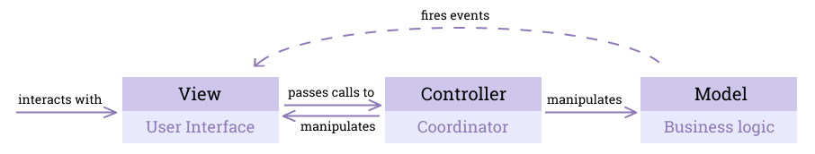
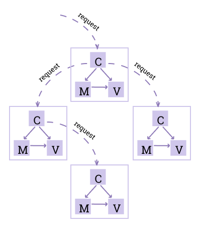
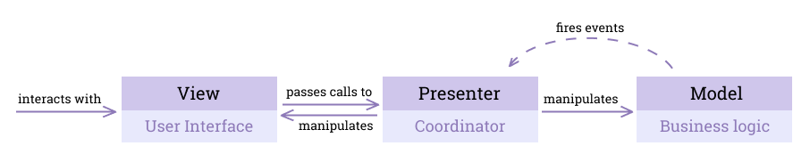
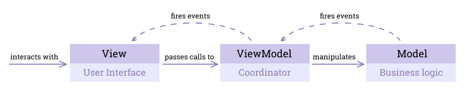
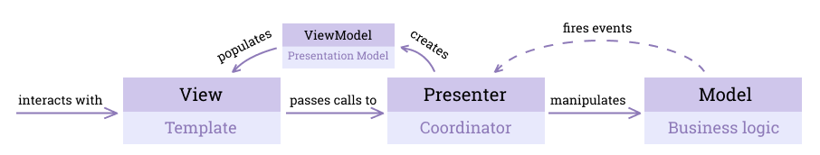
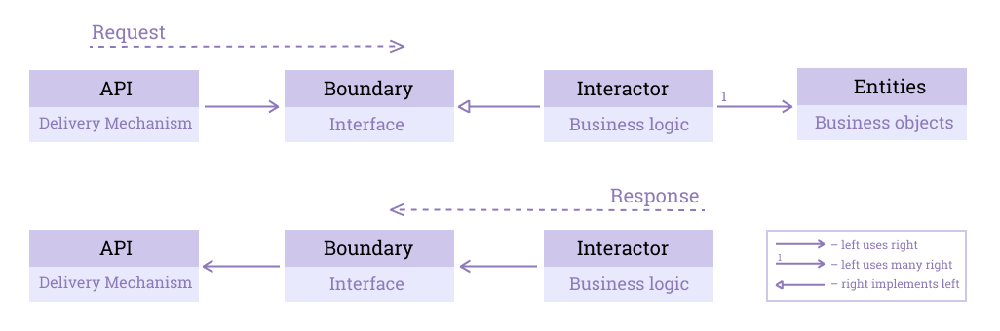
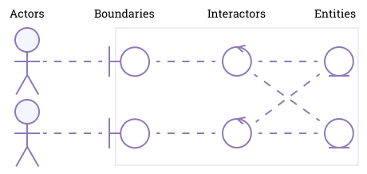
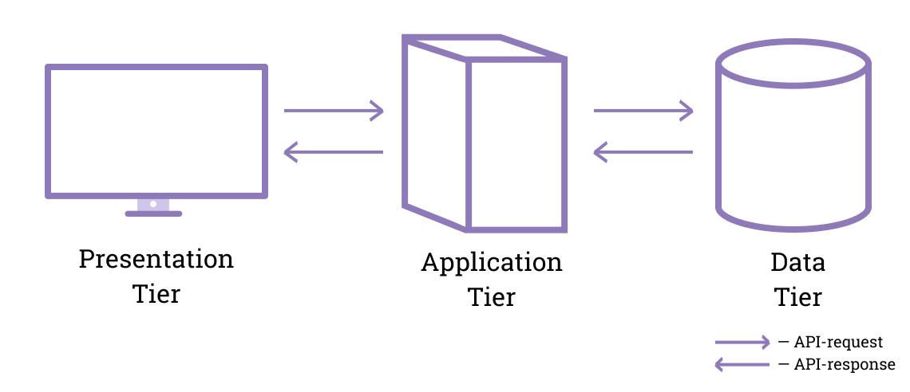
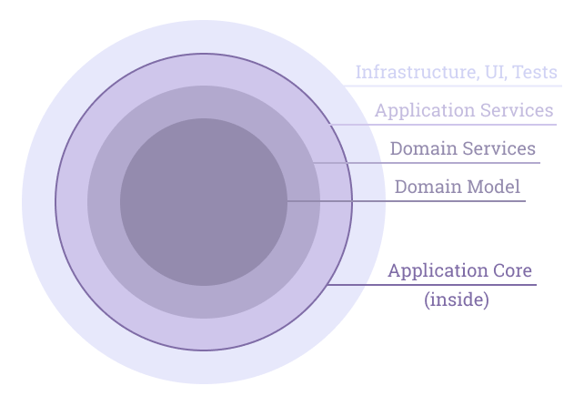

# Архитектурные паттерны

*Заметка* о *типовых решениях* для *организации кода внутри приложения*: как *отделить интерфейс от бизнес-логики*, а *бизнес-логику* — от *базы данных* и *фреймворков*. Паттерны идут *в хронологическом порядке*: от *MVC* 1979 года до *Чистой архитектуры*. Дальше — *Event Sourcing* и *CQRS*, а в конце — *современные паттерны*: *вертикальные срезы*, *Feature-Sliced Design*, *микрофронтенды*, *BFF* и *API Gateway*. Чем архитектурный паттерн отличается от *стиля* и *паттерна проектирования* — в *заметке про* [*архитектуру и проектирование*](./Architecture-Design.md#определения).

- [MVC (1979)](#mvc-1979)
- [Иерархический MVC (2000), PAC (1987)](#иерархический-mvc-2000-pac-1987)
- [MVP (1996)](#mvp-1996)
- [MVVM (2005)](#mvvm-2005)
- [MVPVM](#mvpvm)
- [EBI (1992)](#ebi-1992)
- [Трёхуровневая архитектура](#трёхуровневая-архитектура)
- [DDD (2003)](#ddd-2003)
- [Шестиугольная архитектура, Порты и Адаптеры (2005)](#шестиугольная-архитектура-порты-и-адаптеры-2005)
- [Луковая архитектура (2008)](#луковая-архитектура-2008)
- [Кричащая архитектура (2011)](#кричащая-архитектура-2011)
- [Чистая архитектура (2012)](#чистая-архитектура-2012)
- [Event Sourcing](#event-sourcing)
- [CQRS](#cqrs)
- [Vertical Slice Architecture (2018)](#vertical-slice-architecture-2018)
- [Feature-Sliced Design](#feature-sliced-design)
- [Микрофронтенды (2016)](#микрофронтенды-2016)
- [BFF и API Gateway](#bff-и-api-gateway)

## MVC (1979)
В 1970-ых *обязанности не разделялись*: *смешивание HTML, CSS и работы с базой данных* считалось *нормальной практикой*. С *ростом таких приложений* становилось понятно, что они *очень запутанны* и их *невозможно поддерживать* (тратится слишком много ресурсов), поэтому нередко *разросшиеся приложения* приходилось *переписывать с нуля*.

В 1979 появился *архитектурный шаблон* **MVC** (англ. `Model-View-Controller`), попытавшийся *разрешить проблему*, продвигая идею **разделения ответственности** (англ. `separation of concerns`, `SoC`) между *UI* и *бизнес-логикой*.

**Бизнес-логика** (англ. `business logic`, `domain logic`) — *часть приложения*, задающая *бизнес-правила*, определяющие, как *данные* (состояние, англ. `state`) *предметной области* (англ. `domain`) приложения *создаются*, *хранятся* и *изменяются*.



MVC *разделяет приложение* на *3 концептуальные единицы*
* **Модель** (англ. `Model`) *представляет бизнес-логику* (данные и правила, методы работы с ними) приложения; *не содержит информации*, *как отобразить данные*.
* **Представление** (англ. `View`) *отвечает за пользовательский интерфейс* и *отображает часть данных из Model*. Обычно это *UI-компонента* (кнопка, поле для ввода и прочее); то, что пользователь *видит* и с чем *взаимодействует*.  
* **Контроллер** (англ. `Controller`) выступает *координатором между View и Model* (решает, какие Views показывать и с какими данными), *переводит действия пользователя* (например, клик по кнопке) *в бизнес-логику*.

*Модель* может быть представлена *объектом* или *структурой объектов*.

### Особенности MVC  
1) *View использует объекты данных напрямую из Model*, чтобы эти данные отобразить.  
2) Когда *данные в Model меняются*, срабатывает *событие*, *немедленно обновляющее View*.  
3) *Один View* обычно привязан к *одному Controller*.  
4) *Каждый экран* может иметь *несколько пар View-Controller*.  
5) *Controller* может быть связан с *несколькими Views*. 

Связь Model → View — это паттерн [*Наблюдатель*](./Design-Patterns.md#наблюдатель): View *подписывается* на *изменения* Model. Рой Филдинг приводит MVC из Smalltalk-80 как пример [*событийного стиля*](./Architectural-Styles.md#событийная-архитектура).

### Пример MVC

*Счётчик*, который *увеличивается по нажатию кнопки*. View *получает данные напрямую из Model* (особенность 1), а *изменение Model сразу обновляет View* (особенность 2).
```ts
/* Model: данные и правила работы с ними, ничего не знает об отображении */
class CounterModel {
  private value = 0;
  private listeners: ((value: number) => void)[] = [];

  subscribe(listener: (value: number) => void): void {
    this.listeners.push(listener);
  }

  increment(): void {
    this.value += 1;
    this.listeners.forEach(listener => listener(this.value));
  }
}

/* View: показывает данные из Model */
class CounterView {
  render(value: number): void {
    console.log(`Счётчик: ${value}`);
  }
}

/* Controller: переводит действия пользователя в вызовы Model */
class CounterController {
  private model: CounterModel;

  constructor(model: CounterModel) {
    this.model = model;
  }

  onButtonClick(): void {
    this.model.increment();
  }
}

const model = new CounterModel();
const view = new CounterView();
model.subscribe(value => view.render(value)); /* View следит за изменениями Model */

const controller = new CounterController(model);
controller.onButtonClick(); /* Счётчик: 1 */
controller.onButtonClick(); /* Счётчик: 2 */
```

### Проблема MVC в клиент-серверных приложениях

Когда MVC появился, *протокола HTTP* (1991) и *клиент-серверных приложений* ещё не было.  

Попытка *наложить архитектуру MVC* на *современное клиент-серверное приложение* приводит к *множеству несоответствий* (англ. `inconsistencies`).

* *View* отвечает за *пользовательский интерфейс*, его можно *отнести к клиенту*.  
* *Model* обычно включает *бизнес-логику приложения*, такое лучше *хранить на сервере* в целях *безопасности*, но *какая-то часть логики* (например, валидация формы), может *остаться на фронтенде*, а соответственно и *часть Model*.  
* *Controller* *реагирует на действия пользователя* и *манипулирует Model*. *Нет однозначного ответа* о его *расположении*.  
* *Изменения Модели* *не вызывают изменения во View напрямую*: эта связь *проходит через Controller*. Это связано с тем, что *клиент и сервер функционируют отдельно*, как *два разных приложения*. *Единственный способ* исправить это — *настроить веб-сокеты*.

Во многих *современных приложениях* для того, чтобы *разгрузить сервер* (сократить количество запросов к нему), *часть логики и состояния* хранится *на фронтенде*. Например, *взаимодействие React и Redux* можно представить *в виде MVC*.

## Иерархический MVC (2000), PAC (1987)

**HMVC** (англ. `Hierarchical MVC`) *увеличивает модульность* в контексте *виджетизации UI-блоков*.

Существует мнение, что *авторы HMVC* *переосмыслили другой паттерн*: **PAC** (англ. `Presentation-Abstraction-Control`).

HMVC *разбивает уровень клиента* (англ. `client tier`) на *иерархию из MVC-слоёв*. Это называется **проектированием клиентского уровня** (англ. `client-tier architecture`) и должно *увеличивать масштабируемость* приложения: *каждый MVC-слой независим от других* и может *работать при отсутствии любого другого*.



*Controller*, обрабатывающий *основной запрос*, *пересылает подзапросы* другим Controllers, чтобы *получить рендеринг виджетов* и *включить их* в *рендеринг основного View*.

## MVP (1996)

*MVC* был *хорош для приложений своего времени*, но *приложения выросли* и настало *время изменений*.

**MVP** (англ. `Model-View-Presenter`) *видоизменяет MVC*, *разделяя View и Model* и осуществляя их *коммуникацию только через* **Presenter**.  

*Снимаем со View обязательство* следить за *обновлениями Model* и *наделяем таким обязательством Controller*, *переименовывая* его в **Presenter**.

Если *UI-логику нужно тестировать*, то она размещается *в Presenter*, в противном случае — *в View*.

*Presenter* также называют **Supervisor Controller**.



### Особенности MVP 
1) *View пассивен* (англ. `passive`) и *ничего не знает о Model*. 
2) *Presenter не содержит бизнес-логики*, он просто *вызывает методы Model*, а затем *передаёт необходимые данные во View*.  
3) *Только один Presenter* для *каждого View*.  
4) *Изменение данных в Model* не вызывает *немедленное обновление View*: *событие всегда проходит через Presenter*, что позволяет в нём *перед обновлением View* проделывать *дополнительную логику*, связанную с *представлением*.

### Пример MVP

*Форма входа*: кнопка «*Войти*» *доступна*, только когда *введён email* и *пароль не короче 6 символов*. *View пассивен*: он лишь *передаёт ввод* в Presenter, а Presenter *сам решает*, *что и когда показать*, и *вызывает методы View*.
```ts
/* пассивный View: только методы, которые вызывает Presenter */
interface ILoginView {
  setSubmitEnabled(enabled: boolean): void;
}

class LoginPresenter {
  private view: ILoginView;
  private email = '';
  private password = '';

  constructor(view: ILoginView) {
    this.view = view;
  }

  onEmailChange(email: string): void {
    this.email = email;
    this.update();
  }

  onPasswordChange(password: string): void {
    this.password = password;
    this.update();
  }

  private update(): void {
    this.view.setSubmitEnabled(this.email.includes('@') && this.password.length >= 6);
  }
}

/* в браузере здесь менялся бы атрибут disabled у кнопки */
const consoleView: ILoginView = {
  setSubmitEnabled(enabled) {
    console.log(`кнопка «Войти» ${enabled ? 'активна' : 'недоступна'}`);
  },
};

const presenter = new LoginPresenter(consoleView);
presenter.onEmailChange('max@example.com'); /* кнопка «Войти» недоступна */
presenter.onPasswordChange('secret1'); /* кнопка «Войти» активна */
```
Presenter можно *протестировать без браузера*: достаточно передать ему *поддельный View*, как `consoleView` выше.

### Зависимые Views

Пусть *два Views зависят друг от друга*.  
Например, *первый View* содержит *поля для ввода* (англ. `inputs`), а *второй View* — *кнопку*.  
*Кнопка недоступна* (англ. `disabled`) до тех пор, пока *все поля не заполнятся*.  

Если *данные из полей записываются в Model*, то *Presenter, привязанный к полям*, *записывает данные в Model*, а *Presenter, привязанный к кнопке*, *читает данные из Model*.  

Если *данные не записываются в Model*, то создаём *оборачивающий Presenter*, который *реализует оба Presenters*.

### Пример связи View и Presenter

```js
// View сообщает Presenter, что готов к обновлению данных 
const resume = () => {
  Presenter.load();
};
// View сообщает Presenter, что не хочет отображать что-либо ещё
const pause = () => {
   Presenter.stopLoad();
};
```

## MVVM (2005)
  
*Сложность приложений* продолжала расти и снова появилась *необходимость изменений*.

**MVVM** (англ. `Model-View-ViewModel`) призван *разделить UI и бизнес-логику* таким образом, чтобы за них могли *отвечать разные люди*, использующие *разные технологии* для этих целей. 

*Presenter производит* (англ. `produce`) *данные*, *View потребляет* (англ. `consume`) их. Почему *производитель* должен *беспокоиться о потребителе*?

Таким образом, мы *снимаем с Presenter обязательство изменять View*. Вместо этого используем `Observable`: во View *подписываемся на события* (англ. `subscribe to events`), *излучаемые* (англ. `emit`) Presenter, который мы *переименовываем во ViewModel*.

Если *UI-логику нужно тестировать*, то она размещается *в ViewModel*, в противном случае — *в View*.



В случае, когда *два View зависят друг от друга* (input — один View, кнопка — другой), необходимо, чтобы *ViewModel одного View* *подписался на событие*, которое *излучает другой ViewModel*. 

### Особенности MVVM
1) *Один ViewModel* соответствует *только одному View* и наоборот.
2) *Вся логика из View перемещается во ViewModel*, чтобы *упростить View* и позволить ему выполнять *свою задачу* (визуализация).
3) *Отношение один к одному* установлено между *данными во View* и *данными во ViewModel*.
4) *Изменение данных во ViewModel* вызывает *немедленное обновление View*.

### Пример MVVM

*Та же форма входа*. В MVVM *ViewModel не вызывает View*: она *хранит состояние* и *оповещает подписчиков*, а *View сама подписывается* и *отображает то, что видит*. Логику «*когда кнопка активна*» можно *проверить без интерфейса*: достаточно *создать ViewModel* и посмотреть на `canSubmit`.
```ts
/* ViewModel: состояние для View и действия над ним; о View ничего не знает */
class LoginViewModel {
  email = '';
  password = '';
  private listeners: (() => void)[] = [];

  get canSubmit(): boolean {
    return this.email.includes('@') && this.password.length >= 6;
  }

  subscribe(listener: () => void): void {
    this.listeners.push(listener);
  }

  setEmail(email: string): void {
    this.email = email;
    this.listeners.forEach(listener => listener());
  }

  setPassword(password: string): void {
    this.password = password;
    this.listeners.forEach(listener => listener());
  }
}

/* View сам подписывается на ViewModel и отображает её состояние */
const viewModel = new LoginViewModel();
viewModel.subscribe(() => {
  console.log(`кнопка «Войти» ${viewModel.canSubmit ? 'активна' : 'недоступна'}`);
});

viewModel.setEmail('max@example.com'); /* кнопка «Войти» недоступна */
viewModel.setPassword('secret1'); /* кнопка «Войти» активна */
console.log(viewModel.canSubmit); // true
```

### Зависимые Views

Пусть *два Views зависят друг от друга*.  
Например, *первый View* содержит *поля для ввода* (англ. `inputs`), а *второй View* — *кнопку*.  
*Кнопка недоступна* (англ. `disabled`) до тех пор, пока *все поля не заполнятся*.  

Если *данные из полей записываются в Model*, то *ViewModel, привязанный к полям*, *записывает данные в Model*, а *ViewModel, привязанный к кнопке*, *читает данные из Model*.  

Если *данные не записываются в Model*, то *подписываем ViewModel, привязанный к кнопке*, на *событие*, *излучаемое ViewModel, привязанным к полям ввода*.

### Пример связи View и ViewModel

```js
// View сообщает ViewModel, что готов к загрузке данных 
const resume = () => {
  ViewModel.subscribe(/* ... */);
};
// View сообщает ViewModel, что не хочет отображать что-либо ещё
const pause = () => {
   ViewModel.unsubscribe(/* ... */);
};
```

## MVPVM

**Model** — *набор классов*, содержащий *всю бизнес-логику* и *случаи использования*.

**View** — *шаблон* (англ. `template`), на основании которого *генерируется HTML* при помощи *шаблонизатора* (англ. `template engine`).

**Необработанные данные** (англ. `raw data`) — данные, которые *не были обработаны* для использования.

**ViewModel** (англ. `Presentation Model`) *получает необработанные данные из query* и *держит их* для *использования в шаблоне*; *инкапсулирует сложную логику представления* для *упрощения шаблона*.

Почему важен ViewModel
* *Изменения в Model* могут *всплыть* и *повлиять на ViewModel*, но *не на View*.
* *Сложная логика представления* *не просочится в предметную область* (англ. `not leak into the domain`), поскольку мы можем *инкапсулировать эту логику во ViewModel*.
* *Зависимости View* становятся *явными*, поскольку они должны быть *установлены в ViewModel*.

*View* и *ViewModel* имеют связь "один к одному".

**Presenter** *получает HTTP-запрос* (англ. `request`), *вызывает команду* (англ. `command`) или *запрос* (англ. `query`), использует *данные результата запроса* (англ. `query`), *ViewModel*, *шаблон* и *шаблонизатор* для *генерации HTML* и *отправляет его клиенту* в качестве *HTTP-ответа* (англ. `response`).  

*Все взаимодействия Views* проходят *через Presenter*.



## EBI (1992)

*Архитектурный шаблон* **EBI** (англ. `Entity-Boundary-Interactor`) был *опубликован Иваром Якобсоном* в одной из *серии книг* об *объектно-ориентированной разработке ПО*.

Изначально автор *назвал архитектуру Entity-Interface-Control*, но затем *переименовал* для понимания, что *Interface не связан* с *одноимённой конструкцией в языках программирования*, а *Control не связан с Controller в MVC*.

*Цель EBI*: обычно *объектно-ориентированные методологии* помещают *все обязанности в одну сущность*, *без разделения*, но автор книги считает, что *разделение (инкапсуляция) обязанностей* позволяет сделать систему *более гибкой к изменениям*, которые в таком случае становятся *локальными* (изменяется только один объект системы).
 
**Механизм доставки** (англ. `delivery mechanism`) — *часть приложения*, которую *клиент использует для выполнения приложения*. Эта часть *не должна определять логику приложения*.



*Схема работы* в *обозначениях*, введённых *автором книги*.



### Entity

**Entities** содержат *данные системы* и *всю логику, напрямую связанную с этими данными* (такую логику, которая при внесении изменений в Entity тоже должна изменяться; меняется структура — меняются методы работы с ней). Эта логика *не зависит от приложения*.

*Entities* можно назвать бизнес-объектами приложения.

### Boundary

**Boundaries** содержат в себе *функциональность, касающуюся интерфейса системы* (системного окружения), то есть *отвечают за связь системы с окружающим миром*.

Любое *взаимодействие с системой* происходит через *Boundary*. Действующее лицо (англ. `actor`) может быть не только человеком, но и другим устройством или сторонним API.

*Boundary принимает запрос* (англ. `request`) и *выдаёт ответ* (англ. `response`). Эти абстракции *реализуются* (англ. `implement`) в *Interactor*.

### Interactor

**Interactors** содержат *поведение, не вошедшее в Boundary и Entity* (обычно это операции над несколькими Entity, результат которых возвращается в Boundary; похоже на сервисы).

*Основная задача Interactor*: получить запрос от *Boundary*, манипулировать состоянием приложения (англ. `application state`) через *Entities*, вернуть ответ *Boundary*. 

*Interactors* — слой *бизнес-логики приложения*.  

*Interactor* является конкретной реализацией (англ. `concrete implementation`) *Boundary*.

*Антипаттерн*: *Entity содержит лишь данные*, *всё поведение выносится в Interactor*. 

*Interactors* важны, поскольку они содержат *специфическую логику* для *конкретных* *Boundaries*, в то время как *Entity* содержит *общую* (англ. `generic`) *логику* для *всех* *Boundaries*. В случае, если *вся логика будет храниться в* *Entity*, некоторые *Boundaries* будут *иметь доступ к тому, к чему не должны*, что *увеличивает сложность* и может *привести к ошибкам*.

### Сравнение EBI и MVC

EBI стремится к тому, чтобы *бизнес-логика приложения*, представленная *Entities* и *Interactors*, была *независима от механизма доставки*. Эта логика *не должна знать*, *что её использует*. Это позволяет писать *на любом языке* для *любого случая использования* (англ. `use case`). Требуется лишь *умение определять абстракции* наподобие *интерфейсов*. Причём *статическая типизация здесь не нужна*: нужен только *способ создания чётких и проверяемых определений функциональности*. Если *необходимой структуры нет*, то *достаточно написания документации*. *Boundary должен быть уточнён* (англ. `be specified`), но *не важно, каким образом*.

*MVC всегда зависит от механизма доставки*.

*View и Controller* в MVC составляют *весь уровень представления*, *Model* включает в себя *всё остальное в приложении*, в том числе и *бизнес-логику*. *Boundary в EBI* — *одно целостное соединение с окружающим миром*, *Entities и Interactors* в EBI представляют *всю бизнес-логику*. Таким образом *MVC и EBI не заменяют друг друга*, но *пересекаются*. *Совместное их использование* породило бы паттерн *View-Controller-Boundary-Interactor-Entity*.

### Пример реализации EBI

```
api/
  article.ts
core/  
  entities/  
    article.ts
    entity.ts
  interactors/  
    article.ts  
services/  
  requests/  
    article.ts  
    request.ts  
  responses/  
    article.ts  
    response.ts  
  index.ts  
```

#### Entities
```ts
/* core/entities/entity.ts */
export interface Entity {
  id: string;
}

/* core/entities/article.ts */
import { Entity } from './entity.ts';

export interface Article extends Entity {
  title: string;
}

const validate = (request: Article) => {
  if (request.title.length === 0) {
    throw new Error('Article\'s title must not be empty!');
  }
  return true;
};
```

#### Interactors
```ts
/* core/interactors/article.ts */

export const createArticle = (request: CreateArticleRequest): CreateArticleResponse => {
  
}

export const findArticle = (request: FindArticleRequest): FindArticleResponse => {
  
}

```

#### Boundaries

```ts
/* services/article.ts */
export interface ArticleBoundary {
  createArticle(request: CreateArticleRequest): CreateArticleResponse;
  findArticle(request: FindArticleRequest): FindArticleResponse;
}
```

#### Модели запросов (Request Models)
```ts
/* services/requests/request.ts */
export interface Request {}

/* services/requests/article.ts */
import { Request } from './request.ts';

export interface FindArticleRequest extends Request {
  id: string;
}

export interface CreateArticleRequest extends Request {
  title: string;
}
```
#### Модели ответов (Response Models)
```ts
/* services/responses/response.ts */
interface Response {}

/* services/responses/article.ts */
import { Response } from './response.ts';

export interface FindArticleResponse extends Response {
  id: string;
  title: string;
}

export interface CreateArticleResponse extends Response {
  id: string;
  title: string;
}
```

## Трёхуровневая архитектура

**Трёхуровневая архитектура** (англ. `3-Tier`) *разбивает приложение* на *3 логических уровня* (слоя). 

Чаще всего используется для *клиент-серверных* приложений.

*Трёхуровневая архитектура* позволяет *разрабатывать и размещать каждый уровень отдельно от остальных*. Это делает приложение *более масштабируемым*, поскольку *каждый уровень развивается и функционирует относительно независимо от других*. *Разбиение на уровни* позволяет также *нанимать узкоспециализированных специалистов* (дизайнеры, верстальщики, бэкендеры, тестировщики бэкенда, DevOps), которые будут *быстро и качественно* выполнять *свою часть работы*.



### Уровни
* **Уровень представления** (англ. `Presentation Tier`) содержит *пользовательский интерфейс* (англ. `UI`). Соответствует *фронтенду* (HTML, JS, CSS, фреймворки и прочее).
* **Уровень приложения** (англ. `Application Tier`) содержит *бизнес-логику приложения*. Соответствует *бэкенду* (Node.js, .NET, Java и прочее).
* **Уровень данных** (англ. `Data Tier`) включает в себя *базу данных* или *другую систему хранения данных*, а также *уровень доступа к данным* (англ. `data access layer`). Примеры: MySQL, MongoDB, DynamoDB и прочие.

*Уровни общаются* между собой при помощи *API-запросов*.

*Уровень* (англ. `tier`) — *физическое* разделение: уровни *работают на разных машинах* (браузер, сервер приложений, сервер базы данных). *Слой* (англ. `layer`) — *логическое*: все слои можно *запустить на одном компьютере* (см. [*многослойную архитектуру*](./Architectural-Styles.md#многослойная-архитектура)). Рой Филдинг относит двух-, трёх- и многоуровневые системы к *многоуровневому клиент-серверу* — варианту [*клиент-серверного стиля*](./Architectural-Styles.md#клиент-серверная-архитектура), в котором между клиентом и сервером стоят *посредники*.

## DDD (2003)

Архитектуру **предметно-ориентированного проектирования** (англ. `Domain-Driven Design`, `DDD`) *предложил Эрик Эванс*.

*Идея DDD*: при разработке проекта *основное внимание* должно уделяться *основной предметной области* (англ. `domain`) и *её логике*. Для этого нужно *тесное сотрудничество* между *техническими специалистами* и *экспертами предметной области*.

### Единый язык

**Единый, повсеместный, общий язык** (англ. `Ubiquitous language`) — *общий язык* между *предметной областью* и *её технической реализацией*. *Источником этого языка* должна быть *предметная область* (бизнес).  

*Каждая предметная область* имеет *свои определения*, часто встречающиеся в *требованиях заказчика*, но *программисты часто переименовывают многие вещи по-своему*, создавая таким образом *свою собственную модель предметной области*, придумывают *свои понятия*, которые потом нужно *объяснять другим программистам*. Так возникают *барьеры недопонимания*, чего нужно *избегать*.

*Разработка единого языка* требует *много времени* на *тщательный анализ требований* и *консультации с экспертами предметной области*, но это позволяет создать *внутреннюю базу знаний клиента*. 

### Слои в DDD
* **Пользовательский интерфейс** (англ. `User Interface`) обеспечивает *взаимодействие окружающего мира с приложением*, *преобразуя входные данные в команды приложению* (аналогично Boundary в EBI).
* **Слой приложения** (англ. `Application Layer`) *управляет объектами предметной области* (англ. `Domain Objects`), чтобы *выполнять приходящие команды* — **Случаи использования** (англ. `the Use Cases`). *Не содержит бизнес-логику*. На этом слое лежат *Сервисы приложения* (англ. `Application Services`), являющиеся *контейнерами*, в которых используются такие *объекты предметной области*, как *Репозитории*, *Domain-сервисы*, *Сущности*, *Value-объекты* (аналогично Interactor в EBI, но не все "не Boundary, не Entity" объекты, а только соответствующие *Случаям использования*).
* **Слой предметной области** (англ. `Domain Layer`) *содержит всю бизнес-логику*. (аналогично Entity в EBI).
* **Инфраструктура** (англ. `Infrastructure`) содержит *технические возможности*, которые *поддерживают слои выше* (например, отправка сообщений).

### Объекты предметной области

**Контекст** (англ. `Context`) — *окружение рассматриваемого объекта*, *влияющее на его смысл*.

**Предметная область** (англ. `Domain`) — *сфера знаний*, к которой *относится программа*.

**Модель** (англ. `Model`) — *система абстракций*, описывающая *выбранные аспекты предметной области* и использующаяся для *решения её проблем*.

**Сущность** (англ. `Entity`) — объект, имеющий *индивидуальные черты*. Имеет *уникальный идентификатор* (англ. `id`). *Две Сущности считаются разными* даже в случае *совпадения всех свойств*.

*Пример Сущности*: Несмотря на то, что в кинотеатре *все места выглядят одинаково*, *каждое место имеет свой номер* (уникальный идентификатор). Посетитель приходит и *садится на место, указанное в его билете*. 

**Value-объект** (англ. `Value Object`) — *неизменяемый* (англ. `immutable`) *тип объекта*, *полностью определяемый значениями своих свойств*. В отличие от Сущности *не имеет уникального идентификатора* (англ. `id`). *Два Value-объекта с одинаковыми свойствами* считаются *идентичными*.

*Пример Value-объекта*: В общественном транспорте *все места одинаковы*: можно *сесть куда угодно*, *нумерация не имеет значения*. 

В коде разница видна *по сравнению*: *сущности сравнивают по идентификатору*, а *Value-объекты* — *по значениям*. Value-объект *не меняется*: его операции *возвращают новый объект*.
```ts
/* Сущность: две сущности равны, только если совпадают идентификаторы */
class Seat {
  readonly id: string;
  readonly row: number;
  readonly number: number;

  constructor(id: string, row: number, number: number) {
    this.id = id;
    this.row = row;
    this.number = number;
  }

  equals(other: Seat): boolean {
    return this.id === other.id;
  }
}

/* Value-объект: неизменяемый, равенство по значениям */
class Money {
  readonly amount: number;
  readonly currency: string;

  constructor(amount: number, currency: string) {
    this.amount = amount;
    this.currency = currency;
  }

  add(other: Money): Money {
    if (other.currency !== this.currency) {
      throw new Error('Нельзя складывать разные валюты');
    }
    /* возвращаем новый объект, а не меняем старый */
    return new Money(this.amount + other.amount, this.currency);
  }

  equals(other: Money): boolean {
    return this.amount === other.amount && this.currency === other.currency;
  }
}

/* первый ряд, первое место — но в разных залах */
console.log(new Seat('hall-1/1/1', 1, 1).equals(new Seat('hall-2/1/1', 1, 1))); // false
console.log(new Money(5, 'BYN').add(new Money(5, 'BYN')).equals(new Money(10, 'BYN'))); // true
```

**Агрегат** (англ. `Aggregate`) — *коллекция объектов*, *связанных вместе корневой Сущностью* — **корнем агрегата** (англ. `Aggregate Root`). 

*Корневой агрегат* гарантирует *согласованность изменений*, вносимых в агрегат, *не позволяя внешним объектам хранить ссылки на его элементы*. 
*Агрегаты* можно рассматривать как *ограниченный контекст*, предоставляющий *корневому объекту* и *всему графу объектов* *контекст, в котором они используются*.

*Пример агрегата* — *заказ со строками*. Изменить строки можно *только через корень* `Order`, и он *следит за правилами*: *оплаченный заказ не меняется*, *количество больше нуля*.
```ts
class OrderLine {
  readonly product: string;
  readonly quantity: number;

  constructor(product: string, quantity: number) {
    this.product = product;
    this.quantity = quantity;
  }
}

/* корень агрегата: все изменения заказа проходят через него */
class Order {
  readonly id: string;
  private lines: OrderLine[] = [];
  private paid = false;

  constructor(id: string) {
    this.id = id;
  }

  addLine(product: string, quantity: number): void {
    if (this.paid) {
      throw new Error('Нельзя менять оплаченный заказ');
    }
    if (quantity <= 0) {
      throw new Error('Количество должно быть больше нуля');
    }
    this.lines.push(new OrderLine(product, quantity));
  }

  pay(): void {
    if (this.lines.length === 0) {
      throw new Error('Нельзя оплатить пустой заказ');
    }
    this.paid = true;
  }

  get itemCount(): number {
    return this.lines.reduce((sum, line) => sum + line.quantity, 0);
  }
}

const order = new Order('42');
order.addLine('Маргарита', 2);
order.pay();
console.log(order.itemCount); // 2

try {
  order.addLine('Пепперони', 1);
} catch (error) {
  console.log((error as Error).message); // Нельзя менять оплаченный заказ
}
```

**Репозиторий** — объект, *сохраняющий Сущности или Агрегаты* в *базовый механизм хранения* или *извлекающий их из него*.  

*Репозиторий* является *частью модели предметной области* (англ. `domain model`), поэтому он должен быть *независим от поставщика* (англ. `vendor`) *базы данных*.

**Сервис** — объект, содержащий *методы (команды)*, *концептуально не привязанные к какому-либо объекту* (Entity, Value-объекту). *Не имеет состояния* (англ. `stateless`).

### Ограниченный контекст

В *корпоративных* (англ. `enterprise`) *системах*, где работает *огромное количество разработчиков*, *модель может сильно разрастись*. *Сложно держать всю структуру огромного проекта в голове*. *Сложно распределять обязанности*, когда *все работают в одном месте*. В этом случае *систему обычно разбивают на подсистемы*. 

**Ограниченный контекст** (англ. `Bounded context`) — *подсистема в рамках DDD*, определяющая *контекст применения изолированной части модели*.

Изолированность достигается разными способами (например, разделением схемы базы данных на части или разделением обязанностей между программистами по их умениям).  

*Хорошее разделение*: *сильная функциональная связь внутри подсистем* и *слабая между подсистемами*.

### Антикоррупционный слой

**Антикоррупционный слой** — *промежуточный слой между двумя подсистемами*, заменяющий их *взаимодействие друг с другом* на *взаимодействие с собой*; *изолирующий подсистемы друг от друга*. В таком случае *при удалении или замене одной из подсистем* *вторая останется неизменной* (изменится только антикоррупционный слой).

*Антикоррупционный слой* можно использовать, когда *одна или обе подсистемы не контролируются*, или когда нужно *предотвратить утечку из модели одной системы в другую* (изменяем одну подсистему под требования другой).

### Общее ядро

Иногда, несмотря на *преимущества изолированности*, имеет смысл *использовать общий код между несколькими компонентами* (чтобы не дублировать его). *Компоненты остаются независимыми друг от друга*, хотя и используют **общее ядро** (англ. `shared kernel`). 

Так *один компонент* может *прослушивать событие*, *запущенное другим компонентом*. Другой пример: *использование сервиса*.

*Изменять общее ядро* нужно *очень осторожно*, поскольку оно может *сломать сразу несколько компонентов*.

### Общая подобласть

**Подобласть** (англ. `subdomain`) — *хорошо изолированная часть предметной области* (англ. `domain`).

**Общая подобласть** (англ. `generic subdomain`) — подобласть, которая *не специфична конкретно для приложения*, а может *использоваться почти в любом другом*. (например, рисование статистики, работа с камерой, платёжные методы).

Если в приложении есть *общие подобласти*, нужно *уделять им как можно меньше внимания* по сравнению с *предметной областью*. Это *не самая важная часть приложения*, а если и важная, то *не критичная* (англ. `essential but not crucial`). 

*Общие подобласти* лучше *не писать*, а *устанавливать как сторонние пакеты*.

## Шестиугольная архитектура, Порты и Адаптеры (2005)

**Архитектура "Порты и Адаптеры"** (англ. `Ports & Adapters Architecture`), **Шестиугольная архитектура** (англ. `Hexagonal Architecture`) была *предложена Алистером Кокбёрном*.

*Цель Шестиугольной архитектуры*: позволить приложению *одинаково управляться пользователями, программами, автоматизированными тестовыми сценариями*, а также *разрабатываться и тестироваться изолированно от возможных устройств и баз данных*.

*Основная идея* заключается в том, чтобы *оградить наше приложение* (центральный блок системы) *от всего ввода и вывода* при помощи *порта*, ограничивающего приложение *от внешних инструментов и технологий*. Таким образом *приложение не знает*, *что именно отправило ему входные данные* и *что получило выходные данные из него*. Это позволяет обеспечить *некоторую защиту приложения* от *изменений внешних технологий* (например, замены технологии) и *бизнес-требований*.

### Проблемы традиционного подхода
*Проблема на фронтенде*: происходит *утечка бизнес-логики в UI* (например, логика для конкретного случая использования попадает во View или Controller, что не может переиспользоваться в других UI-компонентах).

*Проблема на бэкенде*: происходит *утечка внешних библиотек и технологий в бизнес-логику*, потому что мы часто *напрямую ссылаемся на эти технологии*, *используем их типы*, *создаём подклассы и экземпляры классов библиотек* в нашей бизнес-логике.

### Шестиугольник

*Многослойные архитектуры* по типу *EBI*, *DDD* показывают *преимущества использования слоёв* в архитектуре.

*Автор подхода* осознал, что у *всех многослойных архитектур есть что-то общее*, их можно *упростить* следующим образом:  
Представление (англ. `Presentation`) — Бизнес-логика (англ. `Business logic`) — Данные (англ. `Data`).

Также Алистер заметил, что *Представление и Данные* являются по сути *точками входа/выхода приложения*, то есть в приложении есть *симметрия*.

Представим *схему со слоями* не сверху вниз, а *слева направо* и разделим на *две симметричные части*, каждая из которых будет содержать *несколько точек входа/выхода*, а *в центре приложение*. Например, *левая* содержит точки *UI и API*, а *правая* — точки *ODM*, *поисковой движок* и *сервис отправки SMS-сообщений*.

Чтобы показать, что *приложение имеет много точек входа/выхода*, приложение представляется *в виде многоугольника* (одна сторона — одна точка). Несмотря на то, что *сторон может быть сколько угодно*, архитектуру назвали *шестиугольной* (англ. `hexagonal`).

### Порт и Адаптер

**Порт** (англ. `Port`) — *независимая точка входа в приложение* и (или) *точка выхода из него*. Во многих языках это называют *интерфейсом*. Мы используем этот интерфейс как *точку входа/выхода*, *не зная конкретной реализации*.

**Адаптер** (англ. `Adapter`) — класс, *адаптирующий* (англ. `adapt`) *один интерфейс к другому*. Это паттерн проектирования [*Адаптер*](./Design-Patterns.md#адаптер), применённый *на уровне архитектуры*.

**Первичный, управляющий адаптер** (англ. `Primary Adapter`, `Driving Adapter`) — адаптер *левой стороны схемы*, отвечающей за *UI и API*. *Запускает какое-то действие в приложении*. 

*Первичный адаптер* *зависит от порта* и содержит *конкретную реализацию порта*, содержащую *случай использования* (англ. `the Use Case`). *Порт и его реализация* (случай использования) *принадлежат приложению*.

**Вторичный, управляемый адаптер** (англ. `Secondary Adapter`, `Driven Adapter`) — адаптер *правой стороны схемы*, отвечающей за *подключение бэкенд-технологий*. *Реагирует на действие первичного адаптера*.

*Вторичный адаптер* — *конкретная реализация порта*, *внедряющаяся в бизнес-логику приложения* (хотя бизнес-логика знает только об интерфейсе). *Порт принадлежит приложению*, а его *конкретная реализация лежит снаружи* и *оборачивает какой-то внешний инструмент*.

### Пример использования Вторичных Адаптеров

Нужно *подключить Mongoose ODM* к нашему приложению, чтобы *связать его с базой данных MongoDB*.  

При использовании *традиционного подхода*, мы *напрямую используем возможности Mongoose*.
```js
const mongoose = require('mongoose');

const User = mongoose.model('User', { name: String });

const create = (name) => {
  const user = new User({ name });
  return user.save();
};
```
*Через месяц заказчик передумал*: теперь он хочет *реляционную базу данных*.  
Нужно *заменить Mongoose ODM на Sequelize ORM*.
```js
const { Sequelize, Model, DataTypes } = require('sequelize');
const sequelize = new Sequelize(/* ... */);

class User extends Model {}
User.init({ name: DataTypes.STRING }, { sequelize, modelName: 'user' });

const create = name => User.create({ name });
```
Такая миграция кода достаточно болезненна.

В случае использования *Портов и Адаптеров*, мы *создаём интерфейс* (порт), *подсказывающий, что должно быть реализовано*.
```ts
interface IUser {
  name: string;
}

/* порт */
interface IUserRepository {
  create: (name: string) => IUser
}
```
*Создаём Адаптер* `UserMongoAdapter`, в котором и будет храниться *вся логика работы с Mongoose*, включающая *реализацию порта*.

Теперь, когда поступает *задание о смене базы данных*, мы просто *создаём ещё один Адаптер* `UserSequelizeAdapter` с *другой реализацией порта*. 

Теперь мы можем *достаточно просто заменять один адаптер другим*.  
Если мы хотим делать это *в режиме реального времени* (англ. `runtime`), то следует использовать паттерн ["Фабрика"](./Design-Patterns.md#фабричный-метод).

*Тестирование также упрощается*. Создаются [Макет](./Testing.md#макет) (англ. `Mock`) или [Заглушка](./Testing.md#заглушка) (англ. `Stub`) на основании *интерфейса (порта)* и *приложение тестируется без взаимодействия с реальной базой данных*.

### Пример использования Первичных Адаптеров

Пусть у нас есть *два UI*: *основной сайт для пользователей* и *инструменты модераторов*.  
Хотим сделать *функциональность отправки электронных сообщений*, *доступную в обоих UI*.

Используя *Порты и Адаптеры*, мы должны *создать интерфейс (порт)* предполагаемого сервиса `EmailService` и *реализовать его в приложении*.
```ts
interface IEmailService {
  sendEmail: (receiver: string, message: string) => void
}
```
Метод `sendEmail` является Случаем использования (англ. `Use Case`).

*Каждый UI* имеет *свой Controller* (или команду консоли), использующий интерфейс, чтобы *вызывать реализованные в сервисе методы*. В данном случае *Controller и есть Адаптер* (адаптер находится на фронтенде, а порт и его реализация на бэкенде).

Теперь мы можем быть уверены, что *UI не затронет бизнес-логику*.

*Тестирование такого подхода* тоже имеет *свои преимущества*. Мы *тестируем UI отдельно от приложения* и *тестируем случаи использования отдельно от UI*.

## Луковая архитектура (2008)

**Луковая архитектура** (англ. `Onion Architecture`) предложена Джефри Палермо.

*Луковая архитектура* имеет *схожую идею с Шестиугольной*: использовать *что-то похожее на Адаптер* во избежание *утечки инфраструктуры* (сторонние библиотеки и API) *в бизнес-логику*. Но, помимо предложенного в Шестиугольной архитектуре *разделения на внутренний* (англ. `internal`) *слой с бизнес-логикой* и *внешний* (англ. `external`) *слой с инфраструктурой*, добавляются *дополнительные слои*, *напоминающие слои в DDD*.

*Слои* представляются в *форме луковицы*.  
*Внешние слои зависят* от *внутренних*, *внутренние* ничего *не знают* о *внешних*.  
Это позволяет нам *изменять внешние слои, не затрагивая внутренние*, что напоминает *принцип Dependency Inversion из SOLID*, но *на архитектурном уровне*.

Более того, *любой внешний слой может напрямую обращаться к любому внутреннему*.  
Это позволяет *избежать создания вспомогательных прокси-методов и классов*, *усложняющих код*.



### Ключевые принципы Луковой архитектуры
* *Приложение построено вокруг независимой объектной модели* (в центре луковицы располагается модель предметной области, которая ни от чего не зависит).
* *Внутренние слои определяют интерфейсы*, *внешние слои их реализовывают*.  
* Направление связанности идёт к центру (англ. `direction of coupling is toward the center`).
* *Ядро приложения* (англ. `Application Core`) *может быть запущено отдельно от инфраструктуры*.

*Пример структуры проекта*:
```
src/
  domain/
    order.ts
  application/
    place-order.ts
    order-repository.ts
  infrastructure/
    postgres-order-repository.ts
  ui/
    order.controller.ts
```
*В центре* — `domain`: *модель ни от чего не зависит*. `application` *использует* `domain` и *объявляет интерфейс* `OrderRepository` в файле `order-repository.ts`. `infrastructure` *реализует этот интерфейс* для *конкретной базы данных*, а `ui` *вызывает случаи использования*. *Импорты идут только к центру*: из `domain` *нельзя импортировать ничего снаружи*.

## Кричащая архитектура (2011)

**Кричащая архитектура** (англ. `Screaming Architecture`) *предложена Робертом С. Мартином*.  

*Идея Кричащей архитектуры*: архитектура должна *чётко показывать*, *в чём заключается суть системы*.   

*Первые папки в проекте* должны быть связаны с *предметной областью*, *верхним уровнем абстракции* (Users, Admins, Messages), но *не с названием технологий* (mongodb, jwt, redis), *не с функциональными блоками* (services, controllers, repositories), *не с механизмами доставки* (http, консоль).

Название идёт от *сравнения со строительством* ([*Screaming Architecture*](https://blog.cleancoder.com/uncle-bob/2011/09/30/Screaming-Architecture.html)). На *чертежах жилого дома* видно *вход*, *прихожую*, *гостиную* и *кухню рядом со столовой* — и сразу понятно, что это *дом*. На чертежах *библиотеки* — *читальные залы* и *галереи книжных полок*. Архитектура «*кричит*» о том, *для чего здание предназначено*. А о чём кричит *структура папок вашего приложения*: «*система здравоохранения*», «*бухгалтерия*», «*складской учёт*» — или «*Rails*», «*Spring*», «*ASP*»?

Мартин ссылается на книгу Ивара Якобсона с подзаголовком *«A Use Case Driven Approach»*: архитектура — это структура, которая *поддерживает случаи использования* системы (о подходе Якобсона — в разделе [*EBI*](#ebi-1992)). Отсюда *три следствия*:
* **Фреймворки — это инструменты, а не образ жизни** (англ. `frameworks are tools, not ways of life`). Архитектура *не должна подстраиваться под фреймворк*. Хорошая архитектура позволяет *отложить выбор* фреймворка, базы данных и веб-сервера, а потом *легко передумать*.
* **Веб — это механизм доставки** (англ. `the Web is a delivery mechanism`). То, что приложение работает *через веб*, — *деталь*: ту же систему можно было бы поставить как *консольное приложение* или *веб-сервис* без *существенных изменений* архитектуры.
* **Случаи использования тестируются без фреймворков**: *без запущенного веб-сервера* и *без подключённой базы данных*. Бизнес-объекты — *простые объекты*, которые *ни от чего не зависят*.

Структура *по функциональным блокам*:
```
src/
  controllers/
    order.controller.ts
    user.controller.ts
  services/
    order.service.ts
    user.service.ts
  repositories/
    order.repository.ts
    user.repository.ts
```
Структура, которая «*кричит*» о *предметной области*:
```
src/
  orders/
    order.ts
    place-order.ts
    cancel-order.ts
  users/
    user.ts
    register-user.ts
  delivery/
    http/
      order.routes.ts
      user.routes.ts
```
Новый разработчик, открыв такой проект, *сразу видит, что система делает* с заказами и пользователями, а *как она доставляется* (HTTP), узнает *позже*: это *деталь*.

## Чистая архитектура (2012)

**Чистая архитектура** (англ. `Clean Architecture`) *предложена Робертом С. Мартином* (дядей Бобом).

*Чистая архитектура* *объединяет в себе многие известные идеи, стили и паттерны*, чтобы показать, *как они могут работать вместе*.

*Цель Чистой архитектуры* та же: независимость от внешних инструментов и механизмов доставки.


В *статье* 2012 года ([*The Clean Architecture*](https://blog.cleancoder.com/uncle-bob/2012/08/13/the-clean-architecture.html)) Мартин перечисляет, *что именно объединяет*: [*Шестиугольную архитектуру*](#шестиугольная-архитектура-порты-и-адаптеры-2005) Алистера Кокбёрна, [*Луковую*](#луковая-архитектура-2008) Джеффри Палермо, свою [*Кричащую*](#кричащая-архитектура-2011), *DCI* Джеймса Коплиена и Трюгве Реенскауга и *BCE* Ивара Якобсона — тот самый [*EBI*](#ebi-1992). Все они *делят программу на слои*: хотя бы *один слой для бизнес-правил* и *один для интерфейсов*. И все дают системы, которые:
* *не зависят от фреймворков*: фреймворк — *инструмент*, а не рамки, в которые нужно *втиснуть систему*;
* *тестируются*: бизнес-правила проверяются *без интерфейса*, *базы данных*, *веб-сервера* и *прочего внешнего*;
* *не зависят от интерфейса*: веб-интерфейс можно *заменить консольным*, не трогая бизнес-правила;
* *не зависят от базы данных*: *Oracle* или *SQL Server* можно *заменить* на *Mongo* или *CouchDB*;
* *не зависят ни от чего внешнего*: бизнес-правила *ничего не знают о внешнем мире*.

### Правило зависимостей

Схему Чистой архитектуры рисуют как *концентрические круги*. Чем *ближе к центру*, тем *выше уровень* программы: *внешние круги* — *механизмы*, *внутренние* — *политики* (правила).

Главное правило — **правило зависимостей** (англ. `The Dependency Rule`): *зависимости в исходном коде направлены только внутрь*. Ничто во внутреннем круге *не знает о внешнем*: во внутреннем коде *не должно упоминаться ни одно имя*, объявленное снаружи, — *ни функция*, *ни класс*, *ни переменная*. То же касается *форматов данных*: внутренний круг *не должен работать с форматами*, которые *порождает внешний*, особенно *фреймворк*.

Кругов на схеме *четыре*:
* **Сущности** (англ. `Entities`) — *бизнес-правила всего предприятия*. Если предприятия нет и пишется *одно приложение*, сущности — его *бизнес-объекты*. Их *меньше всего затрагивают внешние изменения*: смена *навигации по страницам* или *безопасности* не должна их трогать.
* **Случаи использования** (англ. `Use Cases`) — *бизнес-правила конкретного приложения*. Они *управляют потоком данных к сущностям и от них*. Изменения *базы данных*, *интерфейса* и *фреймворков* их *не затрагивают*, а изменения *в работе приложения* — *затрагивают*.
* **Адаптеры интерфейсов** (англ. `Interface Adapters`) *преобразуют данные* из формата, удобного случаям использования и сущностям, в формат, удобный *внешнему миру* — *базе данных* или *вебу*. Здесь *целиком живёт MVC*: *Presenters*, *Views* и *Controllers*. Весь *SQL* — тоже здесь.
* **Фреймворки и драйверы** (англ. `Frameworks and Drivers`) — *база данных*, *веб-фреймворк* и *прочие инструменты*. Своего кода здесь обычно *мало*: только *связующий код* с кругом внутри. «*Веб — это деталь. База данных — это деталь*».

Кругов *не обязательно четыре*: их может быть *больше*, но *правило зависимостей действует всегда*.
### Слои в Чистой архитектуре
*Шестиугольная архитектура* имеет *только два слоя*: *внешний* и *внутренний*.

*Луковая архитектура*: Сервисы приложения (англ. `Application services`), Сервисы предметной области (англ. `Domain Services`), Модель предметной области (англ. `Domain Model`) — *основная часть приложения* (англ. `Application Core`), *пользовательский интерфейс и инфраструктура* — *внешняя часть*.

*Чистая архитектура*: Сервисы приложения, Слой сущностей (англ. `Entities Layer`) — *основная часть приложения*. 

Таким образом, *Роберт Мартин объединил два слоя в один* для *простоты*, *переопределив понятие сущности*.

**Сущность** (англ. `Entity`) — *объект с методами* или *набор структур данных и функций*.

### Поток управления

1. HTTP-запрос поступает в Controller.  
2. Создаётся модель запроса (англ. `Request Model`).  
3. *Выполняется метод в Interactor*, передавая ему *модель запроса*.  
4. *Interactor* использует *реализацию Entity Gateway*, чтобы *найти необходимые сущности*; *оперирует ими*; *генерирует из результата модель ответа* (англ. `Response Model`); *передаёт модель ответа в Presenter* и *возвращает его в Controller*.  
5. Используется Presenter, чтобы сгенерировать ViewModel.  
6. ViewModel привязывается ко View.  
7. View возвращается клиенту.  

### Пересечение границ

Поток управления выше идёт *снаружи внутрь и обратно*: Controller → Interactor (случай использования) → Presenter. Но Presenter — *во внешнем круге*, и случай использования *не может вызвать его напрямую*: это нарушило бы правило зависимостей.

Мартин решает это [*принципом инверсии зависимостей*](./Architecture-Design.md#dip-принцип-инверсии-зависимостей). Случай использования вызывает *интерфейс* — **выходной порт** (англ. `Use Case Output Port`), — объявленный *во внутреннем круге*, а Presenter *во внешнем круге* его *реализует*. Так же устроен и *доступ к данным*: интерфейс *хранилища* (англ. `Entity Gateway`) объявлен внутри, а реализация лежит снаружи.
```ts
/* внутренний круг: случай использования и его порты */
interface RegisterUserRequest {
  email: string;
}

interface RegisterUserResponse {
  id: string;
  email: string;
}

/* выходной порт: объявлен внутри, реализуется снаружи */
interface RegisterUserOutputPort {
  present(response: RegisterUserResponse): void;
}

/* порт к хранилищу: тоже объявлен внутри */
interface UserGateway {
  save(email: string): string;
}

class RegisterUser {
  private users: UserGateway;
  private output: RegisterUserOutputPort;

  constructor(users: UserGateway, output: RegisterUserOutputPort) {
    this.users = users;
    this.output = output;
  }

  execute(request: RegisterUserRequest): void {
    if (!request.email.includes('@')) {
      throw new Error('Некорректный email');
    }
    const id = this.users.save(request.email);
    this.output.present({ id, email: request.email });
  }
}

/* внешний круг: адаптеры */
class InMemoryUserGateway implements UserGateway {
  private emails: string[] = [];

  save(email: string): string {
    this.emails.push(email);
    return String(this.emails.length);
  }
}

class JsonPresenter implements RegisterUserOutputPort {
  viewModel = '';

  present(response: RegisterUserResponse): void {
    this.viewModel = JSON.stringify({ user: response });
  }
}

const presenter = new JsonPresenter();
const registerUser = new RegisterUser(new InMemoryUserGateway(), presenter);

registerUser.execute({ email: 'max@example.com' });
console.log(presenter.viewModel); // {"user":{"id":"1","email":"max@example.com"}}
```
Зависимости в коде *смотрят внутрь*: `JsonPresenter` и `InMemoryUserGateway` *знают об интерфейсах* внутреннего круга, а `RegisterUser` — *ни о ком снаружи*. Заменить *JSON на HTML* или *память на базу данных* можно, *не трогая случай использования*, а сам случай использования *тестируется без базы и без веба*.

### Какие данные пересекают границы

Через границы передают *простые структуры данных*: *DTO*, *аргументы функций*, *словари*. *Сущности* и *строки из базы данных* через границу *не передают*: иначе внутренний круг начнёт *зависеть от формата внешнего*. Данные пересекают границу *в том виде, который удобен внутреннему кругу*.

## Event Sourcing

**Event Sourcing** — паттерн, при котором *каждое изменение состояния* приложения сохраняется *как объект-событие*, а события *хранятся в том порядке*, в котором *были применены*, *всё время жизни* приложения. Мартин Фаулер описал паттерн *в 2005 году* ([*Event Sourcing*](https://martinfowler.com/eaaDev/EventSourcing.html)).

Обычно база хранит *только текущее состояние*: на счёте *1200$* — и всё. При Event Sourcing хранится *журнал событий* (англ. `event store`): *счёт открыт*, *внесено 1000$*, *внесено 500$*, *снято 300$*. *Журнал — главный источник правды*, а *текущее состояние* из него *выводится*.

Лучший пример для программиста — *система контроля версий*: *журнал коммитов* — *хранилище событий*, а *рабочая копия* — *текущее состояние* ([*What do you mean by “Event-Driven”?*](https://martinfowler.com/articles/201701-event-driven.html)).
```ts
type AccountEvent =
  | { type: 'Opened' }
  | { type: 'Deposited'; amount: number }
  | { type: 'Withdrawn'; amount: number };

/* состояние выводится из событий: свёртка журнала */
const balance = (events: AccountEvent[]): number =>
  events.reduce((sum, event) => {
    switch (event.type) {
      case 'Deposited':
        return sum + event.amount;
      case 'Withdrawn':
        return sum - event.amount;
      default:
        return sum;
    }
  }, 0);

const events: AccountEvent[] = [
  { type: 'Opened' },
  { type: 'Deposited', amount: 1000 },
  { type: 'Deposited', amount: 500 },
  { type: 'Withdrawn', amount: 300 },
];

console.log(balance(events)); // 1200
/* состояние на момент третьего события */
console.log(balance(events.slice(0, 3))); // 1500
```

*Что даёт журнал*:
* *Аудит*: известно не только *что* изменилось, но и *как*. *Бухгалтерские проводки* — это *журнал событий* для *остатков на счетах*.
* *Состояние на любой момент в прошлом*: достаточно *повторить события до нужной точки*.
* *Альтернативная история*: при повторе можно *подмешать гипотетические события* и посмотреть, *что бы вышло*.

*Чем приходится платить*:
* *Повтор событий* становится проблемой, если результат *зависит от внешних систем*.
* *Схема событий меняется со временем*, а *старые события* нужно *по-прежнему уметь читать*.
* Многим кажется, что *обработка событий сильно усложняет приложение*.

Чтобы *не повторять все события с начала*, периодически сохраняют **снимки** (англ. `snapshots`) состояния.

*Частое заблуждение* — что Event Sourcing *обязательно асинхронный*. Коммит в *локальный git-репозиторий* — *полностью синхронная операция*.

## CQRS

**Разделение ответственности команд и запросов** (англ. `Command Query Responsibility Segregation`, `CQRS`) — паттерн, при котором для *изменения* информации используется *одна модель*, а для *чтения* — *другая* ([*CQRS*](https://martinfowler.com/bliki/CQRS.html), Мартин Фаулер, 2011). Фаулер пишет, что *впервые услышал о нём от Грега Янга*.

Корни CQRS — в принципе **разделения команд и запросов** (англ. `Command Query Separation`, `CQS`), который ввёл Бертран Мейер ([*CommandQuerySeparation*](https://martinfowler.com/bliki/CommandQuerySeparation.html)). По CQS *каждый метод* — либо **команда**: *выполняет действие* и *ничего не возвращает*, либо **запрос**: *возвращает данные* и *не меняет состояние*. Этот принцип уже встречался в разделе про [*SRP*](./Architecture-Design.md#srp-принцип-единственной-ответственности): *создание пользователя с возвратом созданного объекта* — это *команда и запрос в одном*, а `pop()` у стека — *общепринятое исключение*.

CQRS идёт *дальше*: CQS *разделяет методы*, а CQRS *разделяет объекты*. *Один объект* содержит *команды*, *другой* — *запросы* ([*CQRS Documents*](https://cqrs.wordpress.com/wp-content/uploads/2010/11/cqrs_documents.pdf), Грег Янг).
```ts
interface UserView {
  id: string;
  name: string;
  email: string;
}

/* было: один сервис и для записи, и для чтения */
interface UserService {
  register(name: string, email: string): void;
  changeEmail(id: string, email: string): void;
  getUser(id: string): UserView;
  findByName(name: string): UserView[];
}

/* стало: команды отдельно, запросы отдельно */
interface UserCommands {
  register(name: string, email: string): void;
  changeEmail(id: string, email: string): void;
}

interface UserQueries {
  getUser(id: string): UserView;
  findByName(name: string): UserView[];
}
```

*Зачем*: в *сложных предметных областях* *одна модель и для записи, и для чтения* становится *слишком сложной* и *плохо справляется с обеими задачами*. Модели можно *разнести по разным процессам* и даже *базам*: тогда база стороны чтения становится *базой для отчётов*, которую *обновляет сторона записи*. Особенно полезно, когда *чтений много*, а *записей мало*.

*Цена*: при раздельных базах модели *расходятся во времени*, и согласованность становится *итоговой* (англ. `eventual consistency`). Фаулер *предупреждает*, что *для большинства систем* CQRS *добавляет рискованную сложность*: многие системы *хорошо ложатся на обычный CRUD*, а CQRS стоит применять *лишь к отдельным частям системы* — [*ограниченным контекстам*](#ограниченный-контекст). Он подходит *сложным предметным областям* — тем, где помогает и [*DDD*](#ddd-2003).

*Не путать CQRS и Event Sourcing*. Их *часто сочетают*: команды *порождают события*, а сторона чтения *строится из событий*. Но *каждый можно применять без другого*. Фаулер приводит историю проекта, где «*Event Sourcing оказался катастрофой*»: *любое изменение требовало двойной работы* — обновить *модель и для чтения, и для записи*. На деле это *претензия к CQRS*, а не к Event Sourcing.

*Не путать* и с паттерном проектирования [*Команда*](./Design-Patterns.md#команда): там команда — *объект, упаковывающий вызов*.

## Vertical Slice Architecture (2018)

**Архитектура вертикальных срезов** (англ. `Vertical Slice Architecture`) *строит код вокруг отдельных запросов*, а *не вокруг слоёв*: всё, что нужно *одному запросу*, — от *обработчика* до *работы с базой данных*, — *лежит рядом*. Подход описал Джимми Богард ([*Vertical Slice Architecture*](https://www.jimmybogard.com/vertical-slice-architecture/), 2018).

Богард *начинал с* [*Луковой архитектуры*](#луковая-архитектура-2008), но *через пару месяцев* увидел её *трещины*. *Слоистые архитектуры* — *плоские* или *концентрические* — он называет *монолитными по подходу*: *каждый запрос* проходит через *одни и те же слои* по *жёстким правилам* («*контроллер обязан* вызвать *сервис*, а *сервис обязан* вызвать *репозиторий*»), хотя такая цепочка *нужна лишь меньшинству запросов*, а *тесты обрастают моками*.

*Главная идея*: *связывать код вдоль оси изменений*. Добавляя фичу, мы и так *трогаем почти все слои*: *интерфейс*, *модели*, *валидацию*. Значит, *код одной фичи* должен *лежать вместе*: *минимум связей между срезами*, *максимум — внутри среза*.

Структура *по слоям*:
```
src/
  controllers/
    orders.controller.ts
  services/
    orders.service.ts
  repositories/
    orders.repository.ts
```
Структура *по срезам*:
```
src/
  features/
    place-order/
      place-order.handler.ts
      place-order.test.ts
    cancel-order/
      cancel-order.handler.ts
    get-order-history/
      get-order-history.handler.ts
  shared/
    db.ts
```
*Пример среза*: *всё для запроса* «*оформить заказ*» — *проверка*, *вычисление* и *запись в базу* — в *одном файле*.
```ts
/* features/place-order/place-order.handler.ts */
interface Db {
  orders: { id: string; userId: string; total: number }[];
  prices: Record<string, number>;
}

interface PlaceOrderRequest {
  userId: string;
  items: { productId: string; quantity: number }[];
}

export const placeOrder = (db: Db, request: PlaceOrderRequest) => {
  /* проверка */
  if (request.items.length === 0) {
    throw new Error('Заказ пуст');
  }
  /* логика простая, поэтому обходимся без отдельных сервисов и сущностей */
  const total = request.items.reduce((sum, item) => sum + db.prices[item.productId] * item.quantity, 0);
  /* запись */
  const orderId = String(db.orders.length + 1);
  db.orders.push({ id: orderId, userId: request.userId, total });
  return { orderId, total };
};

/* использование */
const db: Db = { orders: [], prices: { margherita: 10, pepperoni: 12 } };
console.log(placeOrder(db, { userId: 'max', items: [{ productId: 'margherita', quantity: 2 }] })); // { orderId: '1', total: 20 }
```
*Каждый срез сам решает*, *как выполнить запрос*: *простой* — *прямым сценарием* (англ. `Transaction Script`), *сложный* — с *сущностями* и *моделью предметной области*. *Усложнять* стоит, *только когда появляются запахи кода*. *Новая фича добавляет код*, а *не меняет общий*, поэтому *не нужно бояться побочных эффектов*. А раз *запросы* естественно *делятся* на *команды* и *запросы*, [*CQRS*](#cqrs) *получается сам собой*.

*Структура по срезам* «*кричит*» о том, *что умеет система*, — это *продолжение* [*Кричащей архитектуры*](#кричащая-архитектура-2011).

*Цена*: подход *предполагает*, что команда *умеет замечать запахи кода* и *рефакторить* — *понимает*, *когда логику пора вынести* в *предметную область*. Если команда *этого не умеет*, Богард *советует не брать* этот подход.

## Feature-Sliced Design

**Feature-Sliced Design** (FSD) — *методология организации кода фронтенд-приложений*: *набор правил и соглашений*, который *делает проект понятнее* и *устойчивее к постоянно меняющимся требованиям бизнеса* ([*документация FSD*](https://feature-sliced.design/ru/docs/get-started/overview), есть на русском).

Код делится на *три уровня*:
1. **Слои** (англ. `layers`) — *папки со стандартными именами*. *Сверху вниз*, *от большей ответственности и зависимостей к меньшей*: `app`, `pages`, `widgets`, `features`, `entities`, `shared`. Был ещё `processes`, но он *устарел*. *Все слои не обязательны*: обычно есть *хотя бы* `shared`, `pages` и `app`.
2. **Слайсы** (англ. `slices`) — *деление по смыслу для бизнеса*: `user`, `post`, `comments`, `news-feed`. *Имена не стандартизированы*: их *диктует предметная область*. В `app` и `shared` *слайсов нет*.
3. **Сегменты** (англ. `segments`) — *деление по технической роли*: `ui`, `api`, `model`, `lib`, `config`.

Слой | Что в нём лежит
:--: | :--:
`app` | *всё, что касается приложения целиком*: *роутинг*, *глобальный стор*, *стили*, *точка входа*
`pages` | *страницы* (экраны); обычно *одна страница* — *один слайс*
`widgets` | *крупные самостоятельные блоки интерфейса*, особенно *переиспользуемые на нескольких страницах*
`features` | *главные действия пользователя*; *признак фичи* — её *используют на нескольких страницах*
`entities` | *понятия бизнеса*: *данные*, *запросы к API* и *отображение* `user`, `post`, `order`
`shared` | *фундамент*: *клиент API*, *UI-кит без бизнес-логики*, *библиотеки*, *конфигурация*

*Два главных правила*:
* **Правило импорта**. Модуль слайса может *импортировать другие слайсы*, только если они *лежат на слоях строго ниже*. `features/like-post` *не может* импортировать из `features/add-comment`, но *может* — из `entities` и `shared`. Исключения — `app` и `shared`: *слайсов* в них *нет*, а их *сегменты* *импортируют друг друга свободно*.
* **Публичный API**. Каждый слайс *объявляет публичный API* — обычно `index.ts`, — и *снаружи* можно обращаться *только к нему*, а *не к внутренним файлам*.

Пример *социальной сети*:
```
src/
  app/
    routes/
    store/
    styles/
  pages/
    feed/
      ui/
      index.ts
    profile/
      ui/
      api/
      index.ts
  widgets/
    header/
      ui/
      index.ts
  features/
    like-post/
      ui/
      api/
      index.ts
  entities/
    post/
      ui/
      api/
      model/
      index.ts
    user/
      model/
      index.ts
  shared/
    api/
    ui/
    lib/
    config/
```
```ts
/* entities/post/index.ts — публичный API слайса */
export { PostCard } from './ui/post-card';
export { likePost } from './api/like-post';
export type { Post } from './model/post';
```
```ts
/* features/like-post/ui/like-button.tsx */
import { Button } from '@/shared/ui'; /* можно: слой ниже */
import { likePost, type Post } from '@/entities/post'; /* можно: слой ниже, через публичный API */
import { addComment } from '@/features/add-comment'; /* нельзя: соседний слайс на том же слое */
import { postStore } from '@/entities/post/model/store'; /* нельзя: в обход публичного API */
```
*Сегменты называют по назначению*, а *не по сути*: `components`, `hooks` и `types` — *плохие имена*, по ним *трудно искать код*. В этом FSD *похожа на* [*Vertical Slice Architecture*](#vertical-slice-architecture-2018): код *группируется по смыслу для бизнеса*, а *не по технической роли*.

## Микрофронтенды (2016)

**Микрофронтенды** (англ. `micro frontends`) — *архитектурный стиль*, при котором *независимо поставляемые фронтенд-приложения* *собираются в одно целое* ([*Micro Frontends*](https://martinfowler.com/articles/micro-frontends.html), Кэм Джексон, 2019). По сути это [*микросервисы*](./Architectural-Styles.md#микросервисная-архитектура), *перенесённые на фронтенд*: *каждая команда владеет своей частью продукта* от *идеи* до *продакшена*.

В *технологическом радаре* компании *Thoughtworks* микрофронтенды *впервые появились в ноябре 2016 года* со статусом «*Assess*» (*присмотреться*), а *позже поднялись* до «*Adopt*» — *проверенного подхода*.

*Преимущества*:
* *Постепенное обновление*. *Старый фронтенд-монолит* можно *заменять по кусочку*, *не переписывая всё сразу*.
* *Простые и развязанные кодовые базы*. Каждая *намного меньше монолита*, а *случайные связи* между частями, которые *не должны знать друг о друге*, появляются *реже*.
* *Независимое развёртывание*. У каждого микрофронтенда *свой конвейер* *сборки*, *тестов* и *выкладки*.
* *Автономные команды*. Команды *формируются вокруг вертикальных срезов бизнес-функциональности*, а *не технических ролей*; *проще всего* — *одна страница*, *одна команда*.

Обычно есть *одно* **приложение-контейнер** (англ. `container application`). Оно *рисует общие элементы* — *шапку* и *подвал*, — *отвечает за сквозные задачи* вроде *авторизации* и *навигации* и *решает*, *какой микрофронтенд* и *где показать*.

*Способы собрать страницу*:

Способ | Как работает | Независимое развёртывание
:--: | :--: | :--:
*Сборка шаблонов на сервере* | *сервер вставляет HTML-фрагменты* разных команд *в общую страницу* | *да*
*Во время сборки* | *микрофронтенды — npm-пакеты*, *контейнер зависит от них* | *нет*: *любое изменение* — *пересборка всего*, авторы *советуют так не делать*
`iframe` | каждая часть — *отдельная страница во фрейме* | *да*, и *сильная изоляция*, но *сложнее* *маршрутизация*, *история* и *адаптивная вёрстка*
*JavaScript во время выполнения* | бандл каждого микрофронтенда *регистрирует функцию-вход*, *контейнер вызывает нужную* | *да*; *самый гибкий* и *самый популярный* способ
*Web Components* | то же, но каждый микрофронтенд *объявляет свой HTML-элемент* | *да*

*Интеграция через JavaScript*: каждый бандл *подключается тегом* `<script>` и *ничего не рисует сам*, а лишь *регистрирует функцию-вход*.
```html
<script src="https://catalog.example.com/bundle.js"></script>
<script src="https://orders.example.com/bundle.js"></script>
<div id="micro-frontend-root"></div>
```
```js
/* бандл команды «Заказы» */
window.renderOrders = (containerId) => {
  document.getElementById(containerId).innerHTML = '<h2>Мои заказы</h2>';
};

/* контейнер: выбирает микрофронтенд по адресу и говорит ему, где рисоваться */
const microFrontendsByRoute = {
  '/catalog': window.renderCatalog,
  '/orders': window.renderOrders,
};

const render = microFrontendsByRoute[window.location.pathname];
render('micro-frontend-root');
```
Микрофронтенды должны *общаться как можно меньше*: *каждая связь возвращает ту связанность*, от которой *хотели уйти*. Если общаться *всё же нужно*, есть *три способа*:
* *пользовательские события* — связь *косвенная*, но *контракт* между частями *труднее увидеть*;
* *данные и колбэки сверху вниз от контейнера*, *как пропсы в React*, — *контракт явный*;
* *адресная строка*.

```js
/* «Корзина» слушает событие, ничего не зная об отправителе */
window.addEventListener('cart:add', (event) => {
  console.log(`в корзину: ${event.detail.productId}`);
});

/* «Каталог» сообщает, что товар добавлен */
window.dispatchEvent(new CustomEvent('cart:add', { detail: { productId: 'margherita' } }));
/* в корзину: margherita */
```
Сборщики помогают *делить код между сборками*: например, [*Module Federation*](https://webpack.js.org/concepts/module-federation/) в *webpack* позволяет *отдельным сборкам* *открывать* и *подключать код друг друга* и *складываться в одно приложение*. Документация webpack *прямо называет* это *микрофронтендами*.

*Недостатки*:
* *Размер загрузки*. Если *каждый микрофронтенд везёт свою копию React*, пользователь *скачает его n раз*.
* *Стили*. *CSS глобален*: если одна команда пишет `h2 { color: black; }`, а другая `h2 { color: blue; }`, *кто-то расстроится*. Помогают *соглашения об именах* (*BEM*), *вложенность* в *SASS*, *CSS-модули*, *CSS-in-JS* и *Shadow DOM*.
* *Разница окружений*. Микрофронтенд *разрабатывают отдельно*, а *работает он внутри контейнера*: *глобальные стили* и *поведение контейнера* могут *сломать его в продакшене*.
* *Операционная сложность*. *Больше* *репозиториев*, *конвейеров*, *серверов* и *доменов*. Прежде чем переходить, Джексон советует ответить: *хватит ли автоматизации*, *выдержат ли процессы* разработки и тестирования *много приложений* и *как сохранить единый уровень качества*.

Для *бэкенда* Джексон предлагает *полностековые команды* и паттерн [*BFF*](#bff-и-api-gateway): *свой бэкенд* не только *у каждого канала* (веб, мобильное приложение), но и *у каждого микрофронтенда*.

## BFF и API Gateway

Когда за фронтендом стоит *много сервисов*, клиенту *неудобно ходить к каждому* ([*microservices.io*](https://microservices.io/patterns/apigateway.html)):
* *API сервисов* обычно *мельче*, чем *нужно экрану*, и за *одной страницей* приходится *обращаться к нескольким сервисам*;
* *разным клиентам* нужны *разные данные*: *десктопная страница товара* *подробнее мобильной*;
* *мобильная сеть медленнее* и *с большей задержкой*, поэтому *мобильное приложение* может *позволить себе лишь несколько запросов*.

### API Gateway

**API-шлюз** (англ. `API Gateway`) — *единая точка входа для всех клиентов*. *Часть запросов* шлюз *просто проксирует в нужный сервис*, *другие* — *разветвляет на несколько сервисов* и *собирает ответ*. Шлюз может *отдавать разным клиентам разный API* и *проверять права* на запрос.
```ts
const routes: Record<string, string> = {
  '/api/catalog': 'http://catalog:3001',
  '/api/orders': 'http://orders:3002',
  '/api/users': 'http://users:3003',
};

/* куда проксировать запрос */
const resolve = (path: string): string | undefined => {
  const prefix = Object.keys(routes).find(route => path === route || path.startsWith(`${route}/`));
  return prefix ? routes[prefix] + path.slice(prefix.length) : undefined;
};

console.log(resolve('/api/orders/42')); // http://orders:3002/42
console.log(resolve('/api/unknown')); // undefined
```
*Плюсы*:
* клиенты *не знают*, *как система разделена на сервисы* и *где те запущены*;
* *меньше запросов по сети*: данные *нескольких сервисов* приходят *за один запрос*;
* *внешний протокол* можно *переводить во внутренний*.

*Минусы*: это *ещё одна движущаяся часть*, которую нужно *разрабатывать*, *разворачивать* и *поддерживать*, плюс *лишний сетевой переход*.

### BFF

**Бэкенд для фронтенда** (англ. `Backend For Frontend`, `BFF`) — *отдельный серверный компонент* *для каждого пользовательского интерфейса*: *один для веба*, *другой для мобильного приложения*. Так этот подход назвал *Фил Калсадо* в *SoundCloud*, а описал его *Сэм Ньюман* ([*Backends For Frontends*](https://samnewman.io/patterns/architectural/bff/), 2015). По сути BFF — *вариант API-шлюза*: *вместо одного шлюза на всех* — *по шлюзу на каждый тип клиента*.

*Проблема*, которую решает BFF: *общий API для всех клиентов разрастается*. Мобильным приложениям нужны *другие вызовы*, *меньше вызовов* и *меньше данных*, чем вебу: на телефоне *меньше экран*, а лишние соединения *тратят батарею* и *трафик*. Со временем общий API становится *узким местом*: все *вносят изменения в один артефакт*. Для него появляется *отдельная команда*, и фронтенд-командам приходится *проталкивать через неё каждую правку*.

BFF *тесно связан с одним интерфейсом* и обычно *поддерживается той же командой*, что и *сам интерфейс*. API *меняется вместе с экраном*, и их *проще выпускать одновременно*.

Пример из статьи Ньюмана — *список желаний*. *Идентификаторы товаров* хранит *один сервис*, *названия и цены* — *каталог*, *остатки* — *склад*. BFF *делает все запросы сам* и *отдаёт телефону ровно то, что нужно экрану*. Запросы к *каталогу* и *складу* *независимы*, поэтому их *лучше выполнять параллельно*.
```ts
interface Services {
  wishlist: { getItemIds(userId: string): Promise<string[]> };
  catalog: { getItem(id: string): Promise<{ name: string; price: number }> };
  stock: { getCount(id: string): Promise<number> };
}

/* BFF мобильного приложения: один запрос клиента — несколько запросов к сервисам */
const getWishlistScreen = async (userId: string, services: Services) => {
  const ids = await services.wishlist.getItemIds(userId);
  return Promise.all(ids.map(async (id) => {
    const [item, count] = await Promise.all([services.catalog.getItem(id), services.stock.getCount(id)]);
    return { name: item.name, price: item.price, inStock: count > 0 };
  }));
};

/* заглушки вместо настоящих сервисов */
const services: Services = {
  wishlist: { getItemIds: async () => ['p1', 'p2'] },
  catalog: { getItem: async (id) => (id === 'p1' ? { name: 'Маргарита', price: 10 } : { name: 'Пепперони', price: 12 }) },
  stock: { getCount: async (id) => (id === 'p1' ? 5 : 0) },
};

const wishlist = await getWishlistScreen('max', services);
console.log(JSON.stringify(wishlist)); // [{"name":"Маргарита","price":10,"inStock":true},{"name":"Пепперони","price":12,"inStock":false}]
```
*Сколько нужно BFF*: Ньюман *предпочитает* ставить *по одному на каждый тип клиента* — *отдельно для iOS* и *для Android*. В *SoundCloud* оба мобильных приложения *делили один BFF*. Но *чем больше клиентов* у одного BFF, *тем сильнее соблазн раздуть его*.

*Дублирование* между BFF Ньюман *считает меньшим злом*. *Общий код*, вынесенный *между сервисами*, *грозит сильной связанностью*. А попытки *слить всё обратно* в *общий агрегирующий сервис* *раз за разом* приводили к *раздутому коду*.

*Когда нужен BFF*: для приложения *только с веб-интерфейсом* — *лишь если* на сервере *много агрегации*. *Как только* появляется *мобильный клиент* или *внешние партнёры*, Ньюман советует *сразу делать по BFF на каждого*.

*Общие для всех задачи* — *аутентификацию* и *журналирование запросов* — можно *держать в BFF* или *вынести в слой перед ними* (например, *Nginx*). Но *каждый лишний слой добавляет задержку*.
