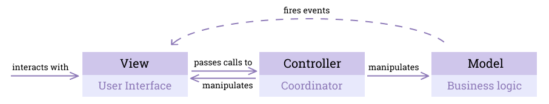
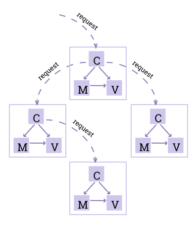
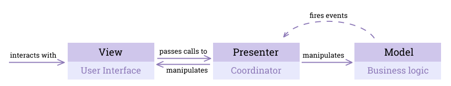
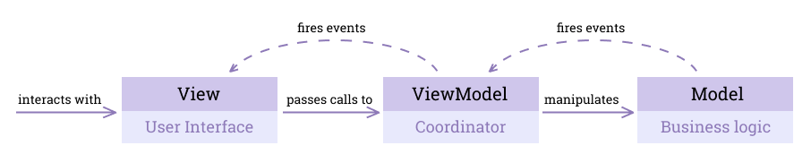
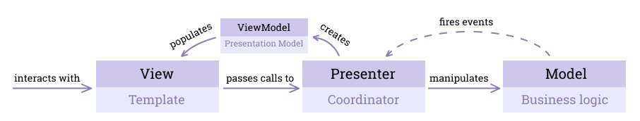
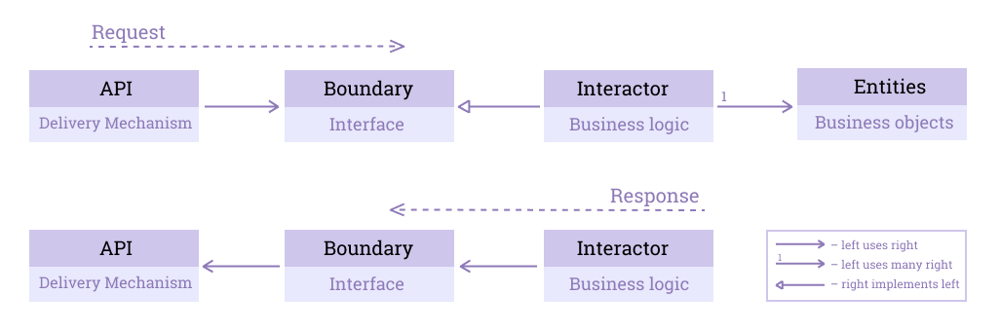
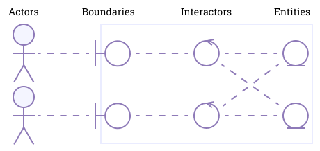
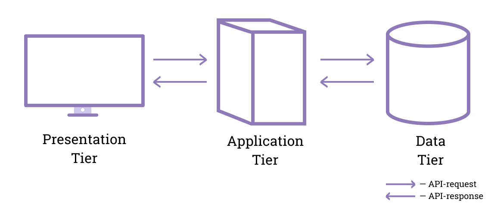
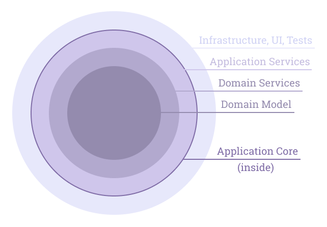

- [Определения](#определения)
  - [Архитектурный стиль](#архитектурный-стиль)
  - [Архитектурный паттерн](#архитектурный-паттерн)
  - [Паттерн проектирования](#паттерн-проектирования)
  - [Принцип проектирования](#принцип-проектирования)
- [Архитектурные стили](#архитектурные-стили)
  - [Монолитная архитектура](#монолитная-архитектура)
  - [Микросервисная архитектура](#микросервисная-архитектура)
  - [Многослойная архитектура](#многослойная-архитектура)
- [Архитектурные паттерны](#архитектурные-паттерны)
  - [MVC (1979)](#mvc-1979)
  - [Иерархический MVC (2000), PAC (1987)](#иерархический-mvc-2000-pac-1987)
  - [MVP (1996)](#mvp-1996)
  - [MVVM (2005)](#mvvm-2005)
  - [MVPVM](#mvpvm)
  - [EBI (1992)](#ebi-1992)
  - [Трёхуровневая архитектура](#трёхуровневая-архитектура)
  - [DDD (2003)](#ddd-2003)
  - [Шестиугольная архитектура, Порты и Адаптеры (2005)](#шестиугольная-архитектура-порты-и-адаптеры-2005)
  - [Луковая архитектура (2008)](#луковая-архитектура-2008)
  - [Кричащая архитектура (2011)](#кричащая-архитектура-2011)
  - [Чистая архитектура (2012)](#чистая-архитектура-2012)
- [Паттерны проектирования](#паттерны-проектирования)
  - [Порождающие](#порождающие)
  - [Структурные](#структурные)
  - [Поведенческие](#поведенческие)
- [Принципы проектирования](#принципы-проектирования)
  - [Поддерживаемый код](#поддерживаемый-код)
  - [Принципы пакетов](#принципы-пакетов)
  - [Основные принципы ООП](#основные-принципы-ооп)
  - [Принципы SOLID](#принципы-solid)
  - [Принцип разделения ответственности (SoC)](#принцип-разделения-ответственности-soc)
  - [Принцип инверсии управления (IoC)](#принцип-инверсии-управления-ioc)
  - [Принцип DRY](#принцип-dry)
  - [Принцип KISS](#принцип-kiss)
  - [Принцип YAGNI](#принцип-yagni)


# Определения

**Архитектура программного обеспечения** (Software Architecture) - набор структур, необходимый для рассуждения о системе, содержащий элементы ПО, связи между ними и их свойства.

**Архитектор** — один из опытнейших программистов в команде, умеющий анализировать высокоуровневые проблемы и их решения.  

Каждый программист при написании кода вносит свой вклад в архитектуру приложения, и важно понимать, как это делать.

Важно понимать, что не существует универсальных решений для всех приложений: все они имеют свои сильные и слабые стороны. Подобрать хорошую архитектуру можно только при условии хорошего понимания требований приложения. Иногда не подходит ни одна существующая архитектура. Так появляются новые.

> Some architectural styles are often portrayed as ‘silver bullet’ solutions for all forms of software. However, a good designer should select a style that matches the needs of the particular problem being solved. 
**Roy Fielding, 2000**

Понятия *архитектурный стиль*, *архитектурный паттерн* и *паттерн проектирования не взаимоисключающие* (not mutually exclusive), а *взаимодополняющие* (complementary). Они отличаются своей областью применения (scope).

## Архитектурный стиль

**Архитектурный стиль** (Architectural Style) в общих чертах указывает, как организовать код в проекте. Это наивысший уровень детализации (granularity), абстракции (abstraction), на котором определяются слои, модули высшего порядка приложения и их отношения, взаимодействия друг с другом.

Архитектурные стили не привязаны к конкретной реализации.

### Примеры архитектурных стилей
* Компонетный (component-based)
* Монолитный (monolithic)
* Многослойный (layered)
* Событийный (event-driven)
* Клиент-серверный (client-server)
* Сервис-ориентированный (service-oriented)

## Архитектурный паттерн

**Паттерн, шаблон** — типичное решение широко распространённой проблемы. Отличается от *алгоритма* тем, что не содержит чёткой последовательности действий, а описывает общую концепцию (идею) решения, реализации которой могут сильно отличаться.

Паттерны следует использовать только при необходимости, в противном случае они могут лишний раз усложнить код.

**Архитектурный паттерн** (Architectural Pattern) решает проблемы, связанные с архитектурными стилями.

### Примеры проблем, которые решают архитектурные паттерны
* Как много уровней (tiers) будет в наше клиент-серверной архитектуре? Как они будут взаимодействовать?
* Какие модули высшего уровня будут в нашей сервис-ориентированной архитектуре?

### Примеры архитектурных паттернов
* MVC (Model-View-Controller)
* EBI (Entity-Boundary-Interactor)
* Трёхуровневый (3-tier)

## Паттерн проектирования

**Паттерн проектирования** (Design Pattern) решает какую-то локальную проблему в проекте, затрагивая лишь конкретный блок кода, но не весь код проекта целиком.

### Примеры проблем и решающих их паттернов проектирования
* Нужно за чем-то проследить в приложении и отреагировать соотвествующем образом (например, показать уведомление при появлении пользователя в сети) — *поведенческий паттерн "Наблюдатель"*.
* Нужно написать простой интерфейс для работы со сложной системой, библиотекой, API — *структурный паттерн "Фасад"*.

## Принцип проектирования

**Принцип проектирования** (Design Principle) предоставляет высокоуровневые рекомендации (high level guidelines) для проектирования приложений. Они не предоставляют рекомендации по реализации (implementation guidelines) и не привязаны к какому-либо языку программирования.

Самыми популярными принципами проектирования являются принципы SOLID.

# Архитектурные стили

## Монолитная архитектура

**Монолитная архитектура** означает, что приложение — большой связанный модуль, все компоненты которого спроектированы для совместной работы, используя общую память и ресурсы.

## Микросервисная архитектура

Микросервисная архитектура означает, что приложение состоит из маленьких независимых приложений, использующих собственные ресурсы и развивающихся независимо друг от друга, которые потенциально могут быть размещены на разных машинах.

### Сага

**Сага** (Saga) — архитектурный паттерн для реализации транзакции, охватывающей (span) несколько сервисов. 

Внутри сервиса доступны ACID-транзакции, но между несколькими сервисами их использовать нельзя.

Saga — последовательность локальных транзакций. Каждый сервис в саге выполняет свою, локальную транзакцию и публикует событие. Другие сервисы прослушивают это событие и выполняют следующую локальную транзакцию. 

Если по какой-либо причине одна транзакция завершается неудачно, то нужно откатить (rollback) изменения предыдущих транзакций. В отличае от обыкновенных ACID-транзакций внутри сервисов, которые отменяются автоматически, в случае использования Saga каждая локальная транзакция делает commit и нужно явно (explicitly) отменить предыдущие действия. Каждая транзакция должна иметь компенсирующую (compensating) транзакцию, отменяющую её. В случае неудачи Saga поочерёдно выполняет компенсирующие транзакции.

<!-- Saga - транзакционный механизм сообщений (transactional messaging mechanism): сервисы взаимодействуют преимущественно обменом сообщений. -->

## Многослойная архитектура

**Разделение на слои** (layering) — обычная практика для организации блоков кода по их роли или обязанностям в системе.

# Архитектурные паттерны

## MVC (1979)
В 1970-ых обязанности не разделялись: смешивание HTML, CSS и работы с базой данных считалось нормальной практикой. С ростом таких приложений становилось понятно, что они очень запутанны и их невозможно поддерживать (тратится слишком много ресурсов), поэтому нередко разросшиеся приложения приходилось переписывать с нуля.

В 1979 появился архитектурный шаблон **MVC** (Model-View-Controller), попытавшийся разрешить проблему, продвигая идею **разделения ответственности** (separation of concerns, SoC) между UI и бизнес-логикой.

**Бизнес-логика** (business logic, domain logic) — часть приложения, задающая бизнес-правила, определяющие, как данные (состояние, state) предметной области (domain) приложения создаются, хранятся и изменяются.



MVC разделяет приложение на 3 концептуальные единицы
* **Модель** (Model) представляет бизнес-логику (данные и правила, методы работы с ними) приложения; не содержит информации, как отобразить данные.
* **Представление** (View) отвечает за пользовательский интерфейс и отображает часть данных из Model. Обычно это UI-компонента (кнопка, поле для ввода и прочее); то, что пользователь видит и с чем взаимодействует.  
* **Контроллер** (Controller) выступает координатором между View и Model (решает, какие Views показывать и с какими данными), переводит действия пользователя (например, клик по кнопке) в бизнес-логику.

Модель может быть представлена объектом или структурой объектов.

### Особенности MVC  
1) View использует объекты данных напрямую из Model, чтобы эти данные отобразить.  
2) Когда данные в Model меняются, срабатывает событие, немедленно обновляющее View.  
3) Один View обычно привязан к одному Controller.  
4) Каждый экран может иметь несколько пар View-Controller.  
5) Controller может быть связан с несколькими Views. 

### Проблема MVC в клиент-серверных приложениях

Когда MVC появился, протокола HTTP (1992) и клиент-серверных приложений ещё не было.  

Попытка наложить архитектуру MVC на современное клиент-серверное приложение приводит к множеству несоответствий (inconsistencies).

* View отвечает за пользовательский интерфейс, его можно отнести к клиенту.  
* Model обычно включет бизнес-логику приложения, такое лучше хранить на сервере в целях безопастности, но какая-то часть логики (например, валидация формы), может остаться на фронтенде, а соответственно и часть Model.  
* Controller реагирует на действия пользователя и манипулирует Model. Нет однозначного ответа о его расположении.  
* Изменения Модели не вызывают изменения во View напрямую: эта связь проходит через Controller. Это связано с тем, что клиент и сервер функционируют отдельно, как два разных приложения. Единственный способ исправить это — настроить веб-сокеты.

Во многих современных приложениях для того, чтобы разгрузить сервер (сократить количество запросов к нему), часть логики и состояния храяится на фронтенде. Например, взаимодействие React и Redux может можно представить в виде MVC.

## Иерархический MVC (2000), PAC (1987)

**HMVC** (Hierarchical MVC) увеличивает модульность в контексте виджетизации UI-блоков.

Существует мнение, что авторы HMVC переосмыслили другой паттерн: **PAC** (Presentation-Abstraction-Control).

HMVC разбивает уроверь клиента (client tier) на иерархию из MVC-слоёв. Это называется **проектированием клиентского уровня** (client-tier architecture) и должно увеличивать масштабируемость приложения: каждый MVC-слой независим от других и может работать при отсутствии любого другого.



Controller, обрабатывающий основной запрос, пересылает подзапросы другим Controllers, чтобы получить рендеринг виджетов и включить их в рендеринг основного View.

## MVP (1996)

*MVC* был хорош для приложений своего времени, но приложения выросли и настало время изменений.

**MVP** (Model-View-Presenter) видоизменяет MVC, разделяя View и Model и осуществляя их коммуникацию только через **Presenter**.  

Снимаем со View обязательство следить за обновлениями Model и наделяем таким обязательством Controller, переименовывая его в **Presenter**.

Если UI-логику нужно тестировать, то она размещается в Presenter, в противном случае — в View.

*Presenter* также называют **Supervisor Controller**.



В случае, когда два View зависят друг от друга (input — один View, кнопка — другой), нужно ViewModel одного View подписаться на событие, которые излучает другой ViewModel. 

### Особенности MVP 
1) View пассивен (passive) и ничего не знает о Model. 
2) Presenter не содержит бизнес-логики, он просто вызывает методы Model, а затем передаёт необходимые данные во View.  
3) Только один Presenter для каждого View.  
4) Изменение данных в Model не вызывает немедленное обновление View: событие всегда проходит через Presenter, что позволяет в нём перед обновлением View проделывать дополнительную логику, связанную с представлением.

### Зависимые Views

Пусть два Views зависят друг от друга.  
Например, первый View содержит поля для ввода (inputs), а второй View — кнопку.  
Кнопка недоступна (disabled) до тех пор, пока все поля не заполнятся.  

Если данные из полей записываются в Model, то Presenter, привязанный к полям, записывает данные в Model, а Presenter, привязанный к кнопке, читает данные из Model.  

Если данные не записываются в Model, то создаём оборачивающий Presenter, который реализует оба Presentors.

### Пример связи View и Presenter

```js
// View сообщает Presentor, что готов к обновлению данных 
const resume = () => {
  Presenter.load();
};
// View сообщает Presentor, что не хочет отображать что-либо ещё
const pause = () => {
   Presenter.stopLoad();
};
```

## MVVM (2005)
  
Сложность приложений продолжала расти и снова появилась необходимость изменений.

**MVVM** (Model-View-ViewModel) призван разделить UI и бизнес-логику таким образом, чтобы за них могли отвечать разные люди, использующие разные технологии для этих целей. 

Presenter производит (produce) данные, View потребляет (consume) их. Почему производитель должен беспокоиться о потребителе?

Таким образом, мы снимаем с Presenter обязательство изменять View. Вместо этого используем `Observable`: во View подписываемся на события (subscribe to events), излучаемые (emit) Presenter, который мы переименовываем во ViewModel.

Если UI-логику нужно тестировать, то она размещается в ViewModel, в противном случае — в View.



В случае, когда два View зависят друг от друга (input — один View, кнопка — другой), необходимо, чтобы ViewModel  View подписаться на событие, которые излучает другой ViewModel. 

### Особенности MVVM
1) Один ViewModel соответствует только одному View и наоборот.
2) Вся логика из View перемещается во ViewModel, чтобы упростить View и позволить ему выполнять свою задачу (визуализация).
3) Отношение один к одному установлено между данными во View и данными во ViewModel.
4) Изменение данных во ViewModel вызывает немедленное обновление View.

### Зависимые Views

Пусть два Views зависят друг от друга.  
Например, первый View содержит поля для ввода (inputs), а второй View — кнопку.  
Кнопка недоступна (disabled) до тех пор, пока все поля не заполнятся.  

Если данные из полей записываются в Model, то ViewModel, привязанный к полям, записывает данные в Model, а ViewModel, привязанный к кнопке, читает данные из Model.  

Если данные не записываются в Model, то создаём оборачивающий Presenter, который реализует оба Presentors.

Если данные не записываются в Model, то подписываем ViewModel, привязанный к кнопке, на событие, излучаемое ViewModel, привязанным к полям ввода.

### Пример связи View и Presenter

```js
// View сообщает Presentor, что готов к загрузке данных 
const resume = () => {
  ViewModel.subscribe(/* ... */);
};
// View сообщает Presentor, что не хочет отображать что-либо ещё
const pause = () => {
   ViewModel.unsubscribe(/* ... */);
};
```

## MVPVM

**Model** — набор классов, содержащий всю бизнес-логику и случаи использования.

**View** — шаблон (template), на основании которого геренируется HTML при помощи шаблонизатора (template engine).

**Необработанные данные** (raw data) — данные, которые не были обработаны для использования.

**ViewModel** (Presentation Model) получает необработанные данные из query и держит их для использования в шаблоне; инкапсулирует сложную логику представления для упрощения шаблона.

Почему важен ViewModel
* Изменения в Model могут всплыть и повлиять на ViewModel, но не на View.
* Сложная логика представления не просочится в предметную область (not leak into the domain), поскольку мы можем инкапсулировать эту логику во ViewModel.
* Зависимости View становятся явными, поскольку они должны быть установлены в ViewModel.

*View* и *ViewModel* имеют связь "один к одному".

**Presenter** получает HTTP-запрос (request), вызывает команду (command) или запрос (query), использует данные результата запроса (query), ViewModel, шаблон и шаблонизатор для генерации HTML и отправляет его клиенту в качестве HTTP-ответа (response).  

Все взаимодействия Views проходят через Presenter.



## EBI (1992)

Архитектурный шаблон **Entity-Boundary-Interactor** (EBI) был опубликован Иваром Якобсоном в одной из серии книг об объектно-ориентированной разработке ПО.

Изначально автор назвал архитектуру Entity-Interface-Control, но затем переименовал для понимания, что Interface не связан с одноимённой конструкцией в языках программирования, а Control не связан с Controller в MVC.

*Цель EBI*: обычно объектно-ориентированные методологии помещают все обязанности в одну сущность, без разделения, но автор книги считает, что разделение (инкапсуляция) обязанностей позволяет сделать систему более гибкой к изменениям, которые в таком случае становятся локальными (изменяется только один объект системы).
 
**Механизм доставки** (delivery mechanism) — часть приложения, которую клиент использует для выполнения приложения. Эта часть не должна определять логику приложения.



Схема работы в обозначениях, введённых автором книги.



### Entity

**Entities** содержат данные системы и всю логику, напрямую связанную с этими данными (такую логику, которая при внесении изменений в Entity тоже должна изменяться; меняется структура — меняются методы работы с ней). Эта логика не зависит от приложения.

*Entities* можно назвать бизнес-объектами приложения.

### Boundary

**Boundaries** содержат в себе функциональность, касающуюся интерфейса системы (системного окружения), то есть отвечают за связь системы с окружающим миром.

Любое *взаимодействие с системой* происходит через *Boundary*. Действующее лицо (actor) может быть не только человеком, но и другим устройсвом или сторонним API.

*Boundary принимает запрос* (request) и *выдаёт ответ* (response). Эти абстракции *реализуются* (implement) в *Interactor*.

### Interactor

**Interactors** содержат поведение, не вошедшее в Boundary и Entity (обычно это операции над несколькими Entity, результат  которых возвращается в Boundary; похоже на сервисы).

*Основная задача Interactor*: получить запрос от *Boundary*, манипулировать состоянием приложения (application state) через *Entities*, вернуть ответ *Boundary*. 

*Interactors* — слой *бизнес-логики приложения*.  

*Interactor* является конкретной реализацией (concrete implementation) *Boundary*.

*Антипаттерн*: Entity содержит лишь данные, всё поведение выносится в Interactor. 

*Interactors* важны, поскольку они содержат специфическую логику для конкретных *Boundaries*, в то время как *Entity* содержит общую (generic) логику для всех *Boundaries*. В случае, если вся логика будет храниться в *Entity*, некоторые *Boundaries* будут иметь доступ к тому, к чему не должны, что увеличивает сложность и может привести к ошибкам.

### Сравнение EBI и MVC

EBI стремится к тому, чтобы бизнес-логика приложения, представленная Entities и Interactors, была независима от механизма доставки. Эта логика не должна знать, что её использует. Это позволяет писать на любом языке для любого случая использования (use case). Требуется лишь умение определять абстракции на подобие интерфейсов. Причём статическая типизация здесь не нужна: нужен только способ создания чётких и проверяемых определений функциональности. Если необхомимой структуры нет, то дотаточно написания документации. Boundary должен быть уточнён (be specified), но не важно, каким образом.

MVC всегда зависит от механизма доставки.

View и Controller в MVC составляют весь уровень представления, Model включает в себя всё остальное в приложении, в том числе и бизнес-логику. Boundary в EBI — одно целостное соединение с окружающим миром, Entities и Interactors в EBI представляют всю бизнес-логику. Таким образом MVC и EBI не заменяют друг друга, но пересекаются. Совместное их использование породило бы паттерн View-Controller-Boundary-Interactor-Entity.

### Пример реализации EBI

```
api/
  article.ts
core/  
  entities/  
    article.ts
    entity.ts
  interactors/  
    article.ts  
services/  
  requests/  
    article.ts  
    request.ts  
  responses/  
    article.ts  
    response.ts  
  index.ts  
```

#### Entities
```ts
/* core/entities/entity.ts */
export interface Entity {
  id: string;
}

/* core/entities/article.ts */
import { Entity } from './entity.ts';

export interface Article extends Entity {
  title: string;
}

const validate = (request: Article) => {
  if (request.title.length === 0) {
    throw new Error('Article\'s title must not be empty!');
  }
  return true;
};
```

#### Interactors
```ts
/* core/interactors/article.ts */

export const createArticle (request: CreateArticleRequest): CreateArticleResponse => {
  
}

export const findArticle (request: FindArticleRequest): FindArticleResponse => {
  
}

```

#### Boundaries

```ts
/* services/article.ts */
export interface ArticleBoundary {
  createArticle(request: CreateArticleRequest): CreateArticleResponse;
  findArticle(request: FindArticleRequest): FindArticleResponse;
}
```

#### Модели запросов (Request Models)
```ts
/* services/requests/request.ts */
export interface Request {}

/* services/requests/article.ts */
import { Request } from './request.ts';

export interface FindArticleRequest extends Request {
  id: string;
}

export interface CreateArticleRequest extends Request {
  title: string;
}
```
#### Модели ответов (Response Models)
```ts
/* services/responses/response.ts */
interface Response {}

/* services/responses/article.ts */
import { Response } from './response.ts';

export interface FindArticleResponse extends Response {
  id: string;
  title: string;
}

export interface CreateArticleResponse extends Response {
  id: string;
  title: string;
}
```

## Трёхуровневая архитектура

**Трёхуровневая архитектура** (3-Tier) разбивает приложение на 3 логических уровня (слоя). 

Чаще всего используется для *клиент-серверных* приложений.

*Трёхуровневая архитектура* позволяет разрабатывать и размещать каждый уровень отдельно от остальных. Это делает приложение более масштабируемым, поскольку каждый уровень развивается и функционирует относительно независимо от других. Разбиение на уровни позволяет также нанимать узкоспециализированных специалистов (дизайнеры, верстальщики, бэкендеры, тестировщики бэкенда, DevOps), которые будут быстро и качественно выполнять свою часть работы.



### Уровни
* **Уровень представления** (Presentation Tier) содержит пользовательский интерфейс (UI). Соответствует фронтенд (HTML, JS, CSS, фреймворки и прочее).
* **Уровень приложения** (Application Tier) содержит бизнес-логику приложения. Соответствует бэкенду (Node.js, .NET, Java и прочее).
* **Уровень данных** (Data Tier) включает в себя базу данных или другую систему хранения данных, а также уровень доступа к данным (data access layer). Примеры: MySQL, MongoDB, DynamoDB и прочие.

*Уровни общаются* между собой при помощи *API-запросов*.

## DDD (2003)

Архитектуру **Domain-Driven Design** (DDD) — предметно-ориентированное проектирование — предложил Эрик Эванс.

Идея DDD: при разработке проекта основное внимание должно уделяться основной предметной области (domain) и её логике. Для этого нужно тесное сотрудничество между техническими специалистами и экспертами предметной области.

### Единый язык

**Единый, повсеместный, общий  язык** (Ubiquitous language) — общий язык между предметной областью и её технической реализацией. Источником этого языка должна быть предметная область (бизнес).  

Каждая предметная область имеет свои определения, часто встречающиеся в требованиях заказчика, но программисты часто переименовывают многие вещи по-своему, создавая таким образом свою собственную модель предметной области, придумывают свои понятия, которые потом нужно объяснять другим программистам. Так возникают барьеры недопонимания, чего нужно избегать.

Разработка единого языка требует много времени на тщательный анализ требований и консультации с экспертами предметной области, но это позволяет создать внутреннюю базу знаний клиента. 

### Слои в DDD
* **Пользовательский интерфейс** (User Interface) обеспечивает взаимодействие окружающего мира с приложением, преобразуя входные данные в команды приложению (аналогично Boundary в EBI).
* **Слой приложения** (Application Layer) управляет объектами предметной области (Domain Objects), чтобы выполнять приходящие команды — **Случаи использования** (the Use Cases). Не содержит бизнес-логику. На этом слое лежат *Сервисы приложения* (Application Services), являющиеся контейнерами, в которых используются такие объекты предметной области, как Репозитории, Domain-сервисы, Сущности, Value-объекты (аналогично Interactor в EBI, но не все "не Boundary, не Entity" объекты, а только соотвутствующие *Случаям использования*).
* **Слой предметной области** (Domain Layer) содержит всю бизнес-логику. (аналогично Entity в EBI).
* **Инфраструктура** (Infrastructure) содержит технические возможности, которые поддерживают слои выше (например, отправка сообщений).

### Объекты предметной области

**Контекст** (Context) — окружение рассматриваемого объекта, влияющее на его смысл.

**Предметная область** (Domain) — сфера знаний, к которой относится программа.

**Модель** (Model) — система абстракций, описывающая выбранные аспекты предметной области и использующаяся для решения её проблем.

**Сущность** (Entity) — объект, имеющий индивидуальные черты. Имеет уникальный идентификатор (id). Две Сущности считаются разными даже в случае совпадения всех свойств.

Пример Сущности: Несмотря на то, что в кинотеатре все места выглядят одинаково, каждое место имеет свой номер (уникальный идентификатор). Посетитель приходит и садится на место, указанное в его билете. 

**Value-объект** (Value Object) — неизменяемый (immutable) тип объекта, полностью определяемый значениями своих свойств. В отличие от Сущности не имеет уникального идентификатора (id). Два Value-объекта с одинаковыми свойствами считаются идентичными.

Пример Value-объекта: В общественном транспорте все места одинаковы: можно сесть куда угодно, нумерация не имеет значения. 

**Агрегат** (Aggregate) — коллекция объектов, связанных вместе корневой Сущностью — **корнем агрегата** (Aggregate Root). 

Корневой агрегат гарантирует согласованность изменений, вносимых в агрегат, не позволяя внешним объектам хранит ссылки на его элементы. 
Агрегаты можно рассматривать как ограниченный контекст, предоставляющий корневому объекту и всему графу объектов контекст, в котором они используются.

**Репозиторий** — объект, сохраняющий Сущности или Агрегаты в базовый механизм хранения или извлекающий ихиз него.  

Репозиторий является частью модели предметной области (domain model), поэтому он должен быть независим от поставщика (vendor) базы данных.

**Сервис** — объект, содержащий методы (команды), концептуально не привязанные к какому-либо объекту (Entity, Value-объекту). Не имеет состояния (stateless).

### Ограниченный контекст

В корпоративных (enterprise) системах, где работает огромное количество разработчиков, модель может сильно разрастить. Сложно держать всю структуру огромного проекта в голове. Сложно распределять обязанности, когда все работают в одном месте. В этом случае систему обычно разбивают на подсистемы. 

**Ограниченный контекст** (Bounded context) — подсистема в рамках DDD, определяющая контекст применения изолированной части модели.

Изолированность достигается разными способами (например, разделением схемы базы данных на части или разделением обязанностей между программистами по их умениям).  

Хорошее разделение: сильная функциональная связь внутри подсистем и слабая между подсистемами.

### Антикоррупционный слой

**Антикоррупционный слой** — промежуточный слой между двумя подсистемами, заменяющий их взаимодействие друг с другом на взаимодействие с собой; изолирующий подситемы друг от друга. В таком случае при удалении или замене одной из подсистем вторая останется неизменной (изменится только антикоррупционный слой).

Антикоррупционный слой можно использовать, когда одна или обе подсистемы не контролируются, или когда нужно предотвратить утечку из  модели одной системы в другую (изменяем одну подсистему под требования другой).

### Общее ядро

Иногда, несмотря на преимущества изолированности, имеет смысл использовать общий код между несколькими компонентами (чтобы не дублировать его). Компоненты остаются независимыми друг от друга, хотя и используют **общее ядро** (shared kernel). 

Так один компонент может прослушивать событие, запущенное другим копонентом. Другой пример: использование сервиса.

Изменять общее ядро нужно очень осторожно, поскольку оно может сломать сразу несколько компонент.

### Общая подобласть

**Подобласть** (subdomain) — хорошо изолированная часть предметной области (domain).

**Общая подобласть** (generic subdomain) — подобласть, которая не специфична конкретно для приложения, а может использоваться почти в любом другом. (например, рисование статистики, работа с камерой, платёжные методы).

Если в приложении есть общие подобласти, нужно уделять им как можно меньше внимания по сравнению с предметной область. Это не самая важная часть приложения, а если и важная, то не критичная (essential but not crucial). 

Общие подобласти лучше не писать, а устанавливать как сторонние пакеты.

## Шестиугольная архитектура, Порты и Адаптеры (2005)

**Архитектура "Порты и Адаптеры"** (Ports & Adapters Architecture), **Шестиугольная архитектура**  (Hexagonal Architecture) была предложена Алистером Кокбёрном.

*Цель Шестиугольной архитектуры*: позволить приложению одинаково управляться пользователями, программами, автоматизированными тестовыми сценариями, а также разрабатываться и тестироваться изолированно от возможных устройств и баз данных.

Основная идея заключается в том, чтобы оградить наше приложение (центральный блок системы) от всего ввода и вывода при помощи порта, ограничивающего приложение от внешних инструментов и технологий. Таким образом приложение не знает, что именно отправило ему входные данные и что получило выходные данные из него. Это позволяет обеспечить некоторую защиту приложения от изменений внешних технологий (например, замены технологии) и бизнес-требований.

### Проблемы традиционного подхода
Проблема на фронтенде: происходит утечка бизнес-логики в UI (например, логика для конкретного случая использования попадает во View или Contoller, что не может переиспользоваться в других UI-компонентах).

Проблема на  бэкенде: происходит утечка внешних библиотек и технологий в бизнес-логику, потому что мы часто напрямую ссылаемся на эти технологии, используем их типы, создаём подклассы и экземпляры классов библиотек в нашей бизнес-логике.

### Шестиугольник

Многослойные архитектуры по типу EBI, DDD показывают преимущества использования слоёв в архитектуре.

Автор подхода осознал, что у всех многослойных архитектур есть что-то общее, их можно упростить следующим образом:  
Представление (Presentation) — Бизнес-логика (Business logic) — Данные (Data).

Также Алистер заметил, что Представление и Данные являются по сути точками входа/выхода приложения, то есть в приложении есть симметрия.

Представим схему со слоями не сверху вниз, а слева направо и разделим на две симметричные части, каждая из которых будет содержать несколько точек входа/выхода, а в центре приложение. Например, левая содержит точки UI и API, а правая — точки ODM, поисковой движок и сервис отправки SMS-сообщений.

Чтобы показать, что приложение имеет много точек входа/входа, приложение представляется в виде многоугольника (одна сторона — одна точка). Несмотря на то, что сторон может быть сколько угодно, архитектуру назвали шестиугольной (hexagonal).

### Порт и Адаптер

**Порт** (Port) — независимая точка входа в приложение и (или) точка выхода из него. Во многих языках это называют *интерфейсом*. Мы используем этот интерфейс как точку входа/выхода, не зная конкретной реализации.

**Адаптер** (Adapter) — класс, адаптирующий (adapt) один интерфейс к другому. 

**Первичный, управляющий адаптер** (Primary, Driving Adapter) — адаптер левой стороны схемы, отвечающей за UI и API. Запускает какое-то действие в приложении. 

*Первичный адаптер* зависит от порта и содержит конкретную реализацию порта, содержащую случай использования (the Use Case). Порт и его реализация (случай использования) принадлежат приложению.

**Вторичный, управляемый адаптер** (Secondary, Driven Adapter) — адаптер правой стороны схемы, отвечащей за подключение бэкенд-технологий. Реагирует на действие первичного адаптера.

*Вторичный адаптер* — конкретная реализация порта, внедряющаяся в бизнес-логику приложения (хотя бизнес-логика  знает только об интерфейсе). Порт принадлежит приложению, а его конкретная реализация лежит снаружи и оборачивает какой-то внешний инструмент.

### Пример использования Вторичных Адаптеров

Нужно подключить Mongoose ODM к нашему приложению, чтобы связать его с базой данных MongoDB.  

При ипользования традиционного подхода, мы напрямую используем возможности Mongoose.
```js
const mongoose = require('mongoose');

const User = mongoose.model('User', { name: String });

const create = (name) => {
  const user = new User({ name });
  return user.save();
};
```
Через месяц заказчик передумал: теперь он хочет реляционную базу данных.  
Нужно заменить Mongoose ODM на Sequelize ORM.
```js
const { Sequelize, Model, DataTypes } = require('sequelize');
const sequelize = new Sequelize(/* ... */);

class User extends Model {}
User.init({ name: DataTypes.STRING }, { sequelize, modelName: 'user' });

const create = name => User.create({ name });
```
Такая миграция кода достаточно болезненна.

В случае использования Портов и Адаптеров, мы создаём интерфейс (порт), подсказывающий, что должно быть реализовано.
```ts
interface IUser {
  name: string!
}

/* порт */
interface IUserRepository {
  create: (name: string) => IUser
}
```
Создаём Адаптер `UserMongoAdapter`, в котором и будет хранится вся логика работы с Mongoose, включающая реализацию порта.

Теперь, когда поступает задание о смене базы данных, мы просто создаём ещё один Адаптер `UserSequelizeAdapter` с другой реализацией порта. 

Теперь мы можем достаточно просто заменять один адаптер другим.  
Если мы хотим делать это в режиме реального времени (runtime), то следует использовать паттерн "Фабрика".

Тестирование также упрощается. Создаются Макет (Mock) или Зуглушка (Stub) на основании интерфейса (порта) и приложение тестируется без взаимодействия с реальной базой данных.

### Пример использования Первичных Адаптеров

Пусть у нас есть два UI: основной сайт для пользователей и инструменты модераторов.  
Хотим сделать функциональность отправки электронных сообщений, доступный в обоих UI.

Используя Порты и Адаптеры, мы должны создать интерфейс (порт) предполагаемого сервиса `EmailService` и реализовать его в приложении.
```ts
interface IEmailService {
  sendEmail: (receiver: string, message: string) => void
}
```
Метод `sendEmail` является Случаем использования (Use Case).

Каждый UI имеет свой Controller (или команду консоли), использующий интерфейс, чтобы вызывать реализованные в сервисе методы. В данном случае Controller и есть Адаптер (адаптер находится на фронтенде, а порт и его реализация на бэкенде).

Теперь мы можем быть уверены, что UI не затронет бизнес-логику.

Тестирование такогоподхода тоже имеет свои преимущества. Мы тестируем UI отдельно от приложения и тестируем случаи использования отдельно от UI.

## Луковая архитектура (2008)

**Луковая архитектура** (Onion Architecture) предложена Джефри Палермо.

Луковая архитектура имеет схожую идею с Шестиугольной: использовать что-то похожее на Адаптер во избежание утечки инфраструктуры (сторонние библиотеки и API) в бизнес-логику. Но, помимо предложенного в Шестиугольной архитектуре разделения на внутренний (internal) слой с бизнес-логикой и внешний (external) слой с инфраструктурой, добавляются дополнительные слои, напоминающие слои в DDD.

*Слои* предтавляются в *форме луковицы*.  
*Внешние слои зависят* от *внутренних*, *внутренние* ничего *не знают* о *внешних*.  
Это позволяет нам изменять внешние слои, не затрагивая внутренние, что напоминает принцип Dependency Inversion из SOLID, но на архитектурном уровне.

Более того, любой внешний слой может напрямую обращаться к любому внутреннему.  
Это позволяет избежать создания вспомогательных прокси-методов и классов, усложняющих код.



### Ключевые принципы Луковой архитектуры
* Приложение построено вокруг независимой объектной модели (в центре луковицы располагается модель предметной области, которая ни от чего не зависит).
* Внутренние слои определяют интерфейсы, внешние слои их реализовывают.  
* Направление связанности идёт к центру (direction of coupling is toward the center).
* Ядро приложения (Application Core) может быть запущено отдельно от инфраструктуры.

## Кричащая архитектура (2011)

**Кричащая архитектура** (Screaming Architecture) предложена Робертом С. Мартином.  

Идея Кричащей архитектуры: Архитектура должна чётко показывать, в чём заключается суть системы.   

Первые папки в проекте должны быть связаны с предметной областью, верхним уровнем абстракции (Users, Admins, Messages), но не с названием технологий (mongodb, jwt, redis), не с функциональными блоками (services, controllers, repositories), не с механизмами доставки (http, консоль).

## Чистая архитектура (2012)

**Чистая архитектура** (Clean Architecture) предложена Робертом С. Мартином (дядей Бобом).

*Чистая архитектура* объединяет в себе многие известные идеи, стили и паттерны чтобы показать, как они могут работать вместе.

*Цель Чистой архитектуры* та же: независимость от внешних инструментов и механизмов доставки.

### Слои в Чистой архитектуре
Шестиугольная архитектура имеет только два слоя: внешний и внутренний.

Луковая архитектура: Сервисы приложения (Application services), Сервисы предметной области (Domain Services), Модель предметной области (Domain Model) — основная часть приложения (Application Core), пользовательский интерфейс и инфраструктура — внешняя часть.

Чистая архитектура: Сервисы приложения, Слой сущностей (Entities Layer) — основная часть приложения. 

Таким образом, Роберт Мартин объединил два слоя в один для простоты, переопределив понятие сущности.

**Сущность** (Entity) — объект с методами или набор структур данных и функций.

### Поток управления

1. HTTP-запрос поступает в Controller.  
2. Создаётся модель запроса (Request Model).  
3. Выполняется метод в Interactor, передавая ему модель запроса.  
4. Interactor использует реализацию Entity Gateway, чтобы найти необходимые сущности; оперирует ими; генерирует из результата модель ответа (Response Model); передаёт модель ответа в Presenter и возвращает его в Controller.  
5. Используется Presenter, чтобы сгенерировать ViewModel.  
6. ViewModel привязывается ко View.  
7. View возвращается клиенту.  

# Паттерны проектирования

## Порождающие

**Порождающие паттерны** отвечают за удобное и безопасное создание новых объектов (групп объектов).

### Одиночка

**Одиночка** (Singleton) — порождающий паттерн, гарантирующий существование только одного объекта определённого класса. Одиночка позволяет обратиться к этому объекту из любого места в приложении.

Часто считается антипаттерном, поскольку нарушает модульность кода (похож на глобальную переменную).

Для реализации одиночки пишется класс с приватным конструктором; стратическим полем, хранящим экземпляр (instance) класса, и статическим методом, создающим и сохраняющим экземпляр при первом обращении и возвращает при последующих.
```ts
class Singleton {
  private static instance: Singleton;
  private constructor() {}
  static getInstance(): Singleton {
    if (!Singleton.instance) {
      Singleton.instance = new Singleton();
    }
    return Singleton.instance;
  }
}

const singletonA = Singleton.getInstance();
const singletonB = Singleton.getInstance();
console.log(singletonA === singletonB); // true
```
## Структурные

## Поведенческие

# Принципы проектирования

## Поддерживаемый код

Наличие **поддерживаемого кода** (maintainable code base) означает возможность применения максимума концептуальных изменений с минимальным изменением кода, то есть изменение одного блока кода должно оказывать минимально возможное влияние на другие блоки. В таком случае изменения делаются проще и быстрее, а баги появляются реже.

**Связанность, зацепление** (coupling) отражает зависимость блоков кода друг от друга. Два блока кода **сильно связанны** (highly coupled), если изменения в одном блоке порождают изменения в другом, **слабо связанны** (loosely coupled), если один блок не зависит или почти не зависит от изменений другого. 

**Сплочёность, связность** (cohesion) отражает, насколько тесно связаны по смыслу функции одного модуля. **Низкая сплоченность** (low cohesion) характерна модулям, имеющим разные несвязнные обязанности, **высокая сплочёность** (high cohesion) — модулям, функции которых выполняют во многом похожие задачи.

### Основные принципы поддерживаемого кода
1) *Инкапсуляция* (encapsulation). Процесс сокрытия внутренних деталей реализации.  
2) *Слабая связанность* (low coupling). Достигается за счёт выбора правильного интерфейса.  
3) *Высокая сплочёность* (high cohesion).

Слово "**функциональный** (functional; блок кода, метод, класс и тд) отражает чисто техническую роль в приложении, оно не связано с предметной областью. Примеры функционального: слой (layer), фабрика (factory), View.

Слово "**концептуальный**" (conceptual; блок кода, метод, класс и тд) отражает бизнес-роль в приложении, оно напрямую связано с предметной областью (domain). Примеры концептуального: User, Article, Comment, Like.

Одна и та же вещь в зависимости от того, с какой стороны на неё смотреть, может быть функциональной и концептуальной одновременно.

**Пакет** — сгруппированный набор классов.  
**Модуль** — функциональный пакет.  
**Компонента** — концептуальный пакет.

Описанные принципы написания поддерживаемого кода часто применяются к отдельным классам, но также и к *пакетам* (*модулям*, *компонентам*). Это позволяет разрабатывать их максимально независимо друг от друга, разделяя обязанности между разными командами разработчиков. Выполнение принципов концептуально изолирует код, который в этом случае хорошо читается, легко тестируется и переиспользуется.

В *хорошо организованном проекте* (well-organised codebase) есть только одно конкретное место, где может лежать какой-то блок кода. 
Можно не знать точное местоположение, но есть только один логический путь, ведущий туда. Это позволяет избежать несогласованности данных, потерянного и дублированного кода, экономит время и нервы разработчиков.

## Принципы пакетов

Группируя классы в пакеты по каким-то критериям (концептуально), мы можем рассуждать об организации проекта на высшем уровне абстракции, управляя отношениями между этими пакетами.

### Принципы сплочёности пакетов (cohesion)
* **Reuse-Release Equivalency (RRE)**. Пакеты должны выпускаться и версионироваться отдельно друг от друга, чтобы всегда можно было выбрать старую версию пакета, если новая не корректно работает.
* **Common-Reuse Principle (CRP)**. Классы в пакете переиспользуются (reuse) вместе. Переиспользуешь один — переиспользуешь все.
* **Common-Closure Principle (CCP)**. Классы, изменяющиеся вместе, должны быть упакованы (packeged) вместе. Чтобы в случае изменений изменялся только один пакет, не затрагивая другие.

### Принципы связанности пакетов (coupling)
* **Acyclic-Dependencies Principle (ADP)**. Циклы в графе пакетных зависимостей недопустимы.
* **Stable-Dependencies Principle (SDP)**. Зависимости в направлении стабильности. Часто меняющиеся части системы должны зависеть от редко меняющихся (стабильных), но не наоборот. 
* **Stable-Abstractions Principle (SAP)**. Стабильные пакеты должны быть более абстрактными и содержать те классы и модули, которые можно расширять, а не те, которые должны изменяться. При изменении классов в пакете велика вероятность изменений их использования, а значит и изменений в зависимых пакетах.

## Основные принципы ООП

### Инкапсуляция

### Наследование

### Полиморфизм

### Абстракция

## Принципы SOLID

Принципы SOLID были разработаны Робертом С. Мартином.

* **Single Responsibility Principle** (SRP, Принцип единственной ответственности).
* **Open-Closed Principle** (OCP, Принцип открытости-закрытости).
* **Liskov Substitution Principle** (LSP, Принцип подстановки Барбары Лисков).
* **Interface Segregation Principle** (ISP, Принцип разделения интерфейса).
* **Dependency Inversion Principle** (DIP, Принцип инверсии зависимостей).

### SRP: Принцип единственной ответственности

Должна быть лишь одна причина изменить класс, то есть класс должен быть ответственен лишь за что-то одно.  

Если класс отвечает за решение нескольких задач, его подсистемы, реализующие решение этих задач, оказываются сильно связанны друг с другом. Изменения в одной такой подсистеме ведут к изменениям в другой.

### OCP: Принцип открытости-закрытости

Программные сущности (классы, модули, функции) должны быть открыты для расширения (extension), но не для модификации (modification).

### LSP: Принцип подстановки Барбары Лисков

Необходимо, чтобы подкласс (subclass) мог служить заменой для своего родительского класса, суперкласса.

### ISP: Принцип разделения интерфейса

Нужно создавать узкоспециализированные интерфейсы, предназначенные для конкретных целей.  

Клиенты не должны зависеть от тех элементов интерфейса, которые они не используют.

### DIP: Принцип инверсии зависимостей

Зависимость должна идти в сторону абстракции, а не чего-то конкретного.

Абстракции не должны зависеть от деталей.  
Детали должны зависеть от абстракций.

Модули верхних уровней не должны зависеть от модулей нижних уровней.  
Оба типа модулей должны зависеть от абстракций.

## Принцип разделения ответственности (SoC)

**Принцип разделения ответственности** (Separation of Concerns, SoC) предполагает разделение приложения на функциональные блоки, как можно меньше перекрывающие функции друг друга.

Объектно-ориентированные языки разделяют ответственность между объектами, процедурные языки — между процедурами и функциями, микросервисная архитектура — между сервисами. Многие архитектуры стремятся отделить представление (Presentation) от бизнес-логики (Business Logic) приложения, некоторые архитектуры дополнительно разделяют бизнес-логику на предметную область (Domain) и на её конкретную реализацию. OOCSS разделяет структурные свойства (Structure) и свойства оформления (Skin). В сетевой модели OSI протокол HTTP отвечает за взаимодействие с пользователем — прикладной уровень (Application layer), за саму передачу данных отвечает протокол TCP — транспортный уровень (Transport  layer). 

## Принцип инверсии управления (IoC)

**Принцип инверсии управления** (Inversion of Control, IoC) предполагает передачу, дилегирование управления из одного места в другое, что позволяет достичь слабой связанности (loose coupling) кода.

Пример из жизни: человек может приготовить еду сам, а может просто заказать её, тогда ему не нужно заботиться о процессе приготовления пищи.  

Путь есть два класса: `Employee`, отвечающий за рабочих, и `Salary`, отвечающий за заработную плату. 
Пусть также каждый новый рабочий по умолчанию получает `500$`.
```ts
class Employee {
  salary: Salary;

  constructor() {
    this.salary = new Salary(500, '$');
  }

  getSalary() {
    return this.salary.toString();
  }
}

class Salary {
  value: number;
  currency: string;

  constructor(value: number, currency: string) {
    this.value = value;
    this.currency = currency;
  }

  toString() {
    return `${this.value}${this.currency}`;
  }
}

const emp = new Employee();
console.log(emp.getSalary());
```
Класс `Employee` напрямую создаёт объект класса `Salary` в своём конструкторе, что делает их сильно связанными. Изменения в `Salary` влекут за собой непосредственные изменения в `Employee`.

Более того, мы не можем изолированно протестировать класс `Employee`, поскольку не можем заменить создание объекта класса `Salary` заглушкой (stub) или заменить класс `Salary` макетом (mock).

Сделаем фабрику, которая будет создавать Salary-объекты.
```ts
const SalaryFactory = (value: number, currency: string): Salary => new Salary(value, currency);
```
и заменим строку `this.salary = new Salary(500)` на `this.salary = SalaryFactory(500)`.

Результат выполнения кода тот же, но мы ослабили связь между классами `Employee` и `Salary`, передав контроль над созданием объектов фабрике. Теперь, если класс `Salary` изменится, мы сможем оградить `Employee` от изменений, внеся изменения только в фабрику.

Например, конструктор класса `Salary` должен теперь принимать один параметр вместо двух: `new Salary('500$')`, тогда фабрика изменится следующим образом
```ts
const SalaryFactory = (value: number, currency: string): Salary => new Salary(`${value}${currency}`);
```

<!-- Также мы теперь можем протестировать `Employee` независимо от `Salary` при помощи следующей заглушки:
```ts
const SalaryFactory = (): object => ({ value: 500, currency: '$', toString() { return this.value + this.currency; } });
```-->

## Принцип DRY

**Принцип DRY** (Don’t repeat yourself) переводится как "Не повторяйся" и нацелен на снижение повторения информации различного рода.
> Every piece of knowledge must have a single, unambiguous, authoritative representation within a system.

«Каждая часть знания должна иметь единственное, непротиворечивое и авторитетное представление в рамках системы».

Когда DRY применяется правильно, изменение элемента системы не требует изменений в других, логически не связанных элементах.

Нарушение принципа DRY называют WET (Write Everything Twice), переводящееся как "Пиши всё дважды".  
Игра слов: dry — сухой, wet — влажный.

Простой пример применения принципа DRY: видишь часто повторяющийся код — выносишь его в функцию или переменную.

## Принцип KISS

**Принцип KISS** (keep it short and simple) переводится как "Держи это коротким и простым" и утверждает, что в большинстве случаев система работает лучше, если отаётся простой, поэтому в области проектирования простота должна быть одной из ключевых целей и следует избегать ненужной сложности.

## Принцип YAGNI

**Принцип YAGNI** (You aren't gonna need it) переводится как "Вам это не понадобится" и утверждает, что не следует добавлять функциональность пока не возникнет необходимость в этом.
> Always implement things when you actually need them, never when you just foresee that you need them.

«Всегда реализуй вещи, когда ты действительно в них нуждаешься, никогда, если ты предвидишь, что они тебе понадобятся».

Написание ненужного в данный момент кода требует время и поддержку, которые могли быть затрачены на важные в данный момент вещи. Такой код ограничивает то, что может быть сделано в будущем, увеличивает сложность приложения.
