- [Реляционная модель данных](#реляционная-модель-данных)
  - [О реляционной модели данных](#о-реляционной-модели-данных)
  - [Коротко о главном из теории множеств](#коротко-о-главном-из-теории-множеств)
  - [О типе данных (домене)](#о-типе-данных-домене)
  - [Отношение и его структура](#отношение-и-его-структура)
  - [Свойства отношений](#свойства-отношений)
  - [Графическое представление отношения (таблица)](#графическое-представление-отношения-таблица)
  - [Операции над отношениями](#операции-над-отношениями)
- [О базах данных](#о-базах-данных)
  - [Реляционные и нереляционные базы данных](#реляционные-и-нереляционные-базы-данных)
  - [Типы баз данных](#типы-баз-данных)
  - [ORM и ODM](#orm-и-odm)
  - [Транзакции и их свойства](#транзакции-и-их-свойства)
  - [Индекс базы данных](#индекс-базы-данных)
  - [Курсоры](#курсоры)
- [Масштабирование баз данных](#масштабирование-баз-данных)
  - [Репликация](#репликация)
  - [Шардинг](#шардинг)
  - [Партиционирование](#партиционирование)
- [Резидентные базы данных](#резидентные-базы-данных)
  - [Преимущества и недостатки резидентной базы данных](#преимущества-и-недостатки-резидентной-базы-данных)
  - [Redis](#redis)
- [Основы SQL](#основы-sql)
  - [Типы команд в SQL](#типы-команд-в-sql)
  - [Отношения](#отношения)
- [Инструкции SQL](#инструкции-sql)
  - [Инструкции для работы с базой данных](#инструкции-для-работы-с-базой-данных)
  - [Создание таблицы с помощью CREATE](#создание-таблицы-с-помощью-create)
  - [Вставка в таблицу с помощью INSERT](#вставка-в-таблицу-с-помощью-insert)
  - [Запросы SELECT](#запросы-select)
  - [Запросы SELECT с условиями WHERE](#запросы-select-с-условиями-where)
  - [Сортировка при помощи ORDER BY](#сортировка-при-помощи-order-by)
  - [Агрегатные функции](#агрегатные-функции)
  - [Группировка значений при помощи GROUP BY](#группировка-значений-при-помощи-group-by)
  - [Связь таблиц при помощи JOIN](#связь-таблиц-при-помощи-join)
  - [Виртуальная таблица VIEW](#виртуальная-таблица-view)
  - [Изменение данных с помощью UPDATE](#изменение-данных-с-помощью-update)
  - [Удаление данных с помощью DROP](#удаление-данных-с-помощью-drop)
  - [Удаление данных с помощью TRUNKATE и DELETE](#удаление-данных-с-помощью-trunkate-и-delete)
  - [Вложенные запросы SELECT](#вложенные-запросы-select) 

<!--
**DAO** (Data Access Object) — объект, представляющий абстрактный интерфейс к какой-то базе данных или другому механизму хранения (persistence mechanism). Он сопоставляет вызовы приложения (app calls) с уровнем хранения (persistance layer), предоставляя некоторые методы работы с данными, не раскрывая детали базы данных. Пример инструмента с DAO: ORM.
**DTO** (Data Transfer Object) — объект, передающий данные между подсистемами приложения. В отличие от DAO, DTO не может содержать поведение (кроме хранения, поиска, сериализации и десериализации своих собственных данных). DTO используют, чтобы объединить в них данные нескольких запросов в один запрос (поскольку подсистемы могут общаться запросами, а каждый запрос - дорогостоящая операция).
**CRUD** (Create, Read, Update, Delete) — базовый набор операций постоянного хранилища (persistent storage): создание, чтение, обновление, удаление.
-->


# Реляционная модель данных

- [О реляционной модели данных](#о-реляционной-модели-данных)
- [Коротко о главном из теории множеств](#коротко-о-главном-из-теории-множеств)
- [О типе данных (домене)](#о-типе-данных-домене)
- [Отношение и его структура](#отношение-и-его-структура)
- [Свойства отношений](#свойства-отношений)
- [Графическое представление отношения (таблица)](#графическое-представление-отношения-таблица)
- [Операции над отношениями](#операции-над-отношениями)

## О реляционной модели данных

<!--
Ключевым понятием реляционной модели данных является **отношение**. Это понятие пришло из теории множества, и для его полного понимания рекомендуется прочитать
-->

*Реляционная модель данных основана* на понятии *отношения*, которое *пришло* из *теории множеств*.

## Коротко о главном из теории множеств

- [Множество](#множество)
- [Кортеж](#кортеж)
- [Декартово произведение множеств](#декартово-произведение-множеств)
- [Отношение в теории множеств](#отношение-в-теории-множеств)


### Множество

**Множество** - это *неупорядоченный набор уникальных объектов*, *обладающих схожими признаками*. Эти *объекты* называются **элементами множества**.

Примеры *множеств*: *множество женских имён*: `N = { Ася, Сара, Рози }`, *множество профессий*: `J = { дизайнер, программист }`, *множество дат*: `D = { 2019, 2020 }`.

*Неупорядоченность множества* означает, что *множества* `{ 2019, 2020 }` и `{ 2020, 2019 }` *считаются одинаковыми*.

*Уникальность элементов множества* означает, что *множество не может содержать* двух и более *одинаковых элементов*. То есть *набор* `{ 3, 2, 2 }` - *не множество*.

### Кортеж

**Кортежем длины n** называют *упорядоченный набор объектов* (*не обязательно уникальных*) `(x1, x2, ..., xn)`, где `x1, x2, ..., xn` *принадлежат* множествам `X1, X2, ... Xn` (не обязательно различным).

Примеры *кортежей*: *кортеж из элементов множеств* `N`, `J`, `D` соответственно: `(Ася, дизайнер, 2019)`, *координаты точки* на плоскости: `(1, 1)`, *набор аргументов функции* `f(x1, x2, x3)`.

*Упорядоченность кортежа* означает, что *кортежи* `(Рози, 2020)` и `(2020, Рози)` *считаются различными*. *Соблюдение порядка элементов кортежа* так же *важно*, как *соблюдение порядка букв в словах* и *цифр в числах*.

*Кортеж длины 2* также называют **упорядоченной парой**, *кортеж длины 3* - **упорядоченной тройкой**.

### Декартово произведение множеств

**Декартово произведение множеств** `X1, X2, ..., Xn` - это операция над множествами `X1, X2, ..., Xn` (не обязательно различными), результатом которой является множество всевозможных кортежей `(x1, x2, ..., xn)`, где элементы `x1, x2, ..., xn` *принадлежат* множествам `X1, X2, ..., Xn` соответственно. Обозначение: `X1 × X2 × ... × Xn`.

Например, декартово произведение `N × D = { (Ася, 2019), (Ася, 2020), (Сара, 2019), (Сара, 2020), (Рози, 2019), (Рози, 2020) }`, а декартово произведение `N × J × D` состоит из `3 • 2 • 2 = 12` кортежей. по типу `(Ася, дизайнер, 2019)`.

### Отношение в теории множеств

**n-арным отношением** `R` **между множествами** `X1, X2, ..., Xn` называют *подмножество декартового произведения* `X1 × X2 × ... × Xn`, то есть *множество*, *содержащее некоторые элементы* (кортежи) множества `X1 × X2 × ... × Xn`. Число `n` - **арность отношения**.

Например, *множество* `{ (Сара, 2019), (Рози, 2020) }` является *бинарным отношением между* множествами `N` и `D`.

*Отношения* могут *обладать* некоторыми *свойствами*и *наделять ими* свои *элементы*.

## О типе данных (домене)

**Тип данных** - это *множество допустимых значений*. *Переменная*, *параметр*, *атрибут* - *любое значение имеет* свой *тип*, называемый *типом данных*.

В *реляционной модели данных тип данных* также *называют* **доменом**.

Вообще говоря, *основными типами данных* в *программировании* являются *числовой* (`7`, `3.14`), *строковый* (`"развитие"`, `'enginer'`) и *логический* (`истина`, `ложь`).

*На практике* же часто *выделяют больше типов*, чтобы *сузить область допустимых значений* и, таким образом, больше *ограничить пользователя*. Например, *числа подразделяют* на *целые* (`integer`) и *дробные* (`float`).

Если мы указываем, что значение принадлежит какому-то типу, то другому типу оно уже приналежать не может.

Типы, предопределённые в системе, называют **базовыми типами**. Многие системы позволяют пользователю *на основе базовых типов создавать* новые - **пользовательские типы**.

В *реляционной модели данных обязательным базовым типом* является лишь *логический* (`boolean`): без него невозможно рассматривать операции над отношениями.

## Отношение и его структура

Понятие *отношения* в *реляционной модели данных отличается* от понятия *отношения* в *теории множеств* лишь тем, что *множествами* `X1, X2, ..., Xn` *выступают типы данных* `T1, T2, ..., Tn` (так же *являющиеся множествами* по определению).

Пусть *имеются типы данных* `T1, T2, ..., Tn` (*не обязательно различные*), тогда **n-арным отношением** (англ. relation) `R` называют *подмножество декартового произведения* `T1 × T2 × ... × Tn`. 

Грубо говоря, *отношение* - это некоторое *множество* (набор) *кортежей*, имеющих *одинаковую схему*, то есть *кортежей* `(t1, t2, ..., tn)`, где `t1, t2, ..., tn` *принадлежат множествам* `T1, T2, ..., Tn` *соответственно*.

*Отношение состоит* из *заголовка* и *тела*. 


### Заголовок отношения

*Заголовок отношения содержит атрибуты* и *соответствующие* им *типы данных*.

**Заголовком** (*схемой*) `H` (англ. header) **отношения** `R` называют *множество упорядоченных пар* `(a, t)`, где `a` (англ. attribute) - *название атрибута*, `t` (англ. type) - *название типа данных* (не сам тип данных, являющийся множеством), соответствующего атрибуту.

Итак, `H = { (a1, t2), (a2, t3), ..., (an, tn) }` - *заголовок n-арного отношения*.

Пример *заголовка* для *отношения между множествами* `N`, `J`, `D`: `H = { (Имя, string), (Профессия, string), (Дата, date) }`.


*Число атрибутов* `n` называется **степенью отношения** или **арностью отношения**. 

*Отношение* с *одним атрибутом* называют **унарным**, с *двумя* — **бинарным**, с *тремя* - **тернарным** и так далее.


Поскольку *множество не может содержать одинаковые элементы*, а *типы данных* в заголовке могут *повторяться*, **названия атрибутов** должны быть **уникальными**. Иначе возможна была бы ситуация `H = { (Дата, date), (Дата, date) }`.

### Тело отношения

Пойдём *от меньшего к большему*.

Мы уже знаем, что *заголовок состоит из элементов* `(a, t)`, *представляющих* собой *атрибуты*.

**Значение атрибута** должно быть *привязано* к самому *атрибуту*, поэтому оно *представляется упорядоченной парой* `((a, t), v)` или, что то же самое, *упорядоченной тройкой* `(a, t, v)`, где `v` (англ. value) - *значение атрибута* `a` *типа* `t`. 

Поскольку *название атрибута уникально*, а *тип данных привязан* к нему *парой* в *заголовке* отношения, *значение атрибута* можно *представить* ещё *проще*: *упорядоченной двойкой* `(a, v)`.

Пусть имеется `n` атрибутов `a1, a2, ..., an`. Тогда **тело** `B` **отношения** `R` - это *множество кортежей* вида: `K = ((a1, v1), (a2, v2), ..., (an, vn))`. *Количество упорядоченных пар* в *кортеже* `K` *должно совпадать* со *степенью отношения* `n`.

То есть `B = { K1, K2, ..., Km }`, где `m` - *число кортежей* `K`, которое называется **кардинальным числом отношения** или **мощностью отношения**.


Пример *тела* `B`, *соответствующего заголовку* `H` *отношения* `R`:  
```
H = { (Имя, string), (Профессия, string), (Дата, date) }

B = {
  ((Имя, Сара), (Профессия, программист), (Дата, 2019)),
  ((Имя, Рози), (Профессия, дизайнер), (Дата, 2019)),
}
```


Графически, `(a, v)` - одна *ячейка таблицы*, а `K` - *строка таблицы*.

## Свойства отношений

Поскольку *отношение* `R`, а также его *заголовок* `H` и *тело* `B`, *являются множествами*, их *свойства вытекают* из *свойств множеств*:  
1) *Отношение не может содержать* двух и более *одинаковых кортежей* в своём теле.  
2) *Порядок следования атрибутов* в заголовке отношения *не имеет значения* (но при этом значения атрибутов в теле отношения должны соответствовать порядку своего атрибута в заголовке).  
3) *Порядок следования кортежей* в теле отношения *не имеет значения*.  

## Графическое представление отношения (таблица)

*Отношение удобно представлять* в виде **таблицы**, **столбцы** которой *соответствуют атрибутам*, **строки** - *кортежам*, а **ячейки таблицы** (*пересечения строк* и *столбцов*) - *значениям атрибутов*. 

#### Отношение `R`
Имя | Профессия | Дата
:--: | :--: | :--:
Ася | дизайнер | 2019
Сара | программист | 2020

*Отношения* нередко *называют таблицами*, но это *не* совсем *правильно*.

*Таблица* лишь *отображает составные части отношения* в удобной форме, но *не отражают сути понятия отношения* и его *свойства*. Например, в обыкновенной таблице не требуется отсутствие одинаковых строк при том, что одинаковых кортежей в отношении быть не может.

Для отождествления понятий таблицы и отношения на таблицу необходимо наложить строгие ограничения.

## Операции над отношениями

Любая операция над отношениями, результатом которой является отношение, называется **реляционной операцией**.

Каким-то образом изменить отношение - вернуть изменённое или новое отношение в качестве результата. Таких операций можно придумать очень много: переименование множества или атрибута; добавление и удаление кортежей, изменение значений атрибутов, создание новых атрибутов и их значений на основе предыдущих и так далее.

Эдгар Кодд, создатель реляционной модели, ввёл 8 операций над отношениями:  
- [Объединение отношений](#объединение-отношений)
- [Пересечение отношений](#пересечение-отношений)
- [Вычитание отношения](#вычитание-отношения)
- [Проекция отношения](#проекция-отношения)
- [Декартово произведение отношений](#декартово-произведение-отношений)
- [Выборка (ограничение)](#выборка-ограничение)
- [Соединение](#соединение)
- [Деление отношений](#деление-отношений)

Часть операций требуют совпадения схем у своих операндов. Заголовки отношений совпадают, если совпадают все названия атрибутов, их типы данных и количество. Среди перечисленных такими операциями являются: объединение, пересечение и вычитание отношений.

Некоторые операции могут изменять схему в результирующем отношении, другие отношения этого не делают.


### Объединение отношений

**Объединения отношений `R` и `S`** - *бинарная операция*, *требующая совпадения заголовков* отношений `R` и `S`, *результатом* которой является *отношение* с *тем же заголовком* и *телом*, *содержащим все кортежи обоих отношений*. Если *отношения* `R` и `S` *имеют одинаковые кортежи* (*пересечения*), то в *отношение-результат* попадает только один из них.

*Обозначение объединения отношений* `R` и `S`: `R UNION S`.

*Объединение отношений* является *аналогом объединения множеств*.

*Ниже* представлен *пример объединения отношений* `R` и `S` с использованием *таблиц для наглядности*.

#### Отношение `R`
Имя | Профессия | Дата
:--: | :--: | :--:
Ася | дизайнер | 2019
Сара | программист | 2020

#### Отношение `S`
Имя | Профессия | Дата
:--: | :--: | :--:
Рози | дизайнер | 2020
Сара | программист | 2020

#### Отношение `R UNION S`
Имя | Профессия | Дата
:--: | :--: | :--:
Ася | дизайнер | 2019
Сара | программист | 2020
Рози | дизайнер | 2020

### Пересечение отношений


**Пересечение отношений `R` и `S`** - *бинарная операция*, *требующая совпадения заголовков* отношений `R` и `S`, *результатом* которой является *отношение* с *тем же заголовком* и *телом*, *содержащим только* те *кортежи*, которые *содержатся в обоих отношений*. 


*Обозначение пересечения отношений* `R` и `S`: `R INTERSECT S`.

*Пересечение отношений* является *аналогом пересечения множеств*.

*Ниже* представлен *пример пересечения отношений* `R` и `S` с использованием *таблиц для наглядности*.

#### Отношение `R`
Имя | Профессия | Дата
:--: | :--: | :--:
Ася | дизайнер | 2019
Сара | программист | 2020

#### Отношение `S`
Имя | Профессия | Дата
:--: | :--: | :--:
Рози | дизайнер | 2020
Сара | программист | 2020

#### Отношение `R INTERSECT S`
Имя | Профессия | Дата
:--: | :--: | :--:
Сара | программист | 2020


### Вычитание отношения


**Вычитание отношения `S` из `R`** - *бинарная операция*, *требующая совпадения заголовков* отношений `R` и `S`, *результатом* которой является *отношение* с *тем же заголовком* и *телом*, *содержащим только* те *кортежи*, которые *принадлежат* отношению `R`, но *не принадлежат* отношению `S`. 


*Обозначение вычитания* отношения `S` из `R`: `R MINUS S`.

*Вычитание отношения* является *аналогом разности множеств*.

*Ниже* представлен *пример вычитания отношения* `S` из `R` с использованием *таблиц для наглядности*.

#### Отношение `R`
Имя | Профессия | Дата
:--: | :--: | :--:
Ася | дизайнер | 2019
Сара | программист | 2020

#### Отношение `S`
Имя | Профессия | Дата
:--: | :--: | :--:
Рози | дизайнер | 2020
Сара | программист | 2020

#### Отношение `R MINUS S`
Имя | Профессия | Дата
:--: | :--: | :--:
Ася | дизайнер | 2019

### Проекция отношения

**Проекция отношения `R`** - *унарная операция над отношением* `R`, которая позволяет *составить новое отношение* из *выбранных атрибутов* отношения `R` *и их значений* в *кортежах* отношения `R`.

<!--
*результатом* которой является *новое отношение* `R'`, содержащее в своём заголовке лишь выбранные атрибуты отношения `R`, а в своём теле - все кортежи отношения `R` с исключением тех значений атрибутов, атрибуты которых не вошли в проекцию. 
-->

*Графически* *проекция отношения* `R` - это *выборка столбцов таблицы*.

Если *при проецировании возникают кортежи-дубликаты*, то они *удаляются из результата*.

Если *отношение* `R` *имеет* `n` *атрибутов*, то его можно *обозначить*: `R(a1, a2, ..., an)`. Тогда *проекция*, *включающая* в себя *первый* и *третий атрибуты* отношения `R` *обозначается*: `R(a1, a3)`.

#### Отношение `R(Имя, Профессия, Дата)`
Имя | Профессия | Дата
:--: | :--: | :--:
Ася | дизайнер | 2019
Рози | дизайнер | 2019
Сара | программист | 2020
Рози | дизайнер | 2020

#### Отношение `R(Имя, Профессия)`
Имя | Профессия
:--: | :--: 
Ася | дизайнер
Рози | дизайнер
Сара | программист
~~Рози~~ | ~~дизайнер~~

*Перечёркнутая строка* является *дубликатом второй строки*, поэтому она *не попадает в результат*.


# О базах данных

**База данных** (Database) — *организованная структура*, предназначенная для *хранения*, *чтения* и *изменения данных*.

**Система управления базами данных** (СУБД, DBMS, Database Management System) — *программное обеспечение*, которое *управляет созданием* и *использованием баз данных*. 

СУБД отвечает за всё, что связано с данными: формат, структура, правила размещения данных и управления над ними.

Примеры СУБД: MySQL, Oracle.

## Реляционные и нереляционные базы данных

**Отношения** (relations) дают возможность *группировки данных* как *связанных наборов*, представленных в виде *таблиц*, которые содержат *упорядоченную информацию* и соотносят атрибуты и значения.

Для *работы* с *реляционными базами данных* используется *язык запросов SQL*.

## Типы баз данных
* **Реляционная** (Relational). Данные организованы как логически независимые таблицы. 
* **Плоская** (Flat).
* **Объектно-ориентированная** (Object-Oriented). Использует концепции ООП.
* **Иерархическая** (Hierarchical). Данные организованны в виде иерархии.
* **Документная** (Document). Тип нереляционных баз данных, предназначенный для хранения и запроса данных в виде документов в формате, подобном JSON. 

## ORM и ODM

**ORM** (Object Relational Mapper) связывает реляционную базу данных с объектной моделью, позволяя переводить данные из объектов в коде в реляционное представление и наоборот. (sequelize) 

**ODM** (Object Document Mapper) связывает документную базу данных с объектной моделью. (mongoose)

## Транзакции и их свойства

**Транзакция** (Transaction) — логическая единица  (logical unit), которая осуществляет доступ к базе данных и, возможно, изменяет данные в ней. 

Транзакции работают с данными, используя операции чтения и записи.

### Свойства ACID
* **Атомарность** (Atomicity) гарантирует, что транзакция не может быть зафиксирована частично: либо выполняются все подоперации транзакции, либо ни одна. Если какая-то операция из последовательности не проходит, то происходит откат (rollback) всей последовательности.
* **Согласованность, консистентность** (Consistency). Каждая успешная транзакция фиксирует только допустимый для системы результат. База данных должна быть согласованна до и после транзакции, во время проведения транзакции согласованность не требуется.
* **Изолированность** (Isolation). Во время выполнения транзакции другие параллельные транзакции не должны оказывать влияния на её результат. Требование дорогое, поэтому в реальных базах транзакции изолируются не полностью: создаются уровни изолированности.
* **Долговечность** (Durability). Если пользователь получил подтверждение от системы, что транзакция выполнена, он может быть уверен, что сделанные им изменения не будут отменены из-за какого-либо сбоя. Изменения, сделанные успешно завершённой транзакцией, должны остаться сохранёнными после возвращения системы в работу.

### Пример транзакции

Пусть деньги переводятся с одного счёта на другой. Используются две основные операции: вывод денег с одного счёта `1000$ - 100$ = 400$`, зачисление их на другой счёт `500$ + 100$ = 600$`. Если первая операция удалась, а вторая нет, то происходит откат, поскольку в противном случае имеем несогласованность (inconsistency) данных до и после транзакции: до транзакции на счетах в сумме было `1500$`, после — `1400$`.

## Индекс базы данных

**Индекс базы данных** (Database Index) — структура данных, которая ускоряет операции поиска в конкретной таблице (коллекции) базы данных за счёт хранения дополнительной информации в базе.

Записи в таблице (документы в коллекции) могут храниться произвольно и поиск по заданному критерию последовательным просмотром большой таблицы (коллекции) может занимать много времени.

Индекс формируется из значений одного или нескольких столбцов таблицы (полей документов коллекции) и указателя на соответствующие строки таблицы (документы коллекции). Также иногда индексы могут создаваться из выражений.

Скорость достигается за счёт структуры самого индекса, которая может быть представлена, например, сбалансированным деревом поиска.

### Замечание об использовании индексов

Важно быть аккуратными с индексами, потому что за любым изменением в таблице (коллекции) должно последовать обновление индекса. Когда данных очень много, это может повлечь за собой очень трудоёмкие вычисления и большую нагрузку на сервер соответственно.

Более того, индексы занимают дополнительное место, поэтому не стоит их создавать (хранить) без необходимости.

## Курсоры

**Курсор** (Cursor) — *управляющая структура*, которая позволяет делать *обход* (traverval) *записей* в *базе данных*. 

Также *курсором* называют *область памяти*, которая *хранит результат поискового запроса* к *базе данных*.

*Механизм работы* с *курсором похож* на работу с *итератором* (iterator), поскольку *курсор позволяет последовательно обработать каждую строку* (каждый документ) из *выбранного набора строк* (set of rows, документов).

*Курсор* также можно рассматривать как *указатель* (pointer) на *одну строку таблицы* (на один документ). *Курсор* может *ссылаться* только на *одну строку* (один документ) в *один момент времени*, но может *перемещаться* к *другим строкам* при необходимости.

*Курсоры* могут быть **явными** (объявляются разработчиком) и **неявными** (создаются автоматически).

### Пример работы с курсором в MongoDB
```js
const usersCursor = db.users.find({ role: 'admin' });
/* последовательный перебор всех документов результирующего набора в цикле while */
while (usersCursor.hasNext()) {
   const user = usersCursor.next();
   console.log(user);
}
```

### Пример работы с курсором в SQL
```SQL
# объявление временных переменных, которые будут использованы для записи данных курсора
DECLARE @id VARCHAR(50);
DECLARE @role VARCHAR(50);
# объявление явного курсора, который будет брать данные столбцов id, role из таблицы users
DECLARE @users_cursor CURSOR FOR
  SELECT id, role
  FROM users
# открытие курсор (наполнение его данными)
OPEN @users_cursor
# последовательное извлечение строк из результирующего набора в цикле WHILTE,
# запись значений в переменные и вывод этих переменных 
WHILE @@FETCH_STATUS = 0
BEGIN
  FETCH NEXT FROM @users_cursor INTO @id, @role
  PRINT @id + ' ' + @role
END
# после извлечения всех строк следует закрыть курсор и освободить занимаемые им ресурсы
CLOSE @users_cursor
# иногда нужно вручную освобождать память курсора (зависит от реализации SQL)
DEALLOCATE @users_cursor
```
Возможные варианты перемещений с `FETCH` по результирующему набору строк.
* `FIRST` — первая строка .
* `NEXT` — следующая строка после текущей.
* `PRIOR` — строка, находящаяся перед текущей.
* `LAST` — последняя строка.
* `ABSOLUTE int` — строка по её абсолютному порядковому номеру `int` при отсчёте с начала (конца), если перед `int` знак + (-). Если указать 0, то ничего не вернётся.
* `RELATIVE int` — перемещение на `int` строк вперёд (назад) от текущей, если перед `int` знак + (-). Если указать 0, то вернётся текущая строка.

Изменение данных таблицы при помощи курсора и `CURRENT`. Курсор должен быть открыт для операции.
```SQL
UPDATE new_users
SET ...
WHERE CURRENT OF @sers_cursor
```
Аналогично можно делать с `DELETE`.

# Масштабирование баз данных

## Репликация

**Репликация** (replication) — *постоянное синхронное* или *асинхронное копирование* (реплицирование) *данных между* несколькими *серверами*.

*Сервер*, *копирующий данные другого сервера*, называют **репликой** (replica).

*Асинхронное копирование* подразумевает, что *копирование данных на другие сервера* может происходить с *некоторой задержкой*.

Когда появляется несколько серверов, нужно выбрать *основной*, *ведущий* сервер — **мастер** (Master). Он будет отвечать за *все изменения данных* (запись).

*Остальные сервера* называют **слейвами** (Slaves). Они *постоянно копируют данные* с *мастера* и *предоставляют их для чтения*. *Мастер* тоже *доступен для чтения* данных.

В *больших системах* может быть *несколько мастеров*, но обычно достаточно одного мастера и нескольких слейвов.

### О выходе из строя

Если слейв выходит из строя, нагрузка распределяется между мастером и оставшимися слейвами. Нерабочий слейв восстанавливается и снова подключается.

Если мастер выходит из строя, слейв становится новым мастером. Если старый мастер восстанавливается, он становится новым слейвом.

Не рекомендуется использовать систему, где есть несколько мастеров и отсутствуют слейвы, так как она гарантированно теряет некоторую часть данных при выходе из строя: каждый мастер отвечает за изменение данных и нет слейвов, хранящих резервные копии этих данных.

### Для чего нужна репликация

*Репликация* позволяет для *обработки запросов* *использовать* *несколько серверов* вместо одного, чтобы *распределить нагрузку* между ними и *повысить* таким образом *производительность системы*.

Можно *организовать систему* таким образом, чтобы *каждый слейв отвечал* за *конкретный тип задач*. Тогда *перегрузка приложения определённым типом задач перегрузит только одного слейва* — *другие функции приложения не будут затронуты*.

Репликация используется не только для масштабирования, но и для резервирования базы данных: если один сервер выходит из строя, другой может его подменить. 

## Шардинг 
**Шардинг** (sharding) — приём масштабирования, который позволяет распределять данные между разными физическими серверами. Процесс шардинга предполагает разнесения данных между отдельными шардами на основе некого ключа шардинга. Связанные одинаковым значением ключа шардинга сущности группируются в набор данных по заданному ключу, а этот набор хранится в пределах одного физического шарда. Это существенно облегчает обработку данных.

Например, в системах типа социальных сетей ключом для шардинга может быть ID пользователя, таким образом все данные пользователя будут храниться и обрабатываться на одном сервере, а не собираться по частям с нескольких.

## Партиционирование
**Партиционирование** (partitioning) — разбиение таблиц, содержащих большое количество записей,
на логические части по некоторым выбранным критериям.

Партиционирование таблиц делит весь объем операций по обработке данных на несколько независимых и параллельно выполняющихся потоков, что существенно ускоряет работу СУБД.

Для правильного конфигурирования параметров партиционирования необходимо, чтобы в каждом потоке было примерно одинаковое количество записей.

Например, на новостных сайтах имеет смысл партиционировать записи по дате публикации, так как свежие новости на несколько порядков более востребованы и чаще требуется работа именно с ними, а не со всех архивом за годы существования новостного ресурса.

# Резидентные базы данных

**Резидентная база данных**, **база данных в памяти** (in-memory database, IMDB) — база данных, размещаемая в оперативной памяти.

Резидентные базы данных могут использовать и дисковую память, но в первую очередь используют оперативную память. Это главное отличае с традиционными СУБД (например, MySQL) и современными базами данных (NoSQL), которые в первую очередь используют диск.

### Преимущества и недостатки резидентной базы данных

Преимуществом резидентной базы данных является быстродействие. Работа с диском является достаточно трудоёмкой операцией, поэтому традиционные базы данных считаются самым узким местом в приложении, в то время как работа с оперативной памятью является очень быстрой.

Недостатком резидентной базы данных является то, что оперативная память не надёжна, поскольку при отключении сервера или при его перегрузке она очищается. Чтобы этого избежать, необходимо перед отключением кэшировать данные на диск.

## Redis

# Основы SQL

**Язык структурированных запросов** (Structured Query Language, SQL) — язык, предназначенный для управления данными в системе реляционных баз данных (RDBMS).

## Типы команд в SQL

### Язык определения данных (DDL)

**Язык определения данных** (Data Definition Language, DDL) состоит из команд, которые используются для определения схемы базы данных. 

DDL-команды помогают задать или изменить структуру объектов базы данных.

**Объектами базы данных** (Database objects) являются таблицы, индексы, функции, представления, процедуры и триггеры.

Примеры DDL-команд
* `CREATE` — создание базы данных или её объектов.
* `ALTER` — изменение структуры базы данных.
* `DROP` — удаление объектов из базы данных.
* `TRUNCATE` — удаление всех записей из таблицы, в том числе и записей о самом удалении.

### Язык запросов данных (DQL)

**Язык запросов данных** (Data Query Language, DQL) предоставляет выражения, которые позволяют получить часть данных из базы данных по заданному запросу (query).

Пример DQL-команд
* `SELECT` — получение данных из базы данных.

### Язык манипулирования данными (DML)

**Язык манипулирования данными** (Data Manipulation Language, DML) состоит из команд, которые используются для манипулирования данными, которые хранятся в базе.

Пример DML-команд
* `INSERT` — вставка данных в таблицу.
* `UPDATE` — обновление данных таблицы.
* `DELETE` — удаление записей из таблицы.

### Язык контроля над данными (DCL)

**Язык управления данными** (Data Control Language, DCL) предоставляет команды, позволяющие управлять правами доступа, разрешения

Пример DCL-команд
* `GRANT` — предоставление пользователю доступа к базе данных.
* `REVOKE` — изымание доступа пользователя к базе данных.

### Язык управления транзакциями (TCL)

**Язык управления транзакциями** (Transaction Control Language, TCL) предоставляет команды, позволяющие управлять транзациями в базе данных.

Транзакции выполняются либо полностью, либо никак. Промежуточных результатов быть не может: они отменяются при неудаче.

Примеры TCL-команд
* `COMMIT` — сохранение результатов успешно выполненной транзакции в базу данных.
* `ROLLBACK` — откат транзакции в случае ошибок.
* `SAVEPOINT` — создание контрольной точки в пределах транзакции, чтобы при неудаче откатывать не всю транзакцию целиком.  

## Отношения

### Один-к-одному

### Один-ко-многим

### Многие-ко-многим

# Инструкции SQL

## Инструкции для работы с базой данных
```SQL
-- создание бд
CREATE DATABASE test;
-- просмотр имеющихся бд
SHOW DATABASES;
-- выбор конкретной бд для использования
USE test;
-- удаление бд
DROP DATABASE test; 
```

## Создание таблицы с помощью CREATE
```SQL
-- схема
CREATE TABLE <table_name> (
  <column_name> <column_type>,
  <another_column_name> <another_column_type>,
  <one_more_column_name> <one_more_column_type>,
  /* ... */,
  PRIMARY KEY (<column_name>),
  FOREIGN KEY (<another_column_name>) REFERENCES <another_table_name>(<another_column_name>)
); 
```
```SQL
CREATE TABLE notes (
  ID INT,
  title VARCHAR(255) NOT NULL,
  description VARCHAR(255),
  PRIMARY KEY (ID)
); 
```
### Ограничения
Столбцам таблицы можно устанавливать **ограничения** (constraints).
* `NOT NULL` — столбец не может иметь значение `NULL`.
* `UNIQUE` — каждое значение в столбце должно быть уникальным.
* `PRIMARY KEY (<key>)` — *первичный ключ*; уникальный идентификатор строки (row) таблицы. Комбинирует в себе ограничения `NOT NULL` и `UNIQUE`. 
* `FOREIGN KEY (<key>) REFERENCES <table>(<key>)` — *внешний ключ*; уникальный идентификатор строки в другой таблице.
* `CHEСK (<condition>)` — проверка удовлетворения заданному условию `condition`.
* `DEFAULT <value>` — задаёт значение по умолчанию.

```sql
CREATE TABLE timers (
  ID CHAR(5),
  seconds INT CHECK (seconds < 60) DEFAULT 0,
  PRIMARY KEY(ID)
);
```
## Вставка в таблицу с помощью INSERT
```SQL
-- схема
INSERT INTO <table_name> (<column_name>, <another_column_name>, /* ... */)
  VALUES (<value>, <another_value>, /* ... */);
```
Если в `VALUES` перечислены значения для каждого столбца и в правильном порядке, то столбцы можно не указывать.
```SQL
INSERT INTO notes (ID, title, description)
  VALUES (1, "Article #1", "Description 1");

INSERT INTO notes
  VALUES (2, "Article #2", "Description 2");

-- error (2 values for 3 columns)
INSERT INTO notes (ID, title, description)
  VALUES (3, "Article #3"); 

INSERT INTO notes (ID, title, description)
  VALUES (4, "Article #4", NULL);

INSERT INTO notes (ID, title)
 VALUES (5, "Article #5"); 

-- error (NOT NULL constraint failed)
INSERT INTO notes (ID, title, description)
  VALUES (6, NULL, "Description 6");
```
```SQL
INSERT INTO timers
  VALUES ("timer1", 59);

-- error (CHECK constraint failed)
INSERT INTO timers
  VALUES ("timer2", 61);

-- error (1 value for 2 columns)
INSERT INTO timers
  VALUES ("timer3");

INSERT INTO timers (ID)
  VALUES ("timer4");
```

## Запросы SELECT

*Получение данных* из *таблицы* происходит при помощи *запросов* `SELECT`.
```SQL
-- схема
SELECT <column_name>, <another_column_name>, /* ... */
  FROM <table_name>;
```
Можно *выбрать определённые столбцы таблицы*, а можно *выбрать* сразу *все* при помощи `*`.
```SQL
SELECT * FROM notes;

```
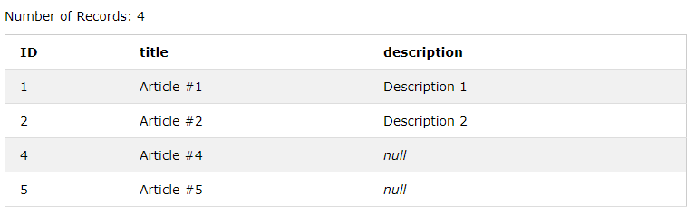
```SQL
SELECT * FROM timers;
```
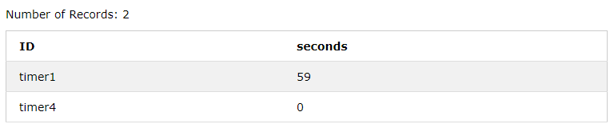

### SELECT DISTINCT

Чтобы запрос *не выдавал повторяющиеся строки*, существует `SELECT DISTINCT`.

Например, в таблице `notes` две строки содержат `null` в `description`.
```SQL
SELECT DISTINCT description FROM notes;
```


*Строка пропускается* только, если *все её значения совпадают* со *значеними другой строки*.
```SQL
SELECT DISTINCT title, description FROM notes;
```

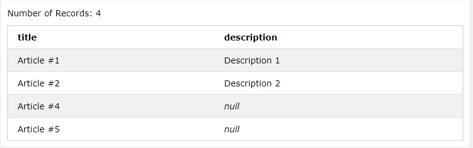
 
## Запросы SELECT с условиями WHERE

**Ключевое слово WHERE** используется для *указания условий* в *запросе* `SELECT`.

```SQL
-- схема
SELECT <column_names>
  FROM <table_name>
  WHERE <condition>; 
```
В условии `condition` можно *производить сравнение текста* и *чисел*, а также *использовать логические операторы* `AND`, `OR`, `NOT`.
```SQL
SELECT *
  FROM notes
  WHERE title = "Article #4" OR title = "Article #5";
```
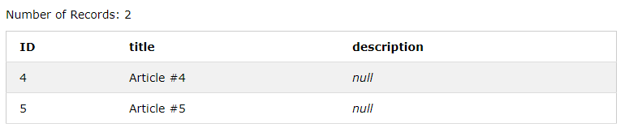
```SQL
SELECT *
  FROM notes
  WHERE title != "Article #1" AND description NOT NULL;
```
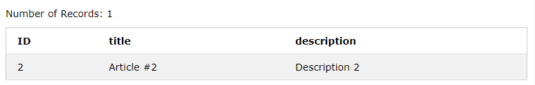
```SQL
SELECT *
  FROM timers
  WHERE seconds > 30;
```
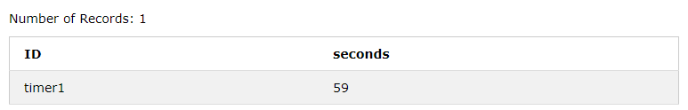

### BETWEEN, IN, LIKE
С помощью *оператора* `BETWEEN` можно задать *промежуток значений* (*число*, *строка*, *дата*).
```SQL
SELECT *
  FROM notes
  WHERE ID BETWEEN 2 AND 5;
```
С помощью *оператора* `IN` можно задать *несколько возможных значений*.
```SQL
SELECT *
  FROM notes
  WHERE ID IN (1, 2, 4);
```
С помощью *оператора* `LIKE` можно задать *шаблон для поиска* (`%` — любое количество символов, `_` — один символ).
```SQL
SELECT *
  FROM notes
  WHERE title LIKE "Article___" AND description LIKE "DESCRIPTION%";
```
## Сортировка при помощи ORDER BY

**Ключевое слово ORDER BY** используется для *сортировки результатов запроса* `SELECT`.

Можно указать *порядок сортировки*: `ASC` (ascending) — *по возрастанию*, используется *по умолчанию*; `DESC` (descending) — *по убыванию*.
```SQL
SELECT *
  FROM notes
  ORDER BY description;
```
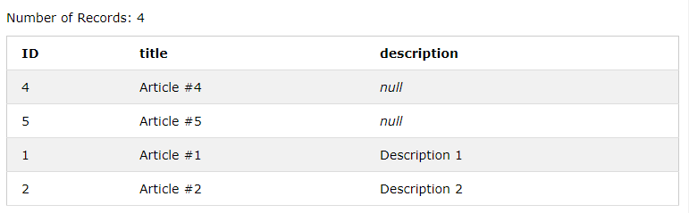
```SQL
SELECT *
  FROM notes
  ORDER BY ID DESC;
```
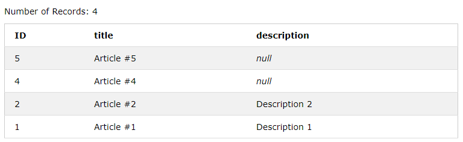

## Агрегатные функции

**Агрегатные функции** *применяются* к *столбцу* и *возвращают единое значение*.

* `AVG (column_name)` — среднее значение столбца `column_name`.
* `COUNT (column_name)` — количество строк.
* `MAX (column_name)` — наибольшее значение столбца.
* `MIN (column_name)` — наименьшее значение столбца.
* `SUM (column_name)` — сумма значений в столбце.

```SQL
SELECT COUNT(ID), MIN(ID), AVG(ID), MAX(ID), SUM(ID) FROM notes;
```
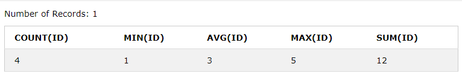

### Оператор AS

**Оператор  AS** используется для *переименования столбца* в *результате* запроса `SELECT`.
```sql
-- схема
SELECT <column_name> AS <name> FROM <table_name>;
```

```sql
SELECT MAX(seconds) AS max_seconds FROM timers;
```
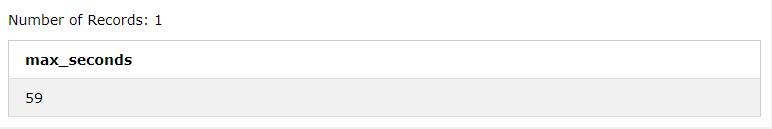

## Группировка значений при помощи GROUP BY

**Ключевое слово GROUP BY** используется для *группировки значений* в *столбце*. 
```SQL
-- схема
SELECT <column_names>
  FROM <table_name>
  GROUP BY <column_name>;
```

*Несколько строк группируются* в *одну*, что *позволяет* использовать *агрегатные функции* для *каждой* получившейся *группы*.
```SQL
SELECT *, COUNT(ID) AS rows_count
  FROM notes
  GROUP BY description;
```
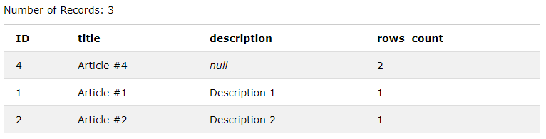

### GROUP BY с условиями HAVING

*Ключевое слово* `WHERE` *не может использоваться* с *агрегатными функциями*, поэтому ввели **ключевое слово HAVING**.
```SQL
-- схема
SELECT <column_names>
  FROM <table_name>
  GROUP BY <column_name>
  HAVING <condition>;
```

```SQL
SELECT *, COUNT(ID) AS rows_count
  FROM notes
  GROUP BY description
  HAVING COUNT(description) = 1;
```

## Связь таблиц при помощи JOIN

**Ключевое слово JOIN** используется для связи нескольких таблиц в одну по их общим атрибутам.
```sql
-- схема
SELECT <column_names>
  FROM <table_A>
  JOIN <table_B>
  ON <table_A.column_name_1> = <table_B.column_name_2>; 
```

С `JOIN` удобно использовать **псевдонимы** — *сокращённые названия таблиц*.
```sql
-- схема
SELECT <column_names>
  FROM <table_A> A
  JOIN <table_B> B
  ON A.<column_name_1> = B.<column_name_2>; 
```

Создадим и заполним ещё одну таблицу для примера.
```sql
CREATE TABLE seconds (
  ID INT,
  value INT CHECK (value < 60) DEFAULT 0,
  PRIMARY KEY(ID)
);

INSERT INTO seconds VALUES(1, 0);
INSERT INTO seconds VALUES(2, 30);
INSERT INTO seconds VALUES(3, 59);

INSERT INTO timers VALUES ("timer5", 15);

SELECT * FROM timers;
SELECT * FROM seconds;
```
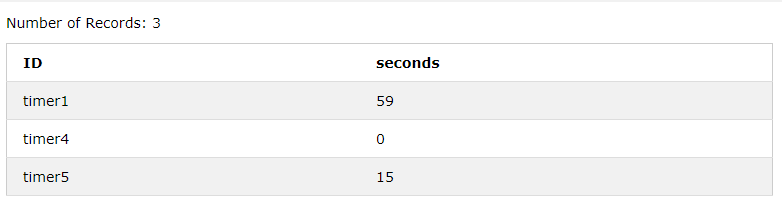


* `JOIN`, `INNER JOIN` (внутреннее объединение) — строки, содержащиеся и в A, и в B.

```sql
SELECT *
  FROM seconds A
  JOIN timers B
  ON A.value = B.seconds;
```
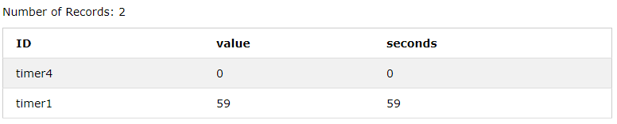

* `LEFT JOIN` (левосторонее объединение) — строки, содержащиеся в A, даже при их отсутствии в B.
```sql
SELECT A.ID AS a_id, B.ID AS b_id, A.value, B.seconds
  FROM seconds A
  LEFT JOIN timers B
  ON A.value = B.seconds;
```
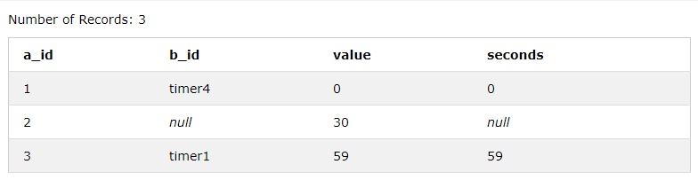

* `LEFT JOIN` без пересечения — строки, содержащиеся в A, но не содержащиеся в B.
```sql
SELECT *
  FROM seconds A
  LEFT JOIN timers B
  ON A.value = B.seconds
  WHERE B.seconds IS NULL;
```
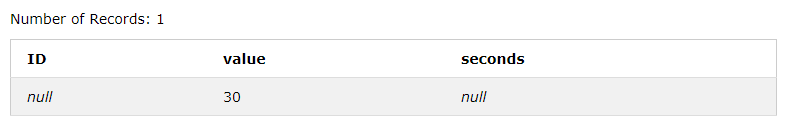

*Аналогично* определяются `FULL OUTER JOIN` (все строки в A и все в B), `FULL OUTER JOIN` без пересечения, `RIGHT JOIN` (правостороннее объединение), `RIGHT JOIN` без пересечения.

* `FULL OUTER JOIN` без пересечения.
```sql
SELECT *
  FROM seconds A
  FULL OUTER JOIN timers B
  ON A.value = B.seconds
  WHERE B.seconds IS NULL AND A.value IS NULL;
```

Можно *объединить большее количество таблиц*.
```sql
SELECT A.column_1, B.column_2, C.column_3
  FROM table_A A 
  JOIN table_B B ON A.column_1 = B.column_2 
  JOIN table_C C ON B.column_2 = C.column_3;
```

## Виртуальная таблица VIEW

**VIEW** — *виртуальная таблица*. 

Виртуальная таблица похожа на обычную таблицу, но ей не является, поскольку не хранит реальные данные, а лишь ссылается на них. По этой причине данные в виртуальной таблице нельзя изменить.

Создаётся на основании результата выполнения выражения (обычно результат запроса `SELECT`). Может содержать данные из нескольких таблиц одновременно.
```SQL
-- схема
CREATE VIEW <view_name> AS
  SELECT <column_names>
  FROM <table_name>; 
```

```SQL
CREATE VIEW timers_less_30sec AS
  SELECT *
  FROM timers
  WHERE seconds < 30;

SELECT * FROM timers_less_30sec;
```
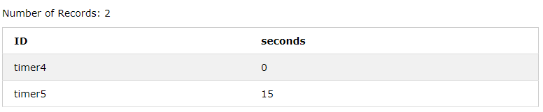

Поскольку `VIEW` хранит ссылки на реальные данные, он знает всё об их изменениях и всегда отображает последнюю версию.
```SQL
INSERT INTO timers VALUES ("timer7", 25);

SELECT * FROM timers_less_30sec;
```
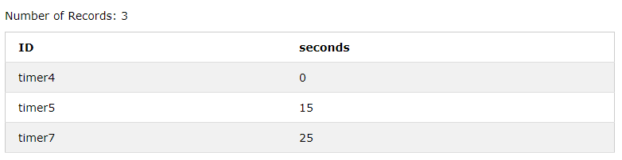


## Изменение данных с помощью UPDATE

Обновление строк таблицы
```SQL
UPDATE <table_name>
  SET <column_name> = <value>, <another_column_name> = <another_value>, /* ... */
  WHERE <condition>; 
```
# Удаление данных с помощью DROP
Удаление таблицы.
```SQL
DROP TABLE <table_name>; 
```
Удаление `VIEW`.
```SQL
DROP VIEW <view_name>; 
```

## Удаление данных с помощью TRUNKATE и DELETE

Удаление строк в таблице по какому-то условию.
```SQL
DELETE FROM <table_name>
  WHERE <condition>;
```

*Удалить все строки* из *таблицы* можно *двумя способами*.
```SQL
DELETE FROM <table_name>;
-- или (Transact-SQL)
TRUNCATE TABLE <table_name>;
```

`TRUNCATE` работает быстрее, но имеет следующие ограничения.
* Отсутствие условий `WHERE`.
* Не отрабатывают триггеры (в том числе на удаление).
* `TRUNCATE` не работает, если на удаляемую таблицу имеется ссылка по внешнему ключу.
* Не журнализируется удаление отдельных строк таблицы.

## Вложенные запросы SELECT

*Запросы* `SELECT` могут быть **вложенными** (nested). *Вложенный запрос* называется **подзапросом** (subquery).
```SQL
SELECT <column_names>
  FROM  <table_name>
  WHERE <value> IN (SELECT <column-name>
                      FROM <another_table_name>
                      WHERE <condition>)
```
```SQL
SELECT <column_name> = (SELECT <column_name> FROM <table_name> WHERE <condition>)
  FROM <table_name>
  WHERE <condition>
```
