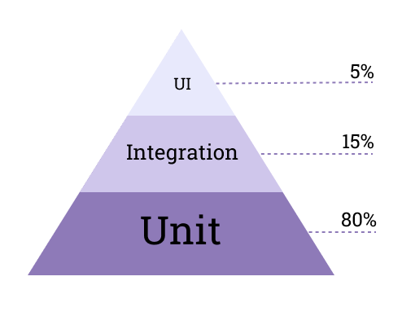

- [Зачем тестировать приложение](#зачем-тестировать-приложение)
- [Тестирование и его разновидности](#тестирование-и-его-разновидности)
  - [Ручное и автоматизированное тестирование](#ручное-и-автоматизированное-тестирование)
  - [Пирамида тестирования](#пирамида-тестирования)
- [Подходы к написанию тестов](#подходы-к-написанию-тестов)
  - [TDD](#tdd)
  - [ATDD](#atdd)
  - [BDD](#bdd)
  - [TDD vs ATDD vs BDD](#tdd-vs-atdd-vs-bdd)
  - [DDT](#ddt)
  - [KDT](#kdt)
- [Тестовые объекты](#тестовые-объекты)
  - [Пустышка](#пустышка)
  - [Заглушка](#заглушка)
  - [Макет](#макет)
- [Паттерны](#паттерны)
  - [Объект-страница](#объект-страница)

<!--   - [Тестирование чёрного и белого ящиков](#тестирование-чёрного-и-белого-ящиков)
  - [Функциональное и нефункциональное тестирование](#функциональное-и-нефункциональное-тестирование) -->
<!--   - [Регрессионное тестирование](#регрессионное-тестирование) -->

## Зачем тестировать приложение

У *каждого программиста* (неважно, профессионал он или любитель) *бывают* случаи, когда его *приложение ломается*. Очень *здорово*, когда *проблема* ему хорошо *знакома* и *решить* её можно достаточно *быстро*, но иногда даже *маленькое, незаметное изменение* в *коде* может *привести* к *часам*, а иногда и дням безудерджного *дебага*. 

В такие моменты *хочется знать*, *какие части приложения точно работают*, а какие нет. Существует *множество путей решения* этой проблемы. 

Например, *системы контроля версий* (такие, как *Git*) позволяют *просмотреть* лишь те *изменения*, которые были *внесены после* выхода в свет *последней рабочей версии приложения*. Это позвояет *не проверять всё приложение целиком* и *искать ошибку среди последних изменений*.

Если же система котроля версия не используется или изменений после последней рабочей версии было слишком много, то найти ошибку всё ещё затруднительно.

На *помощь* приходит *тестирование*. 

Качественное тестирование очень важно для приложения. Хороший тестировщик продумывает все возможные и невозможные исходы и проверяет каждый из них. Без такого тестирования невозможно гарантировать корректность работы прилолжения, а значит оно может сломаться в любом месте и в любой момент.

В идеале это работает так, что некоторый готовый блок кода проверяется тестами и в случае успешного прохождения он больше не трогается. На практике же часто приходится затрагивать один и тот же код, при этом именно тесты могут показать, что ничего не сломалось после внесения изменений.

Чем больше становится приложение и команда, которая над ним работает, тем больше вероятность возникновения ошибок и сложность их исправления. Тесты помогут избежать попадения этих ошибок в production, а также локализовать эти ошибки, что явно поможет их устранить.

Ещё одно применение тестов: описание требований к приложению. Заказчик описывает, чего он ожидает от некоторой функциональности, программист запускает тесты ( тестировщик тестирует готовый продукт) и таким образом показывает, что все требования заказчика были соблюдены.

# Тестирование и его разновидности

**Обеспечение качества** (Quality assurance, QA) — способ предотвращения ошибок и дефектов в производимых продуктах, а также предотвращения проблем при доставке продуктов или услуг клиенту.

**Тестируемая система** (System under test, SUT) — система, которая тестируется на корректность работы.

## Ручное и автоматизированное тестирование

**Ручное тестирование** — прямое взаимодействие QA-инженера с приложением.  
QA ищет неисправности и недостатки, а затем информирует о них программиста.

### Плюсы ручного тестирования
* *Отчёт тестировщика* — первый отзыв потенциального пользователя, позволяющий увидеть приложение его глазами.
* *Обратная связь* (feedback) по **UI**. Протестировать UI приложения и выявить его недостатки пока позволяет только ручное тестирование.
* *Отсутствие затрат на написание тестов*. Это важно при быстром внедрении новой функциональности. На малых проектах написание и поддержку тестов может оказаться достаточно затратным.

### Минусы ручного тестирования
* *Человеческий фактор*. Часть ошибок может упускаться, некоторые результаты субъективны.
* *Трудозатраты и продолжительность*. Ручное тестирование обычно занимает много времени. Часто требуется тесное взаимодействие QA с программистом во время тестирования для разъяснения многих вопросов.
* *Отсутствие возможности моделирования большой нагрузки*. При ручном тестировании невозможно смоделировать большое количество пользователей.

**Автоматизированное тестирование** — написание кода для тестов.  
Ожидаемый сценарий описывается кодом, затем при запуске тестов он сравнивается с реальным и программа указывает расхождения.

### Плюсы автоматизированного тестирования
* *Отсутствие человеческого фактора*. Хорошо написанный тест не может забыть что-то проверить, он каждый раз последовательно проверяет действия.
* *Скорость выполнения*. Код для сценария пишется один раз, а его запуск обычно занимает несколько секунд.
* *Переиспользуемость*. Код автотестов может быть использован неоднократно, особенно при внедрении новой функциональности.
* *Возможность моделирования большой нагрузки*. Приближает тесты к реальной ситуации использования приложения.

### Минусы автоматизированного тестирования
* *Отсутствие тестирования глазами пользователя* (UX). Не всё можно покрыть автотестами.
* *Отсутствие обратной связи*. Автоматизированные тесты не предоставляют обратную связь о качестве продукта, они лишь выполняют запрограммированные сценарии.
* *Затраты на написание тестов и их поддержку*. Автоматизированные тесты трубуют написания большого количества кода. При изменении тестируемых частей приложения, нужно изменять и их тесты (иначе они станут бесполезными). Это может быть губительно для маленьких проектов и проектов, где всё меняется довольно быстро и непредсказуемо.

<!-- * Надежность. Автоматизированные тесты могут упасть по многим причинам, например, при большой загруженности тестовой машины или при проблемах с сетью. -->

<!-- 

## Тестирование чёрного и белого ящиков

### Чёрный ящик

**Тестирование чёрного ящика** (black-box testing), **тестирование на основе спецификации** (specification-based testing) — метод тестирования ПО, при котором проверка функциональности приложения происходит, не вдаваясь во внутреннюю структуру приложения. При определённых входных данных должен быть определённый результат. 

Специфических знаний о коде приложения, внутренней структуре проекта и языках программирования в целом не требуется. Тестировщие должен знать, что должно делать приложение (из спецификации) и что оно делает на самом деле (проверяет сам), но может не знать, как оно это реализует. 

Метод может быть применен практически на всех уровнях тестирования: Unit, Integration, System, Acceptence.  

### Белый ящик

**Тестирование белого ящика** (white-box testing), **структурное тестирование** (structural testring) — метод тестирования, при котором тестируются внутренние структуры приложения.

Тестирование белого ящика — метод тестирования приложения на уровне исходного кода.

Метод применяется на следующих уровнях тестирования: Unit, Integration, System.

Тестирование белого ящика позволяет выявить множество проблем в приложении, но может пропустить нереализованные части спецификации.

## Функциональное и нефункциональное тестирование

**Функциональное тестирование** — процесс обеспечения качества (QA process) и подтип тестирования чёрного ящика. 

Функциональное тестирование проводится для проверки соответствия системы или её компонентов функциональным требованиям, описывающих функции системы и её компонентов.

Функциональное тестирование обычно описывает, что система делает.

**Нефункциональное тестирование** — тестирование системы (приложения) на предмет её нефункциональных требований: способа работы, а не конкретного поведения. 

### Примеры нефункциональных тестов
* Стресс-тестирование (Stress testing)
* Тестирование безопастности (Security testing)
* Тестирование производительности (Performance testing)
* Тестирование масштабируемости (Scalability testing)
* Тестирование выносливости (Endurance testing)
* Тестирование восстановления (Recovery testing)
* Тестирование документации (Documentation testing)

Многие из этих понятий пересекаются или даже взаимозаменяются в зависимости от приложения. -->
<!-- 
## Регрессионное тестирование

**Регрессионное тестирование** (regression testing) — повторно запускающиеся функциональные и нефункциональные тесты, предназначенные для проверки того, что ранее написанный и протестированный код не сломался после новых изменений. -->

<!-- ## Уровни тестирования
* Модульное, Компонентное тестирование (Unit, Component Testing)
* Интеграционное тестирование (Integration Testing)
* Системное тестирование (System Testing)
* Приёмочное тестирование (Acceptance Testing)

## Модульное тестирование
 -->


## Пирамида тестирования

Майк Кон, автор книги "Scrum. Гибкая разработка ПО", представляет тестирование приложения в виде пирамиды.  

Чем выше по пирамиде, тем дольше и затратнее делать тесты.

По этой причине автор расставил следующие приоритеты: 80% — модульные тесты, 15% — интеграционные и API-тесты, 5% — UI-тесты (могут быть как автоматизированными, так и ручными).



# Подходы к написанию тестов

## TDD

**Test-Driven Development** (TDD) — разработка через тестирование; подход к разработке и тестированию, при котором сначала создаются тесты, которым должен удовлетворять код, затем его реализация.  

*TDD* имеет *итеративный процесс*. Сперва пишется тест на новый, ещё не реализованный функционал, а затем пишется минимальное количество кода (ничего лишнего) для его реализации. При успешном прохождении теста, можно задуматься о качестве кода и сделать его рефакторинг.

### Преимущества TDD
- Полное покрытие кода тестами.
- Заранее задумываемся об использовании кода.
- Хорошие тесты являются неплохим примером использования кода (что-то вроде документации).

### Пример TDD
Например, напишем тест для функции, которая должна возводить двойку в степень.
```js
const runTests = () => {
  assert.equal(pow2(0), 1, '2^0 = 1');
  assert.equal(pow2(1), 2, '2^1 = 2');
  assert.equal(pow2(2), 4, '2^2 = 4');
};
```
Теперь на основании теста пишется сама функция.
```js
const pow2 = (power) => {
  let result = 1;
  for (let i = 0; i < power; i++) {
    result *= 2;
  }
  return result;
}
```
Функция удовлетворяет тестам выше, добавим новые тесты.
```js
assert.equal(pow2(-1), 0.5, '2^(-1) = 0.5');
assert.equal(pow2(-2), 0.25, '2^(-2) = 0.25');
assert.equal(pow2(-3), 0.125, '2^(-3) = 0.125');
```
Дописываем нужный функционал.
```js
const pow2 = (power) => {
  let result = 1;
  if (power > 0) {
    for (let i = 0; i < power; i++) {
      result *= 2;
    }
  } else {
    for (let i = 0; i > power; i--) {
      result /= 2;
    }
  }
  return result;
}
```
Далее снова пишем тесты.

## ATDD

**Приемочное тестирование** (Acceptance Testing) — тестирование, направленное на проверку соответствия системы требованиям.

**Acceptance TDD** (ATDD) - разработчка через приёмочные тесты. Подход близок к TDD, но отличается тем, что привлекает тестировщиков, программистов и сторону заказчика к совместному написанию критериев принятия тестов до начала написания кода. 

Сперва придумываются критерий выполненной работы и критерий того, что она выполнена правильно. Эти критерии описываются доступным для понимания нетехническому человеку языком.

ATDD вносит ястность, что все участники проекта точно понимают, что необходимо сделать и реализовать.

## BDD

**Behavior-Driven Development** (BDD) — разработка, основанная на поведении; расширение подхода TDD, где особое внимание уделяется поведению системы в терминах бизнеса. Такие тесты обычно иллюстрируют и тестируют сценарии, интересные заказчику системы. Поэтому для BDD-тестов используются фреймворки (Chai, Mocha, Jest) с синтаксисом, понятным не только программисту, но и представителю заказчика. Обычно этот синтаксис похож на английский язык.

```js
const createArticle = title => ({ title, date: new Date() });

describe('createArticle', () => {
  const article = createArticle('Weather');
  it('should return an object', () => article.to.be.an('object'));
  it('the object should have a "date" and "title" properties', () => {
    expect(article).to.have.property('date'));
    expect(article).to.have.property('title'));
  });
});
```

## TDD vs ATDD vs BDD

TDD-тесты пишутся программистами для программистов. Они не указывают, что конкретно нужно тестировать и как именно должны выглядеть и называться тесты.

BDD вдохновлено архитектурой DDD (Domain-Driven Design) и фокусируется на предметной области приложения, в то время как TDD фокусируется на сам код, реализацию.

ATDD фокусируется на отображении требований в приёмочных тестах и использует эти тесты для разработки. Вопрос, определяющий ATDD-тесты: "Система делает то, что от неё требуется?".

BDD ориентирован на клиента (customer-focused), в то время как ATDD больше риентированной на разработчика (developer-focused) и часто использует те же технологии, что и TDD.

BDD-тесты могут быть написаны и поняты не только программистом, но и техническими менеджерами или тестировщиками, что позволяет убрать языковой барьер между всеми ними.

## DDT

**Data-Driven Testing (DDT)** — тестирование, управляемое данными; подход к архитектуре автоматизированных тестов, при котором тестовые данные хранятся отдельно от тестов (в файле или базе данных).

### Алгоритм DDT
* Часть тестовых данных извлекается из хранилища.
* Выполняется скрипт, в котором вызывается обычный тест с извлечёнными тестовыми данными.
* Сравниваются полученные (actual) результаты с ожидаемыми (expected).
* Алгоритм повторяется со следующим набором входных данных.

### Пример DDT

Перепишем функцию `pow2` из раздела TDD.
```js
const runTests = () => {
  assert.equal(pow2(0), 1, '2^0 = 1');
  assert.equal(pow2(1), 2, '2^1 = 2');
  assert.equal(pow2(2), 4, '2^2 = 4');
  /* ... */
};
```
Возводить двойку в степень можно до бесконечности (на самом деле не совсем, поскольку в JavaScript `MAX_SAFE_INTEGER = 2^53 - 1`), но писать все эти степени руками не хочется.  

Что можно сделать?  
Можно взять файл, содержащий степени двоек и подгружать данные из его.
```js
/* pow-data.txt */
1 2 4 8 16 32 64 128 256 512 1024 2048 4096 ...
```
Пишем функционал, загружающий данные из файла и возвращающий их в виде массива.
```js
const fs = require('fs');

const readPowData = async (filename) => {
  const powData = await fs.readFile(filename, 'utf8'); // async, await доступны в fs с Node 11+
  return powData.split(' ');
};
```
Пишем функционал для тестов таким образом, чтобы можно было запускать их с массивом данных.
```js
const runTest = (power, expectedValue) => assert.equal(pow2(power, expectedValue), `2^${power} = ${expectedValue}`);

const runTests = (powDataArray) => {
  powDataArray.forEach((item, index) => {
    runTest(index, item);
  });
};
```
Считываем данные из файла и запустить тесты.
```js
let powDataArray = await readPowData('pow-data.txt');
runTests(powDataArray);
```
Загружаем данные из другого файла или же из другого источника, снова запускаем тесты.
```js
powDataArray = await readPowData('pow-data-2.txt');
runTests(powDataArray);

powDataArray = await getPowDataFromDB();
runTests(powDataArray);
```

## KDT

**Keyword-Driven Testing (KDT)** — тестирование, управляемое ключевыми словами; подход, использующий ключевые слова, описывающие набор действий, необходимых для выполнения определённого шага тестового сценария.

Для использования подхода нужно определить набор ключевых слов и сопоставить им действия (функции).

В KDT используется что-то вроде таблиц, чтобы ключевые слова могли иметь параметры, поэтому подход иногда называют **Table-Driven Testing (TDT)**.

### Алгоритм KDT
* Считываем ключевые слова вместе с их параметрами из таблицы.
* Последовательно вызываем связанные с ключевыми словами функции.

### Пример KDT

Пусть наш тестовый сценарий требует входа в пользовательский аккаунт, отправки двух сообщений на разные адреса и выход из аккаунта.  

Определяем ключевые слова: `Login`, `Send Email`, `Logout`.  

Сопоставим им функции.
```js
/* keyword "Login" */
const login = (username, password) => { /* ... */ };

/* keyword "Send Email" */
const sendEmail = (receiver, message) => { /* ... */ };

/* keyword "Logout" */
const logout = () => { /* ... */ };
```

Теперь можно описать тестовый сценарий, например, следующим файлом (одна строка - одно ключевое слово).
```js
/* user-test.txt */
Login         | user                  | pass123
Send Email    | another-user@mail.com | Hello!
Send Email    | my-friend@mail.com    | Hi!
Logout
```

Обработаем этот файл.
```js
const fs = require('fs');

const removeExtraSpaces = str => str.replace(/ +\| +/g, '|');

const readTestData = async (filename) => {
  const testData = await fs.readFile(filename, 'utf8');
 
  // убираем лишние пробелы в файле
  const formattedTestData = removeExtraSpaces(testData);

  // возвращаем массив строк файла
  return formattedTestData.split('\n'); 
};
```
Чтобы выполнять действие в зависимости от ключевого слова, можно использовать простую функцию с конструкцией `switch`.
```js
const makeAction = (keyword, params) => {
  switch (keyword) {
    case 'Login': return login(...params);
    case 'Send Email': return sendEmail(...params);
    case 'Logout': return logout();
  };
};
```
Осталось только считать строки из файла и выполнить то, что описано в каждой.
```js
  let rows = await readTestData('user-test.txt');
  rows.forEach((row) => {
    // выделяем ключевое слово и параметры в строке
    const [keyword, ...params] = row.split('|');
    // выполняем действие
    makeAction(keyword, params);
  });
```
Тут можно сделать вспомогательную функцию.
```js
const executeRows = (rows) => {
  rows.forEach((row) => {
    const [keyword, ...params] = row.split('|');
    makeAction(keyword, params);
  });
};
```
Теперь можно выполнять любые последовательности, состоящие из определённых нами ключевых слов.
```js
  let rows = await readTestData('user-test.txt');
  executeRows(rows);

  rows = await readTestData('another-test.txt');
  executeRows(rows);

  rows = ['Login|admin|admin', 'Logout'];
  executeRows(rows);
```

# Тестовые объекты

Для достижения изолированности какого-то блока тестируемого кода внешние зависимости при его тестировании заменяются **тестовыми объектами**.

<!-- Тестовые объекты увеличивают переиспользуемость тестов и улучшают их поддержку. -->

## Пустышка

**Пустышка (Dummy)** — простейший тестовый объект, реализующий интерфейс, минимально совместимый с интерфейсом реального объекта. 

Код Dummy не содержит никакой логики.  

Dummy используется в тех случаях, когда обращение к реальному объекту в данном тесте не имеет значения или отсутствует.

Например, нам в контексте теста не нужна проверка авторизации, поэтому мы заменяем реальную функцию `checkAuth()` на тестовую, которая всегда возвращает истиное значение.
```js
const checkAuth = () => true;

checkAuth(); // true
```
В реальности же функция `checkAuth` могла иметь следующий интерфейс `(token: string) => boolean`.

## Заглушка

**Заглушка (Stub)** — тестовый объект, частично реализующий логику реального объекта (валидные данные на входе - валидные данные на выходе).

Stub обычно содержит тривиальную логику, имитирующую работу нескольких методов реального объекта.

<!-- функция или метод класса, которая подменяет реализацию оригинальной функции и не выполняет никакого осмысленного действия, возвращает пустой результат или тестовые данные. -->

Например, имитируем создание пользователя в базе данных: принимаем данные пользователя и сразу же возвращаем полученные данные вместе с сгенерированным id (должен был сгенерироваться в бд).
```js
const generateId = () => parseInt(Math.random() * 1000);

const createUser = data => Promise.resolve({
  ...data,
  _id: generateId(),
});
```

Перепишем пример для Dummy так, чтобы он смог стать Stub (принимает валидные данные и отдаёт тоже).
```js
const checkAuth = token => !!token;

checkAuth('qq'); // true
checkAuth(''); // false
```

## Макет 

**Макет (Mockup)** — модуль или класс, представляющий собой конкретную фиктивную (dummy) реализацию определенного интерфейса. 

Макет, как правило, предназначен для подмены оригинального объекта системы исключительно для тестирования взаимодействия и изолированности тестируемого компонента.

Методы макета чаще всего из себя представляют заглушки.

### Пример макета

Пусть имеется интерфейс, описывающий методы работы с базой данных.
```ts
import { ICreateUser } from '/* ... */';
import { IUser } from '/* ... */';

interface IUserRepository {
  createUser: (data: ICreateUser) => IUser;
  getUser: (id: string) => IUser;
}
```

Вместо того, чтобы использовать реальную базу данных, мы заменяем её фиктивной реализацией: реализуем интерфейс при помощи заглушек. 

Тогда макет:
```ts
/* users-mock.ts */
import { ICreateUser } from '/* ... */';
import { IUser } from '/* ... */';
import { generateId } from '/* ... */';

const users = [];

/* заглушка */
const createUser = (data: ICreateUser): IUser => {
  const newUser = {
    ...data,
    _id: generateId(),
  };
  users.push(newUser);
  Promise.resolve(newUser);
}

/* заглушка */
const getUser = (id: string): IUser => Promise.resolve(users.find(user => user._id));

export default () => {
  createUser,
  getUser,
};
```

# Паттерны

## Объект-страница

**Объект-страница** (Page Object Model, POM) — модуль (класс), представляющий интерфейс отдельной страницы тестируемой системы. 

При использовании POM тесты оперируют с абстрактными объектами страниц и не завязаны на конкретную реализацию пользовательского интерфейса (его дизайн и вёрстку).

Тесты используют методы POM каждый раз, когда требуется взаимодействие с UI страницы. 

*Преимущества Page Object*
- Изменение дизайна и вёрстки страниц может потребовать изменения только во внутренней реализации объекта страницы, но оно не затрагивает тестовые сценарии, оперирующие данной страницей. 
- Абстрактность интерфейса позволяет переиспользовать тесты для различных девайсов.
различных устройств и разрешений экранов, что очень удобно.

## Шпион
**Шпион** (Spy) — объект-обёртка (по типу прокси), слушающий вызовы и сохраняющий информацию об этих вызовах (аргументы, количество вызовов, контекст) оригинального объекта системы. 

Сохраненные шпионом данные используются в тестах.

## Испытательная Платформа

**Испытательная Платформа** (TestBed)  — это специально воссозданная тестовая среда, платформа для тестирования (например, комплекс Макетов, Заглушек и Шпионов).

*Испытательная Платформа* применяется для комплексного тестирования отдельных связок системы или её компонентов. 

## Фикстура
**Фикстура** (Fixture)  —  механизм, позволяющий привести объект или всю систему в определенное состояние и зафиксировать это состояние для тестов. 

Под фикстурой чаще всего понимают тестовые данные необходимые для корректного запуска тестов, а также механизмы загрузки/выгрузки этих данных в хранилище. 

Основное назначение фикстуры: привести данные системы к определенному (фиксированному) состоянию, которое будет точно известно во время выполнения тестов.
